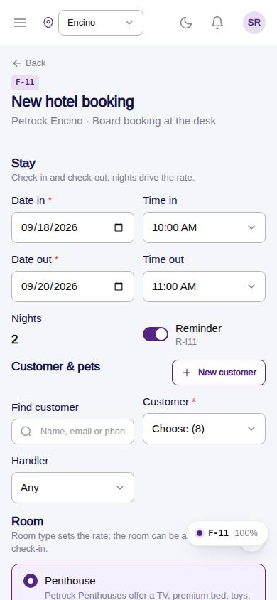
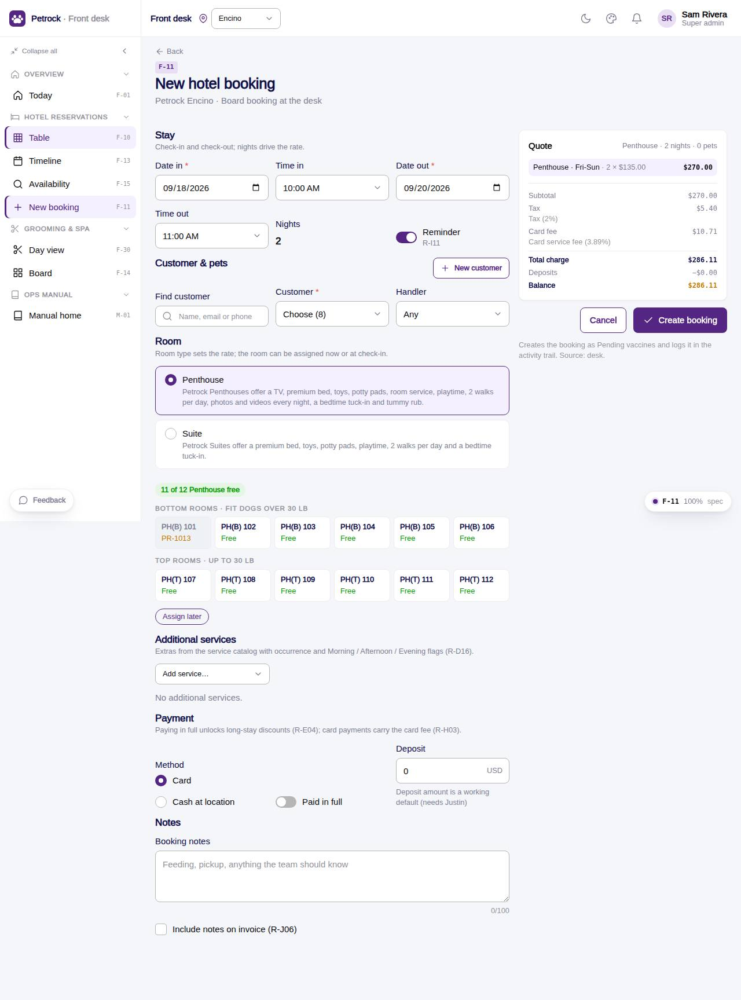

# F-11 · New / edit board booking

## Purpose

The "Board Bookings" form of the design rebuilt as a page: the desk creates (or edits) a hotel stay with dates and times, a customer (or a new one inline), the pets with their vaccine state, room type and room with the fit rules, additional services, payment terms and a live quote from the pricing engine. Prefills come from the availability check, the timeline (empty cell) and Rebook.

## Screenshots

| 390 | 1280 |
| --- | --- |
|  |  |

## Sections (layout order)

1. Stay - Date in / Time in / Date out / Time out, nights, Reminder (R-I11)
2. Customer & pets - find + select customer, New customer modal (R-J05, required fields R-J01), handler, pet cards with `PetVaccineStatus`, share-room toggle
3. Room - room type cards (inclusions copy, R-X01 warning), `RoomAssignmentPicker` (free / busy / no fit)
4. Additional services - service rows with qty, occurs (once / daily / per night), M / A / E flags (R-D16)
5. Payment - card / cash, paid in full, deposit
6. Notes - 100 characters (R-J02), include on invoice (R-J06)
7. Quote sidebar - `BookingChargeSummary`, validation errors, Cancel / Create booking

## Data

| Table | Read / write | Notes |
| --- | --- | --- |
| `bookings` | write | code `PR-<next>`, quote json, status per R-X04 |
| `booking_pets` | write | one per pet, room_id copied |
| `booking_services` | write | replaced on edit |
| `booking_events` | write | created / edited |
| `customers` | read / write | inline new customer |
| `pets`, `employees`, `rooms`, `room_types`, `services` | read | |
| `rates`, `seasons`, `discounts`, `fees`, `taxes` | read | pricing engine input only |
| `vaccine_records`, `vaccine_types` | read | R-X04 gate |

## Rules

- `R-X04` - confirmed only when every pet's required vaccines are verified, else pending_vaccines (R-A05)
- `R-E09` / `R-X01` - room fit (top rooms ≤30 lb) and the 55 lb suite warning
- `R-E01`, `R-E04`, `R-H03`, `R-H04` - discounts, card fee and tax through `quoteDeskStay()`
- `R-D16`, `R-J02`, `R-J05`, `R-J06`, `R-I11`, `R-A07`, `R-A10`
- `R-D13`, `R-D17` - book-out-whole-room and pickup / delivery are registered as requested, not built
- `R-X03`, `R-X05` - room availability; checked-in stays keep their dates

## Logic

- `quoteDeskStay()` = `quoteHotel()` (rooms, discounts, boarding tax) + service lines taxed at the service rate + card fee on the whole.
- Deposit defaults to 0; Paid in full sets deposit = total. Payment status: paid / authorized / pending from deposit vs total.
- Edit mode keeps the status, replaces pets and services, logs an `edited` event.

## Components

PageHeader, Section, Card, Input, Select, TimePicker, Toggle, Checkbox, RadioGroup, Textarea, Button, IconButton, Modal, Avatar, Badge, StatusBadge, EmptyState, PetVaccineStatus, RoomAssignmentPicker, BookingChargeSummary.

## Real vs mock

Mock data; no payment is taken here (deposits are recorded on the detail page through the PaymentProvider). Chargeable-day multipliers (R-D09) are not modelled: nights drive the price (decision pending Justin).

## Responsive check (D-016)

Checked at 360, 390, 768, 1280, 1920 (2026-09-18): quote sidebar stacks under the form below 1100 px; field grid reflows; no overflow.

## Changelog

- `docs/changelog/_pending/frontdesk-reservations.md`
