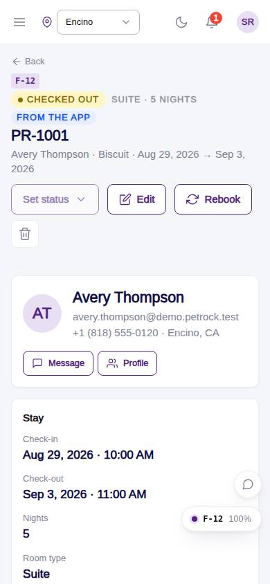
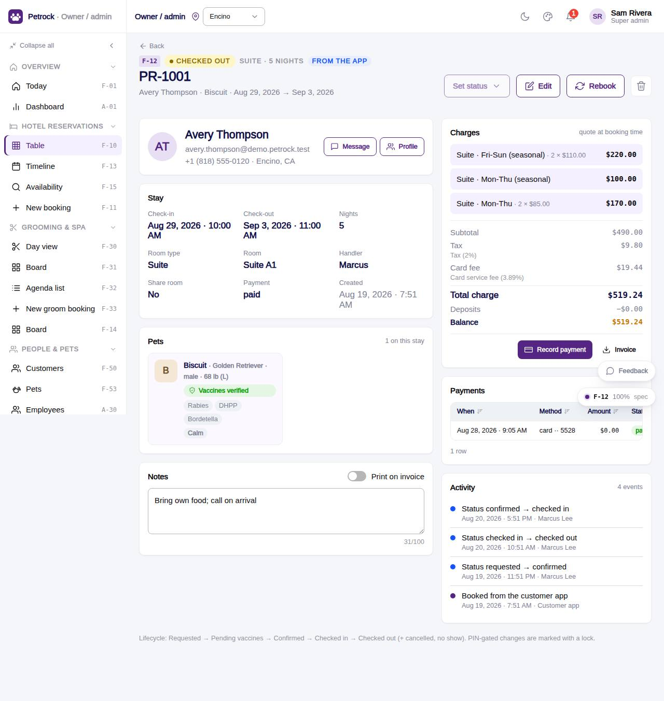

# F-12 · Booking detail

## Purpose

One stay, everything the desk needs: customer, pets with vaccine and medical flags, dates and room, charges and payments, notes and the activity trail. The header carries the day's actions: Check in / Check out (quick button), Set status (allowed transitions, lock when a manager PIN is needed), Edit, Rebook, Delete (PIN). Payments are recorded here through the PaymentProvider; refunds need a PIN.

## Screenshots

| 390 | 1280 |
| --- | --- |
|  |  |

Dark: `../screenshots/F-12/390-dark.jpg`, `../screenshots/F-12/1280-dark.jpg`.

## Sections (layout order)

1. PageHeader - code, `StatusBadge`, room type · nights, source badge; actions (BookingStatusMenu, Edit, Rebook, Delete)
2. Customer card - avatar, contact, Message / Profile links
3. Stay card - `BookingInfoGrid`: check-in, check-out, nights, room type, room (+ Assign / Change), handler, share room, payment, created
4. Pets card - per pet: breed, weight, `PetVaccineStatus`, medication / alert / attribute badges
5. Notes card - 100-char textarea with Save, "Print on invoice" toggle (R-J06)
6. Charges card - `BookingChargeSummary` from the stored quote + services; Record payment, Refund (PIN), Invoice (placeholder)
7. Payments card - payments for this stay
8. Activity card - `booking_events` + approvals, newest first (R-J08)
9. Modals - RoomPickModal, Record payment, PinApprovalModal

## Data

| Table | Read / write | Notes |
| --- | --- | --- |
| `bookings` | read / write | status, room_id, notes, deposit, payment_status, delete |
| `booking_pets`, `booking_services` | read / delete | |
| `booking_events` | read / write | every action logs one |
| `approvals` | read / write | via PinApprovalModal |
| `payments`, `invoices` | read / write | record payment / refund |
| `customers`, `pets`, `employees`, `rooms`, `room_types`, `vaccine_records`, `vaccine_types` | read | |
| `audit_log` | write | status / delete |

## Rules

- `R-I06`, `R-I07` - transitions from `BOOKING_TRANSITIONS`; PIN for cancel / no-show / reopen / confirm-without-vaccines
- `R-J08` - activity trail
- `R-H08`, `R-D14` - deposits and balance
- `R-X05` - check-in needs a room
- `R-P01` - delete and refund need a PIN
- `R-A05`, `R-A10`, `R-J06`, `R-D16`

## Logic

- Record payment: `PaymentProvider.createPaymentIntent` -> `payments` row -> `bookings.deposit += amount`, `payment_status` paid when deposit ≥ total; invoice deposit / balance updated when one exists.
- Refund: PIN -> provider refund -> negative `payments` row (`refund_of`) -> deposit 0, status refunded.
- Rebook opens F-11 with `?rebook=<id>` (customer, room type, notes prefilled).

## Components

PageHeader, Card, Avatar, Badge, StatusBadge, BookingInfoGrid, PetVaccineStatus, BookingChargeSummary, BookingStatusMenu, Button, IconButton, Textarea, Toggle, Input, Select, Modal, DataTable, EmptyState, RoomAssignmentPicker, PinApprovalModal.

## Real vs mock

Payments go through `MockPaymentProvider` (always succeeds); Stripe replaces it behind the same interface. Invoice PDF is a toast placeholder (F-20s). Message / Profile link to routes other modules own.

## Responsive check (D-016)

Checked at 360, 390, 768, 1280, 1920 (2026-09-18): two columns above 1000 px, one below; header actions wrap; no overflow.

## Changelog

- `docs/changelog/_pending/frontdesk-reservations.md`
- 0019 - QA fixes: Charges read `quoteLinesOf(booking.quote)` (app and desk quote shapes); pinned staff get the not-found state for the other location's booking; eyebrow wraps at 360 px; status menu keys off `bookings.status`.
