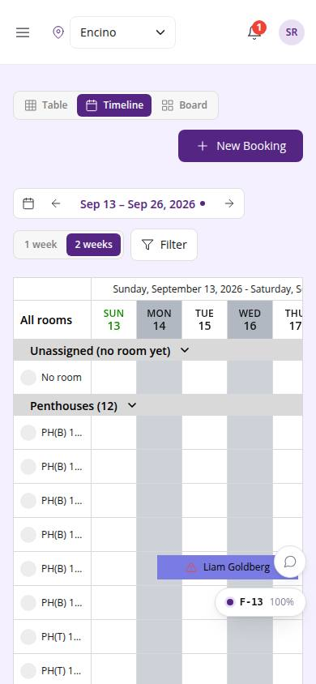
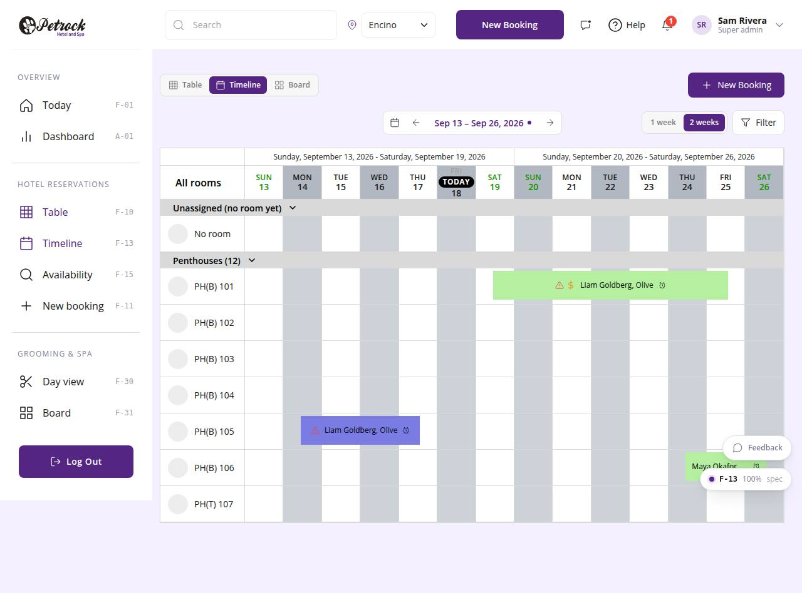

# F-13 · Room timeline

## Purpose

Rooms as rows, days as columns, stays as blocks coloured by status (D-008: designed fresh around rooms and stays). The desk sees occupancy for one or two weeks, spots vaccine / balance / note flags on each block, drags a stay to another room or start day, and acts from the block popover (Open, Assign room, Set status). Clicking an empty cell starts a booking for that room and day.

## Screenshots

| 390 | 1280 |
| --- | --- |
|  |  |

Dark: `../screenshots/F-13/390-dark.jpg`, `../screenshots/F-13/1280-dark.jpg`.

## Sections (layout order)

1. Top line - ViewSwitch left, "New Booking" right (`all reservation grooming.jpg`)
2. Timeline bar - range pill (`ReservationDayNav` with range) centred; 1 week / 2 weeks and the `FilterPopover` (room type, status, Unassigned row, Daycare rows, Cancelled / no show, flag legend) right
3. `RoomTimeline` - week-range headers, 54 px day heads (green weekends, black TODAY pill), alternating day columns, dashed today line, grey group rows Unassigned, Penthouses, Suites, Daycare (Full day / Half day / Play hour), 32 px room discs, flat status blocks
4. Block popover - code, status, customer, dates, room, pets, balance, vaccine chips, notes; Open / Assign room / Set status
5. Move modal - from / to confirmation (R-X07); RoomPickModal; PinApprovalModal

## Data

| Table | Read / write | Notes |
| --- | --- | --- |
| `bookings` | read / write | room_id, check_in / check_out on move, status |
| `booking_pets` | read / write | room_id follows the booking |
| `daycare_bookings` | read | daycare rows |
| `customers`, `pets`, `rooms`, `room_types`, `vaccine_records`, `vaccine_types` | read | |
| `booking_events`, `approvals`, `audit_log` | write | moves and status changes |

## Rules

- `R-I09`, `R-I01` - block colour = status hue
- `R-I07` - context actions in the popover
- `R-X07` - a move keeps the nights; target must be the booked type, fit the heaviest dog (R-E09) and be free (R-X03)
- `R-I06`, `R-X05` - PIN-gated transitions; checked-in stays only change room, not dates

## Logic

- Block spans [check-in day, check-out day) starting at the check-in half-day; same-day stays take one cell; overlapping blocks stack in lanes.
- Drop validation gives a toast with the reason (wrong type, no fit, taken, checked-in date change).

## Components

SegmentedControl, ReservationDayNav, FilterPopover, Select, Toggle, Button, Badge, StatusBadge, Modal, RoomTimeline, PetVaccineStatus, BookingStatusMenu, RoomAssignmentPicker, PinApprovalModal.

## Real vs mock

Mock data. Dragging works with the mouse; keyboard users use the popover actions (Assign room / Set status) and the Edit page for dates.

## Responsive check (D-016)

Checked at 360, 390, 768, 1280, 1920 (2026-09-18): the grid scrolls horizontally inside its card with a sticky room column (96 px on phones); the page itself never overflows. Degrades gracefully on phones as D-016 allows.

## Changelog

- `docs/changelog/_pending/frontdesk-reservations.md`
- 0019 - QA fixes: Popover "Checked in" on a room-less booking opens the picker with "Assign & check in"; the popover flips above the block near the bottom; TODAY tag 12 px; feedback chip no longer covers the sticky group header.

- 2026-09-18 fidelity part (d): compared against the export in `docs/design/fidelity/F-13.png` (see README there for score and remaining deltas).
