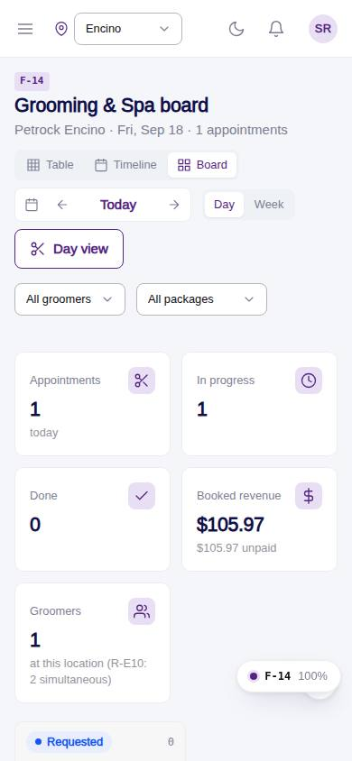
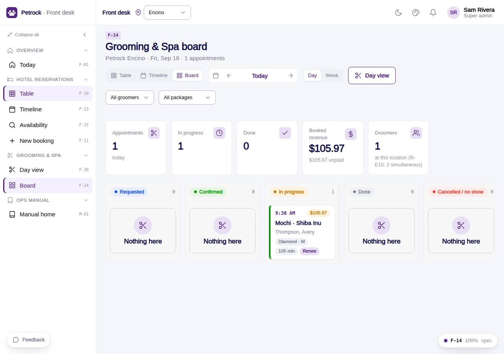

# F-14 · Grooming & Spa board

## Purpose

Kanban of the day's (or week's) Grooming & Spa appointments by status: Requested, Confirmed, In progress, Done, Cancelled / no show. Groomers and the desk drag cards through the day; cancelling or marking no-show needs a manager PIN. A card opens a drawer with the appointment (pet, customer, package, add-ons, groomer, price, vaccines, notes) and a status select as the keyboard alternative to dragging. No Figma board exists (open question 84); designed fresh per D-008.

## Screenshots

| 390 | 1280 |
| --- | --- |
|  |  |

## Sections (layout order)

1. PageHeader - ViewSwitch, day navigator, Day / Week, link to the grooming day view (F-30)
2. Filter bar - groomer, package
3. StatTiles - appointments, in progress, done, booked revenue (unpaid), groomers
4. `AppointmentBoard` - five columns, cards with time, pet · breed, customer, package · size, minutes, groomer, flags (vaccine, unpaid)
5. Appointment drawer - `BookingInfoGrid`, inclusions, add-ons, `PetVaccineStatus`, notes, linked hotel stay, status select
6. Close modal (Cancelled vs No show) -> PinApprovalModal

## Data

| Table | Read / write | Notes |
| --- | --- | --- |
| `appointments` | read / write | status, payment_status on cancel |
| `customers`, `pets`, `employees`, `packages`, `addons` | read | |
| `vaccine_records`, `vaccine_types` | read | flags |
| `approvals`, `audit_log` | write | PIN and status changes |

## Rules

- `R-X06` - cancelled / no-show need a manager PIN (R-I06 applied to appointments)
- `R-G01`, `R-G10` - package and size on the card, minutes from the appointment quote
- `R-E10` - two simultaneous grooming appointments per location (shown as a hint)
- `R-L02` - groomer colour is the card accent
- `R-I01` - status colours

## Logic

- Columns = `APPOINTMENT_STATUS` with cancelled and no_show merged into one locked column.
- Done appointments cannot move back (rebook instead).

## Components

PageHeader, SegmentedControl, ReservationDayNav, StatTile, Select, Badge, Avatar, Button, Drawer, Modal, RadioGroup, AppointmentBoard, BookingInfoGrid, PetVaccineStatus, EmptyState, PinApprovalModal.

## Real vs mock

Mock data. Creating and editing appointments (time, groomer, add-ons) belongs to the grooming module (F-30s); this board only moves status.

## Responsive check (D-016)

Checked at 360, 390, 768, 1280, 1920 (2026-09-18): columns scroll horizontally on desktop when narrower than five columns, and stack vertically under 768 px; no page overflow.

## Changelog

- `docs/changelog/_pending/frontdesk-reservations.md`
