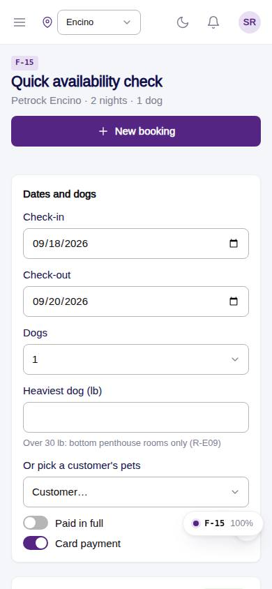
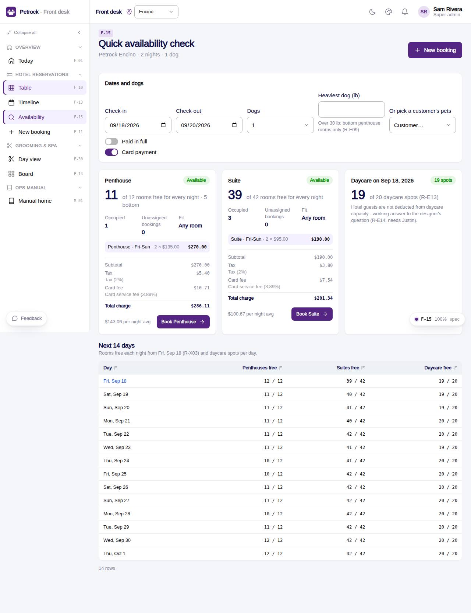

# F-15 · Quick availability check

## Purpose

The phone question answered in ten seconds: for these dates, this many dogs and this weight (or a customer's actual pets), which room types have rooms free for every night, do the fit rules allow it, what does it cost, and how full are the next two weeks. "Book this" opens the booking form prefilled.

## Screenshots

| 390 | 1280 |
| --- | --- |
|  |  |

## Sections (layout order)

1. PageHeader
2. Dates and dogs card - check-in, check-out, dogs, heaviest dog, or pick a customer's pets; paid in full, card
3. Result cards per room type - free / total, bottom rooms, occupied / unassigned / fit, R-X01 warning, quote (`BookingChargeSummary`), Book this
4. Daycare card - spots free on the check-in day
5. Next 14 days - `DataTable` of rooms free per night per type and daycare spots

## Data

| Table | Read / write | Notes |
| --- | --- | --- |
| `rooms`, `room_types`, `bookings` | read | `availabilityByType()` |
| `daycare_bookings`, `capacities` | read | daycare spots |
| `customers`, `pets` | read | pick pets |
| `rates`, `seasons`, `discounts`, `fees`, `taxes` | read | `quoteHotel()` |

## Rules

- `R-X03` - free = active rooms - occupied on any night - unassigned overlapping bookings
- `R-E09`, `R-X01` - fit rules and the suite warning
- `R-E11`, `R-E12`, `R-E13` - capacities from the rooms and capacities tables
- `R-E14` - hotel guests not deducted from daycare capacity (working answer, needs Justin)
- `R-D05`, `R-E01`, `R-E04` - quote lines

## Logic

- Same-day check-in / check-out still blocks one night in the availability maths.
- "Book this" passes `checkIn`, `checkOut`, `roomType`, `customer`, `pets` as query parameters to F-11.

## Components

PageHeader, Card, Input, Select, Toggle, Button, Badge, Checkbox, BookingInfoGrid, BookingChargeSummary, DataTable, Section.

## Real vs mock

Mock data; the maths is the same function the form and the timeline use.

## Responsive check (D-016)

Checked at 360, 390, 768, 1280, 1920 (2026-09-18): result cards stack on phones; the 14-day table becomes cards under 480 px; no overflow.

## Changelog

- `docs/changelog/_pending/frontdesk-reservations.md`
