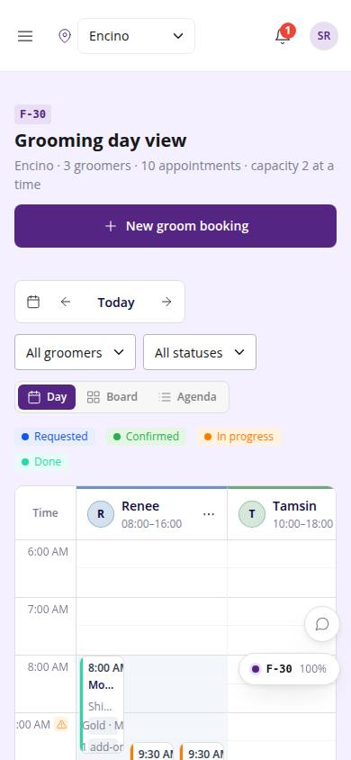
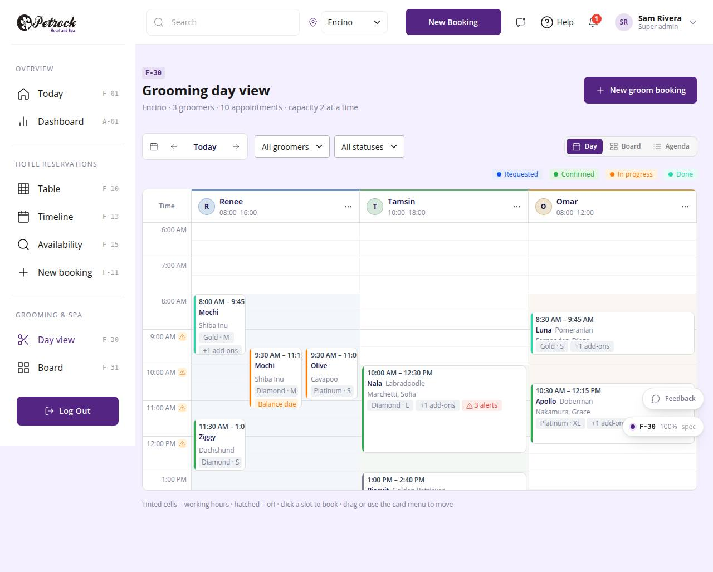

# F-30 · Grooming day view

## Purpose

Run the grooming day at one location: groomer columns tinted by working hours, appointments by time, flags for vaccines / payment / unconfirmed, column order-colour-hide per user, click a slot to book, drag to reschedule.

## Screenshots

| 390 | 1280 |
| --- | --- |
|  |  |

Dark: `../screenshots/F-30/390-dark.jpg`, `../screenshots/F-30/1280-dark.jpg`, `../screenshots/F-30/3840-dark.jpg` (light 4K: `../screenshots/F-30/3840.jpg`).

Before the 2026-09-21 look-and-feel pass (prompt 0018): `../screenshots/F-30/390-before.jpg`, `../screenshots/F-30/1280-before.jpg` - the D-17 screenshot diff at `/#/dev/qa/screenshots` shows before and after side by side.

## Sections (layout order)

1. PageHeader (title, New groom booking)
2. GroomingDateNav + filters (groomer, status) + view toggle (Day / Board / Agenda)
3. Legend row (right-aligned status dots + hidden-column chips)
4. GroomDayGrid (time x groomers; white heads with an initials disc and a thin coloured top border, 8 % working-hours tint, hatched off hours, side-by-side lanes for overlaps, over-capacity warning chip, now hairline with a time chip)
5. Helper line under the grid

## Data

| Table | Read / write | Notes |
| --- | --- | --- |
| `appointments` | read + write (reschedule by drag) | |
| `appointment_extras` | read | |
| `employees` | read | |
| `groomer_column_prefs` | read + write (per user) | |
| `customers` | read | |
| `pets` | read | |
| `vaccine_records` | read | |
| `vaccine_types` | read | |
| `packages` | read | |
| `capacities` | read | |
| `locations` | read | |

## Rules

- `R-G20` - see `src/rules/` (registry) and the Rules tab of the inspector on this page
- `R-G21` - see `src/rules/` (registry) and the Rules tab of the inspector on this page
- `R-A11` - see `src/rules/` (registry) and the Rules tab of the inspector on this page
- `R-X62` - see `src/rules/` (registry) and the Rules tab of the inspector on this page
- `R-G10` - see `src/rules/` (registry) and the Rules tab of the inspector on this page
- `R-G17` - see `src/rules/` (registry) and the Rules tab of the inspector on this page
- `R-E10` - see `src/rules/` (registry) and the Rules tab of the inspector on this page
- `R-J08` - see `src/rules/` (registry) and the Rules tab of the inspector on this page

## Logic

- Cards are ScheduleCards: pet + breed, customer, package · size chips; the R-G20 string "Owner Last, PET; Breed; Package Size" stays as the card's accessible name and tooltip
- Vaccine flag from petVaccineSummary (R-A11) rendered as an alert Badge with text, never a bare icon
- Grid hours from location hours ±1h; working hours are an 8 % tint of the groomer hue, off hours a neutral hatch
- Overlapping appointments split the column into n side-by-side lanes
- Over-capacity hours get a warning chip beside the neutral hour label when overlaps > capacities.grooming (R-G21)
- Column prefs upsert to groomer_column_prefs per user + location (R-X62); swatches are the groomerHues tokens
- Now hairline only when the shown day is today
- Compact cards show at most one alert chip ("N alerts" when several); the full list stays in the card's accessible name and tooltip
- Drag / slot click writes appointments.starts_at + groomer_id (audit)

## Components

`PageHeader`, `GroomingDateNav`, `SegmentedControl`, `Select`, `Chip`, `Button`, `GroomDayGrid`, `ScheduleCard`, `Badge`, `PetVaccineChip`, `EmptyState`.

## Actions (D-196, D-197)

Declared in the page spec; this is what a voice / agent controller and the future WebMCP tools drive. Every UI change on this page updates the list in the same commit.

| id | Label | Intent | Permission | Params |
| --- | --- | --- | --- | --- |
| `grooming.setDay` | Change the day | show another day in the grooming day view | - | `day: date` |
| `grooming.filterGroomer` | Filter by groomer | show only one groomer column | - | `groomer: id` |
| `grooming.filterStatus` | Filter by status | show only appointments in one status | - | `status: string` |
| `grooming.openAppointment` | Open an appointment | open one appointment | - | `id: id` |
| `grooming.bookSlot` | Book an empty slot | start a groom booking at that time with that groomer | `appointments.write` | `groomer: id, time: string` |
| `grooming.reschedule` | Reschedule an appointment | move an appointment to another groomer or time | `appointments.write` | `id: id, groomer: id, time: string` |
| `grooming.moveColumn` | Reorder a groomer column | move a groomer column left or right | - | `groomer: id, direction: enum:-1,1` |
| `grooming.colourColumn` | Recolour a groomer column | change the colour of a groomer column | - | `groomer: id, colour: string` |
| `grooming.hideColumn` | Hide a groomer column | hide a groomer column | - | `groomer: id` |
| `grooming.showColumn` | Show a hidden column | bring a hidden groomer column back | - | `groomer: id` |
| `grooming.newBooking` | New groom booking | start a new grooming appointment | `appointments.write` | - |

## Real vs mock

Real: appointments, groomers, prefs and capacity come from the tables; drag / slot booking write through the DataProvider. Mock: localStorage data; working hours are seeded JSON. Company-OS: same calls through CompanyOsProvider.

## Responsive check (D-016)

Checked at 360, 390, 768, 1280, 1920, 2560 and 3840, light and dark (2026-09-21, D-194): horizontal scroll with a sticky time column on phones (columns 160 px); groomer heads, the initials disc and the working-hours tint hold up at 4K; lanes for overlapping appointments split evenly at every width. The legend row wraps below the toolbar under 900 px.

## Changelog

- `docs/changelog/_pending/frontdesk-grooming-people.md` (to be merged into the next numbered entry)
- 0032 - look-and-feel pass: one `ScheduleCard` and one `AppointmentBoard` (D-231, D-234), calm timeline grid (D-232), muted groomer hues with lanes (D-233), desk-table `num` tone and section rows (D-235); spec `actions` added, `checkedAt` to 3840.
