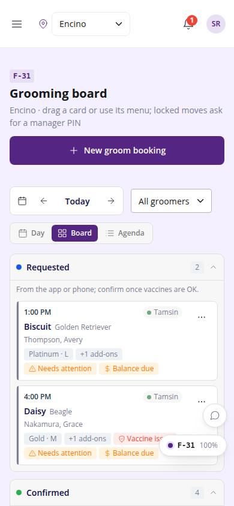
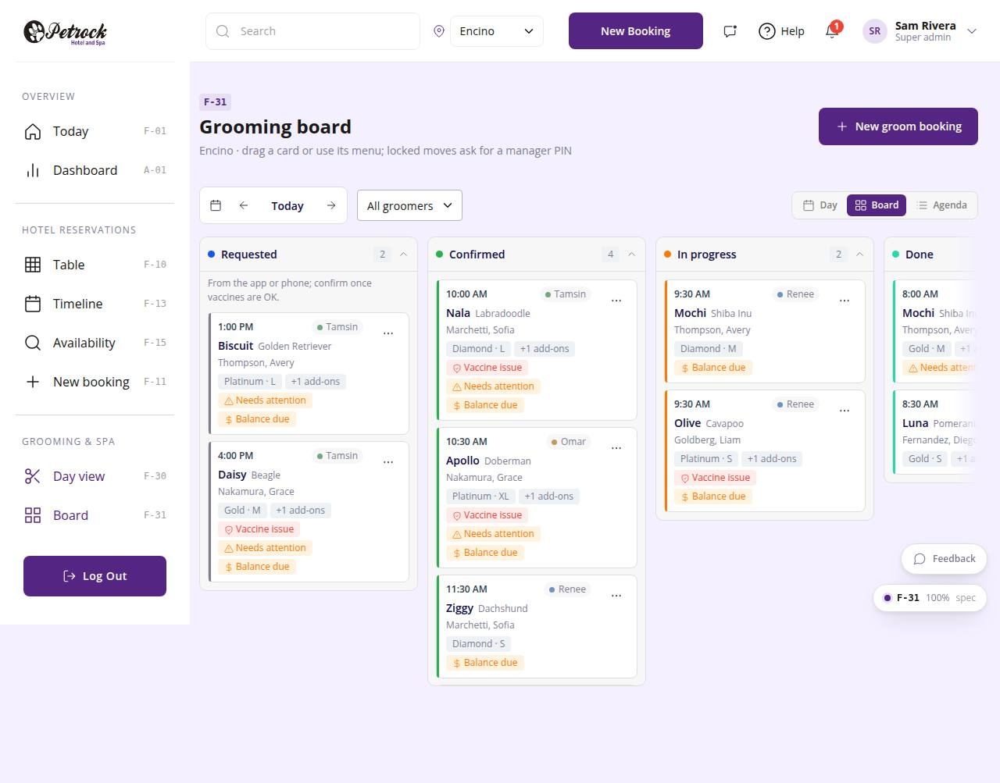

# F-31 · Grooming board

## Purpose

Kanban of the day's appointments by status (requested, confirmed, in progress, done, cancelled / no show) with drag or "Move to" transitions, PIN-gated where the lifecycle says so.

## Screenshots

| 390 | 1280 |
| --- | --- |
|  |  |

Dark: `../screenshots/F-31/390-dark.jpg`, `../screenshots/F-31/1280-dark.jpg`.

Before the 2026-09-21 look-and-feel pass (prompt 0018): `../screenshots/F-31/390-before.jpg`, `../screenshots/F-31/1280-before.jpg` - the D-17 screenshot diff at `/#/dev/qa/screenshots` shows before and after side by side.

## Sections (layout order)

1. PageHeader
2. GroomingDateNav + groomer filter + view toggle
3. AppointmentBoard (6 status columns: dot + label + count + collapse; ScheduleCards; cancelled / no show collapsed by default)
4. PinApprovalModal

## Data

| Table | Read / write | Notes |
| --- | --- | --- |
| `appointments` | read + write (status) | |
| `employees` | read | |
| `customers` | read | |
| `pets` | read | |
| `packages` | read | |
| `vaccine_records` | read | |
| `vaccine_types` | read | |
| `approvals` | read + write (via PinApprovalModal) | |
| `audit_log` | read + write | |

## Rules

- `R-X63` - see `src/rules/` (registry) and the Rules tab of the inspector on this page
- `R-I06` - see `src/rules/` (registry) and the Rules tab of the inspector on this page
- `R-J08` - see `src/rules/` (registry) and the Rules tab of the inspector on this page
- `R-G20` - see `src/rules/` (registry) and the Rules tab of the inspector on this page
- `R-I01` - see `src/rules/` (registry) and the Rules tab of the inspector on this page

## Logic

- Allowed moves from APPOINTMENT_TRANSITIONS (mirror of the booking lifecycle), offered both by dragging and from the card menu (D-195)
- confirmed -> cancelled / no_show and re-open need a manager PIN (R-X63); those entries carry a lock
- Cards are ScheduleCards: pet + breed, customer, groomer chip, package · size; the R-G20 string is the accessible name
- Every move writes audit_log (R-J08)

## Components

`PageHeader`, `GroomingDateNav`, `SegmentedControl`, `Select`, `AppointmentBoard`, `ScheduleCard`, `Badge`, `PinApprovalModal`, `Toast`.

## Actions (D-196, D-197)

Declared in the page spec; this is what a voice / agent controller and the future WebMCP tools drive. Every UI change on this page updates the list in the same commit.

| id | Label | Intent | Permission | Params |
| --- | --- | --- | --- | --- |
| `grooming.setDay` | Change the day | show another day on the grooming board | - | `day: date` |
| `grooming.filterGroomer` | Filter by groomer | show only one groomer's appointments | - | `groomer: id` |
| `grooming.openAppointment` | Open an appointment | open one appointment | - | `id: id` |
| `grooming.moveStatus` | Move an appointment | move an appointment to another status column | `appointments.write` | `id: id, status: enum:requested,confirmed,in_progress,done,cancelled,no_show` |
| `grooming.collapseColumn` | Collapse a column | collapse or expand a board column | - | `column: string` |
| `grooming.newBooking` | New groom booking | start a new grooming appointment | `appointments.write` | - |

## Real vs mock

Real: transitions and PIN approvals write appointments / approvals / audit_log. Mock: PIN check is the FNV-1a hash mock.

## Responsive check (D-016)

Checked at 360, 390, 768, 1280, 1920, 2560 and 3840, light and dark (2026-09-21, D-194): the six status columns scroll sideways with scroll-snap and an edge fade; collapsed columns keep their dot, label and count; the card menu opens in place and is reachable by keyboard at every width.

## Changelog

- `docs/changelog/_pending/frontdesk-grooming-people.md` (to be merged into the next numbered entry)
- 0032 - look-and-feel pass: one `ScheduleCard` and one `AppointmentBoard` (D-231, D-234), calm timeline grid (D-232), muted groomer hues with lanes (D-233), desk-table `num` tone and section rows (D-235); spec `actions` added, `checkedAt` to 3840.
