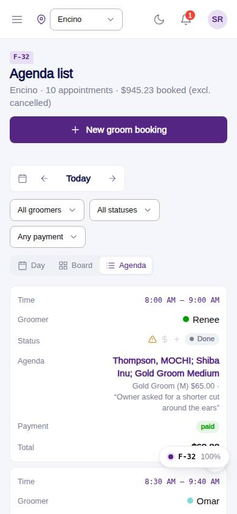
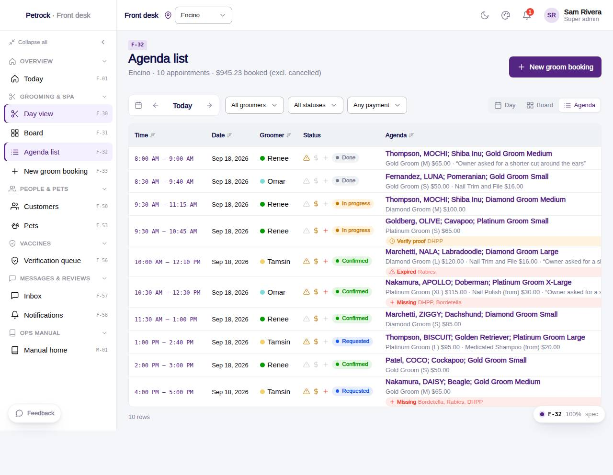

# F-32 · Grooming agenda list

## Purpose

Table of the day's grooming appointments (Time, Groomer, Status flags, Agenda with package + add-on line items, Payment, Total) with filters and a date navigator.

## Screenshots

| 390 | 1280 |
| --- | --- |
|  |  |

Dark variant: not a key page (theme tokens apply; checked manually).

## Sections (layout order)

1. PageHeader with day total
2. Toolbar - date nav, groomer / status / payment filters, view toggle
3. DataTable - Time (link), Date, Groomer (colour dot), Status flags (warning · coin · cross) + badge, Agenda (R-G20 label + line items + vaccine chip), Payment, Total

## Data

| Table | Read / write | Notes |
| --- | --- | --- |
| `appointments` | read | |
| `appointment_extras` | read | |
| `employees` | read | |
| `customers` | read | |
| `pets` | read | |
| `packages` | read | |
| `addons` | read | |
| `fees` | read | |
| `taxes` | read | |
| `vaccine_records` | read | |
| `vaccine_types` | read | |

## Rules

- `R-A11` - see `src/rules/` (registry) and the Rules tab of the inspector on this page
- `R-G01` - see `src/rules/` (registry) and the Rules tab of the inspector on this page
- `R-G11` - see `src/rules/` (registry) and the Rules tab of the inspector on this page
- `R-H04` - see `src/rules/` (registry) and the Rules tab of the inspector on this page
- `R-H03` - see `src/rules/` (registry) and the Rules tab of the inspector on this page

## Logic

- Line items recomputed by quoteForAppointment from packages / addons / fees / taxes (never hardcoded)
- Status flag icons: warning (requested / note), coin (payment pending), cross (vaccine issue)
- Day totals = sum of totals excluding cancelled / no-show

## Components

`PageHeader`, `GroomingDateNav`, `SegmentedControl`, `DataTable`, `GroomStatusBadge`, `PetVaccineChip`, `Badge`, `Icon`, `Button`

## Real vs mock

Real: line items recomputed live from packages / addons / taxes / fees. Mock: none beyond localStorage.

## Responsive check (D-016)

Checked at: 360, 390, 768, 1280, 1920 with Playwright (no console errors, no horizontal overflow). Phones: DataTable falls back to cards.

## Changelog

- `docs/changelog/_pending/frontdesk-grooming-people.md` (to be merged into the next numbered entry)
