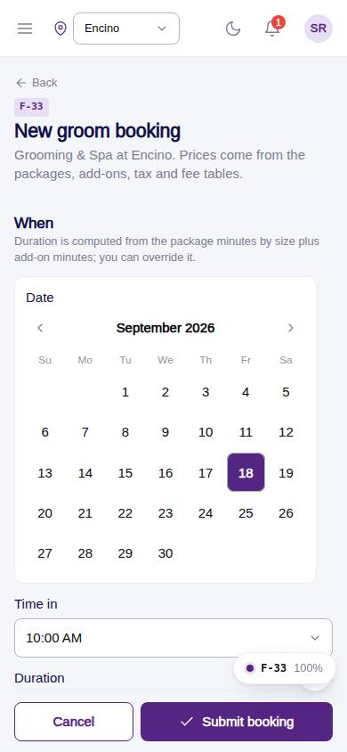
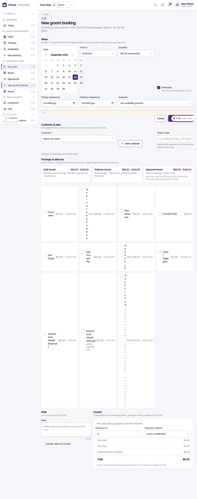

# F-33 · Groom booking form

## Purpose

Create or edit a Grooming & Spa appointment at the desk: date, time, groomer, customer (+ New customer), one or more pets with vaccine status, package priced by size, add-ons, discount (PIN), payment method, invoice preview, note.

## Screenshots

| 390 | 1280 |
| --- | --- |
|  |  |

Dark: `../screenshots/F-33/390-dark.jpg`, `../screenshots/F-33/1280-dark.jpg`.

## Sections (layout order)

1. When - date, time, computed duration (override), reminder, pickup / delivery, groomer with busy hint; capacity warning
2. Customer & pets - customer select, New customer, Open customer, groom style; pet cards with vaccine chip and attributes; vaccine notice
3. Package & add-ons - three package cards priced for the chosen pets; add-on checkboxes with price and added minutes
4. Note + Include notes on invoice
5. Invoice - live lines, discount % (PIN), payment method, sub total / discount / tax / fee / total
6. Sticky footer - Cancel / Submit
7. PinApprovalModal for the discount

## Data

| Table | Read / write | Notes |
| --- | --- | --- |
| `appointments` | read + write | |
| `appointment_extras` | read + write | |
| `customers` | read | |
| `pets` | read | |
| `pet_profiles` | read | |
| `employees` | read | |
| `packages` | read | |
| `addons` | read | |
| `fees` | read | |
| `taxes` | read | |
| `vaccine_records` | read | |
| `vaccine_types` | read | |
| `capacities` | read | |
| `approvals` | read + write (discount) | |
| `audit_log` | read + write | |
| `notifications` | read + write (customer) | |

## Rules

- `R-G01` - see `src/rules/` (registry) and the Rules tab of the inspector on this page
- `R-G10` - see `src/rules/` (registry) and the Rules tab of the inspector on this page
- `R-G13` - see `src/rules/` (registry) and the Rules tab of the inspector on this page
- `R-G16` - see `src/rules/` (registry) and the Rules tab of the inspector on this page
- `R-G17` - see `src/rules/` (registry) and the Rules tab of the inspector on this page
- `R-G21` - see `src/rules/` (registry) and the Rules tab of the inspector on this page
- `R-X64` - see `src/rules/` (registry) and the Rules tab of the inspector on this page
- `R-J05` - see `src/rules/` (registry) and the Rules tab of the inspector on this page
- `R-J06` - see `src/rules/` (registry) and the Rules tab of the inspector on this page
- `R-I11` - see `src/rules/` (registry) and the Rules tab of the inspector on this page
- `R-J02` - see `src/rules/` (registry) and the Rules tab of the inspector on this page
- `R-J03` - see `src/rules/` (registry) and the Rules tab of the inspector on this page
- `R-A11` - see `src/rules/` (registry) and the Rules tab of the inspector on this page
- `R-H03` - see `src/rules/` (registry) and the Rules tab of the inspector on this page
- `R-H04` - see `src/rules/` (registry) and the Rules tab of the inspector on this page

## Logic

- Duration = package minutes by size + add-on minutes (R-G10, R-G13); default 1 h when no package (R-G17)
- Quote via quoteGrooming (packages, addons, taxes, card fee)
- Discount > 0 opens PinApprovalModal action discount.apply (R-X64)
- One appointment row per pet (R-G16)
- Status: confirmed when vaccines OK, requested otherwise
- Capacity warning when overlaps >= capacities.grooming (R-G21)
- New customer returns via ?return= with the new id (R-J05)

## Components

`PageHeader`, `Section`, `DatePicker`, `TimePicker`, `Input`, `Select`, `Checkbox`, `Chip`, `RadioGroup`, `Textarea`, `Button`, `Card`, `PetVaccineChip`, `Badge`, `PinApprovalModal`, `Toast`

## Real vs mock

Real: pricing from tables, capacity check, one row per pet, PIN for discounts, customer notification rows. Mock: no deposit is taken here (PaymentProvider used on F-59); recurrence not built (R-G18).

## Responsive check (D-016)

Checked at: 360, 390, 768, 1280, 1920 with Playwright (no console errors, no horizontal overflow). Phones: form grid collapses to one column; sticky action footer.

## Changelog

- `docs/changelog/_pending/frontdesk-grooming-people.md` (to be merged into the next numbered entry)
