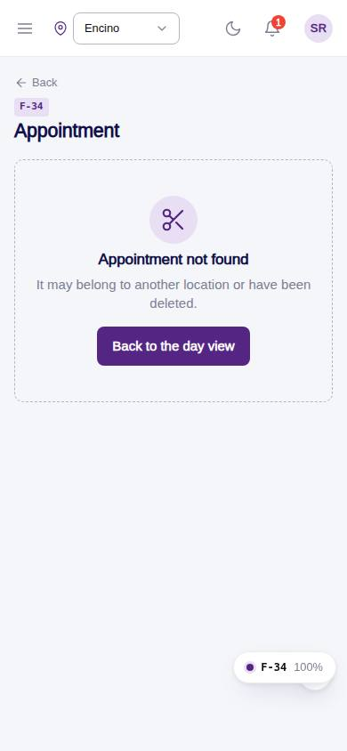
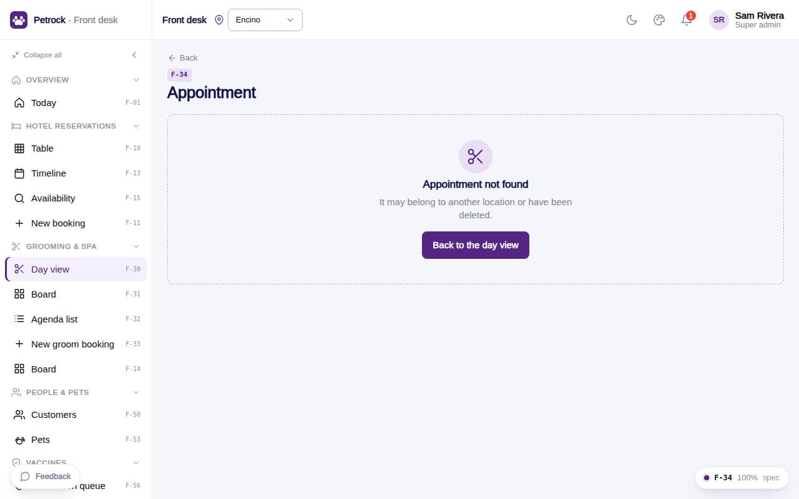

# F-34 · Grooming appointment detail

## Purpose

Read one appointment like the Figma booking detail: customer card, pet, status and payment, date / time / groomer, note, line items and total; change status (PIN where gated), edit, message the customer, open the invoice.

## Screenshots

| 390 | 1280 |
| --- | --- |
|  |  |

Dark variant: not a key page (theme tokens apply; checked manually).

## Sections (layout order)

1. PageHeader - code, status eyebrow, Edit, Invoice
2. CustomerSummaryCard with pet, breed, size, vaccine chip
3. Facts card - Date, Time, Groomer, Payment status, Contact, Reason, Groom style, Reminder, Pickup / delivery
4. Additional information - note, attributes, medical; Status actions (PIN where gated); Message / Vaccines links
5. Your appointment - line items with inclusions, sub total, tax / fee / discount, total

## Data

| Table | Read / write | Notes |
| --- | --- | --- |
| `appointments` | read + write (status) | |
| `appointment_extras` | read | |
| `customers` | read | |
| `pets` | read | |
| `employees` | read | |
| `packages` | read | |
| `addons` | read | |
| `fees` | read | |
| `taxes` | read | |
| `vaccine_records` | read | |
| `vaccine_types` | read | |
| `invoices` | read | |
| `approvals` | read + write | |
| `audit_log` | read + write | |

## Rules

- `R-I03` - see `src/rules/` (registry) and the Rules tab of the inspector on this page
- `R-X63` - see `src/rules/` (registry) and the Rules tab of the inspector on this page
- `R-J08` - see `src/rules/` (registry) and the Rules tab of the inspector on this page
- `R-A11` - see `src/rules/` (registry) and the Rules tab of the inspector on this page
- `R-G01` - see `src/rules/` (registry) and the Rules tab of the inspector on this page
- `R-H04` - see `src/rules/` (registry) and the Rules tab of the inspector on this page

## Logic

- Lines from quoteForAppointment (stored total shown when it differs)
- Transitions from APPOINTMENT_TRANSITIONS; PIN per R-X63
- Audit on every change (R-J08)

## Components

`PageHeader`, `CustomerSummaryCard`, `Card`, `GroomStatusBadge`, `Badge`, `PetVaccineChip`, `Button`, `PinApprovalModal`, `Toast`, `EmptyState`

## Real vs mock

Real: quote recomputed from tables; status actions gated by PIN. Mock: PIN hash.

## Responsive check (D-016)

Checked at: 360, 390, 768, 1280, 1920 with Playwright (no console errors, no horizontal overflow). Phones: two-column layout stacks.

## Changelog

- `docs/changelog/_pending/frontdesk-grooming-people.md` (to be merged into the next numbered entry)
