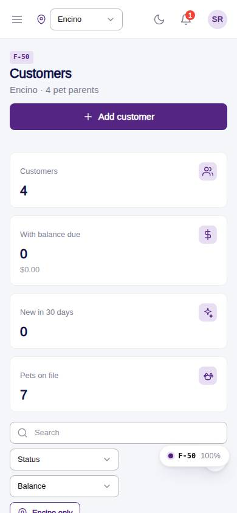
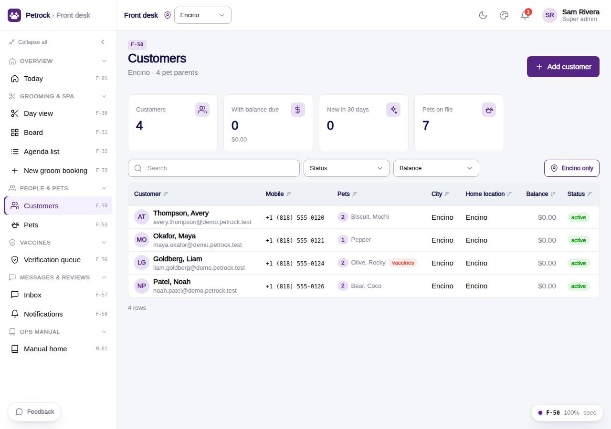

# F-50 · Customers

## Purpose

Find any pet parent: searchable table with pets, phone, email, home location, balance and status; add a customer; open the detail.

## Screenshots

| 390 | 1280 |
| --- | --- |
|  |  |

Dark variant: not a key page (theme tokens apply; checked manually).

## Sections (layout order)

1. PageHeader - Add customer
2. StatTiles - Customers, With balance due, New in 30 days, Pets on file
3. DataTable - search, Status / Balance filters, location toggle; columns Customer, Mobile, Pets, City, Home location, Balance, Status

## Data

| Table | Read / write | Notes |
| --- | --- | --- |
| `customers` | read | |
| `customer_profiles` | read | |
| `pets` | read | |
| `locations` | read | |

## Rules

- `R-J07` - see `src/rules/` (registry) and the Rules tab of the inspector on this page
- `R-K05` - see `src/rules/` (registry) and the Rules tab of the inspector on this page

## Logic

- Default filter = current location (home_location_id) unless all-locations mode
- Balance due tile sums customers.balance > 0

## Components

`PageHeader`, `StatTile`, `DataTable`, `Avatar`, `Badge`, `Button`

## Real vs mock

Real: table joins; location scope toggle. Mock: none.

## Responsive check (D-016)

Checked at: 360, 390, 768, 1280, 1920 with Playwright (no console errors, no horizontal overflow). Phones: DataTable falls back to cards.

## Changelog

- `docs/changelog/_pending/frontdesk-grooming-people.md` (to be merged into the next numbered entry)
