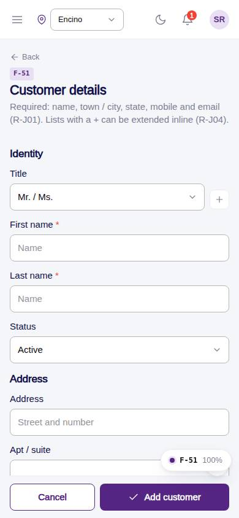
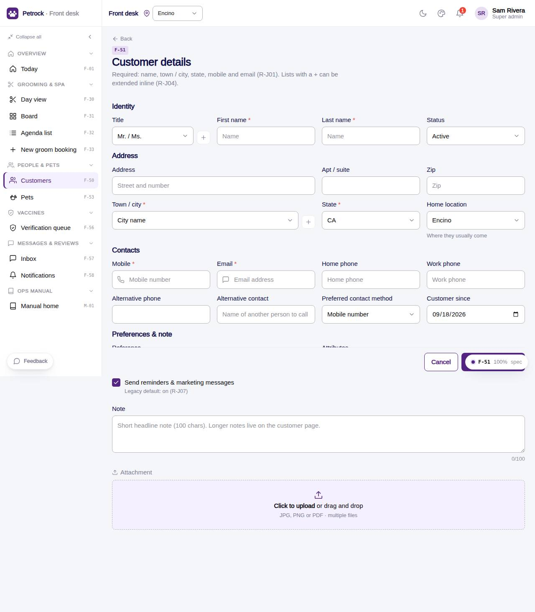

# F-51 · Add / edit customer

## Purpose

The Figma Customer Details form: identity, address, contacts, preferred contact, reference, attributes, note (100 chars) and attachment; validates the required fields.

## Screenshots

| 390 | 1280 |
| --- | --- |
|  |  |

Dark variant: not a key page (theme tokens apply; checked manually).

## Sections (layout order)

1. Identity - title (+), first, last, status
2. Address - address, apt, zip, town / city (+), state, home location
3. Contacts - mobile*, email*, home, work, alt phone, alt contact, preferred method, customer since
4. Preferences & note - reference (+), attributes (+ chips), marketing opt-in, note (0/100), attachment dropzone
5. Sticky footer - Cancel / Add customer

## Data

| Table | Read / write | Notes |
| --- | --- | --- |
| `customers` | read + write | |
| `customer_profiles` | read + write | |
| `lookup_values` | read + write (+ add) | |
| `attachments` | read + write (mock) | |
| `locations` | read | |
| `audit_log` | read + write | |

## Rules

- `R-J01` - see `src/rules/` (registry) and the Rules tab of the inspector on this page
- `R-J02` - see `src/rules/` (registry) and the Rules tab of the inspector on this page
- `R-J04` - see `src/rules/` (registry) and the Rules tab of the inspector on this page
- `R-J05` - see `src/rules/` (registry) and the Rules tab of the inspector on this page
- `R-J07` - see `src/rules/` (registry) and the Rules tab of the inspector on this page
- `R-J11` - see `src/rules/` (registry) and the Rules tab of the inspector on this page

## Logic

- Required: first, last, city, state, mobile, email (R-J01)
- Defaults: active, mobile contact, since today, marketing on (R-J07)
- Lookups extendable inline (R-J04)
- ?return= sends the new id back to the caller (R-J05)

## Components

`PageHeader`, `Section`, `Input`, `Select`, `DeskLookupSelect`, `Checkbox`, `Textarea`, `DeskAttachmentDropzone`, `Button`, `Toast`

## Real vs mock

Real: validation, lookups extended inline, profile extras. Mock: attachments are mock:// URLs (no storage yet).

## Responsive check (D-016)

Checked at: 360, 390, 768, 1280, 1920 with Playwright (no console errors, no horizontal overflow). Phones: form grid collapses to one column; sticky action footer.

## Changelog

- `docs/changelog/_pending/frontdesk-grooming-people.md` (to be merged into the next numbered entry)
