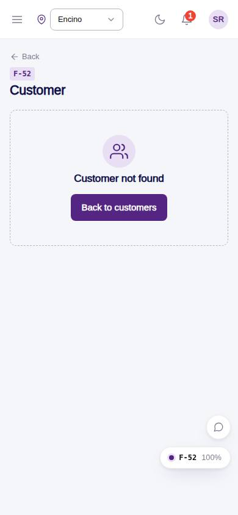
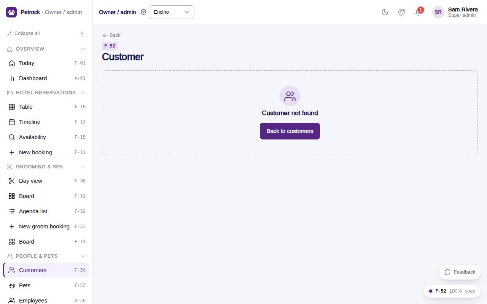

# F-52 · Customer detail

## Purpose

Everything about one pet parent: contact card with balance, pets with vaccine standing, hotel bookings, grooming appointments, daycare days, invoices, notes timeline; edit, add pet, message, deactivate (PIN).

## Screenshots

| 390 | 1280 |
| --- | --- |
|  |  |

Dark: `../screenshots/F-52/390-dark.jpg`, `../screenshots/F-52/1280-dark.jpg`.

## Sections (layout order)

1. PageHeader - Edit, Message, Add pet
2. CustomerSummaryCard - contact, balance, pets, since, extras row, headline note
3. Tabs - Pets (cards) / Hotel / Grooming / Daycare / Invoices / Notes
4. Deactivate customer (PIN)

## Data

| Table | Read / write | Notes |
| --- | --- | --- |
| `customers` | read + write (status via PIN) | |
| `customer_profiles` | read | |
| `pets` | read | |
| `vaccine_records` | read | |
| `vaccine_types` | read | |
| `bookings` | read | |
| `booking_pets` | read | |
| `appointments` | read | |
| `daycare_bookings` | read | |
| `invoices` | read | |
| `customer_notes` | read + write | |
| `conversations` | read | |
| `attachments` | read | |
| `approvals` | read + write | |
| `audit_log` | read + write | |

## Rules

- `R-X68` - see `src/rules/` (registry) and the Rules tab of the inspector on this page
- `R-A11` - see `src/rules/` (registry) and the Rules tab of the inspector on this page
- `R-J02` - see `src/rules/` (registry) and the Rules tab of the inspector on this page
- `R-I01` - see `src/rules/` (registry) and the Rules tab of the inspector on this page

## Logic

- Balance = customers.balance + unpaid invoice balances
- Deactivate = soft delete with PIN record.delete (R-X68)
- Notes: add, pin

## Components

`PageHeader`, `CustomerSummaryCard`, `Tabs`, `Card`, `DataTable`, `StatusBadge`, `GroomStatusBadge`, `PetVaccineChip`, `Badge`, `Textarea`, `Button`, `EmptyState`, `PinApprovalModal`, `Toast`

## Real vs mock

Real: notes timeline, soft delete with PIN, balance = customers.balance + open invoice balances. Mock: none.

## Responsive check (D-016)

Checked at: 360, 390, 768, 1280, 1920 with Playwright (no console errors, no horizontal overflow). Phones: two-column layout stacks.

## Changelog

- `docs/changelog/_pending/frontdesk-grooming-people.md` (to be merged into the next numbered entry)
- 0019 - QA fixes: Pinned staff get the not-found state for a pet parent whose home location is the other one; the All-locations toggle on F-51 shows only for roles that may switch.
