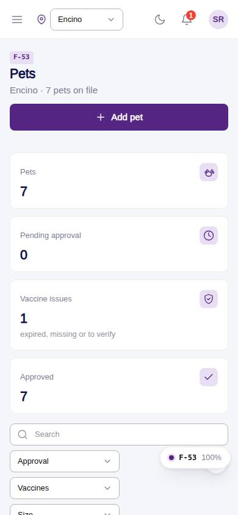
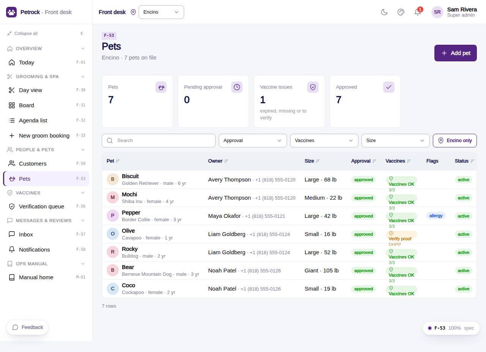

# F-53 · Pets

## Purpose

All pets with owner, breed, size / weight, approval and vaccine standing; filters for pending approval and vaccine issues; add a pet.

## Screenshots

| 390 | 1280 |
| --- | --- |
|  |  |

Dark variant: not a key page (theme tokens apply; checked manually).

## Sections (layout order)

1. PageHeader - Add pet
2. StatTiles - Pets, Pending approval, Vaccine issues, Approved
3. DataTable - search, Approval / Vaccines / Size filters, location toggle

## Data

| Table | Read / write | Notes |
| --- | --- | --- |
| `pets` | read | |
| `customers` | read | |
| `vaccine_records` | read | |
| `vaccine_types` | read | |
| `locations` | read | |

## Rules

- `R-A11` - see `src/rules/` (registry) and the Rules tab of the inspector on this page
- `R-A04` - see `src/rules/` (registry) and the Rules tab of the inspector on this page
- `R-B11` - see `src/rules/` (registry) and the Rules tab of the inspector on this page
- `R-G01` - see `src/rules/` (registry) and the Rules tab of the inspector on this page

## Logic

- Vaccine standing per pet via petVaccineSummary (R-A11)
- Size from weight when missing (sizeFromWeightLbs)

## Components

`PageHeader`, `StatTile`, `DataTable`, `Avatar`, `Badge`, `PetVaccineChip`, `Button`

## Real vs mock

Real: vaccine standing per pet computed from records. Mock: none.

## Responsive check (D-016)

Checked at: 360, 390, 768, 1280, 1920 with Playwright (no console errors, no horizontal overflow). Phones: DataTable falls back to cards.

## Changelog

- `docs/changelog/_pending/frontdesk-grooming-people.md` (to be merged into the next numbered entry)
