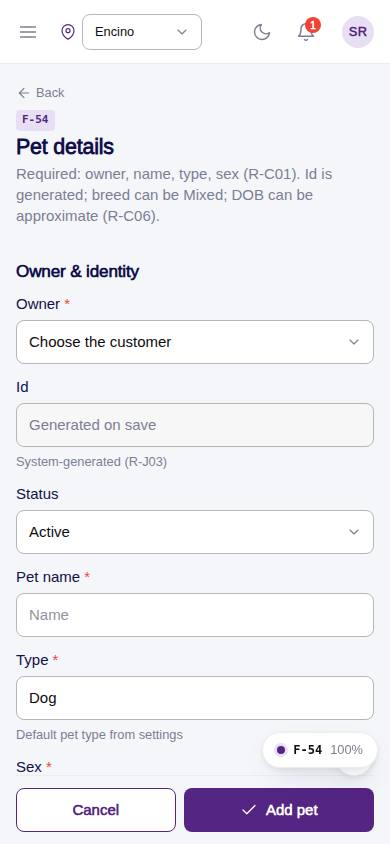
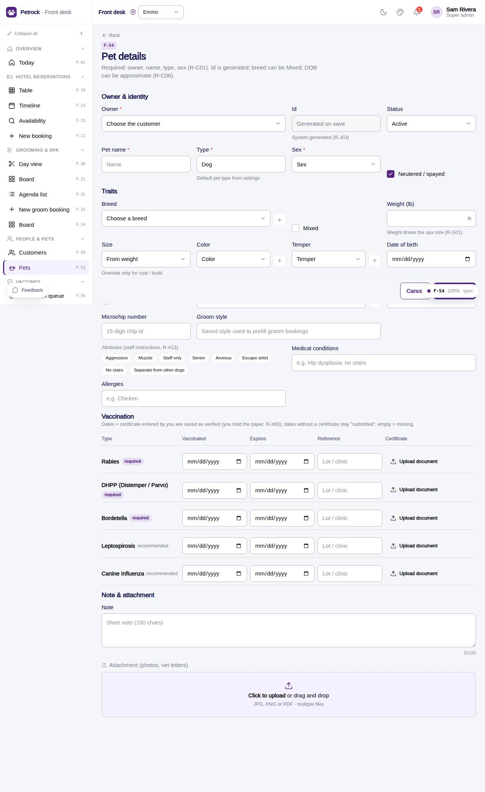

# F-54 · Add / edit pet

## Purpose

The Figma Pet Details form: owner, identity (id read-only), breed (+) / mixed, size, sex, weight, colour (+), temper, DOB / approximate, vet (+), registration and microchip, attributes, the vaccination table with certificate upload, note, attachment.

## Screenshots

| 390 | 1280 |
| --- | --- |
|  |  |

Dark variant: not a key page (theme tokens apply; checked manually).

## Sections (layout order)

1. Owner & identity - owner*, id (read-only), status, name*, type*, sex*, neutered
2. Traits - breed (+) / mixed, weight -> auto size, size override, color (+), temper (+), DOB / approximate, vet (+), registration, microchip, groom style, attribute chips, medical, allergies
3. Vaccination - one row per vaccine type: vaccinated, expires (auto +1 year), reference, certificate upload
4. Note & attachment
5. Sticky footer - Cancel / Add pet

## Data

| Table | Read / write | Notes |
| --- | --- | --- |
| `pets` | read + write | |
| `pet_profiles` | read + write | |
| `customers` | read | |
| `vets` | read + write (+ add) | |
| `vaccine_types` | read | |
| `vaccine_records` | read + write | |
| `lookup_values` | read + write (+ add) | |
| `attachments` | read + write (mock) | |
| `audit_log` | read + write | |

## Rules

- `R-C01` - see `src/rules/` (registry) and the Rules tab of the inspector on this page
- `R-C06` - see `src/rules/` (registry) and the Rules tab of the inspector on this page
- `R-B03` - see `src/rules/` (registry) and the Rules tab of the inspector on this page
- `R-B08` - see `src/rules/` (registry) and the Rules tab of the inspector on this page
- `R-J04` - see `src/rules/` (registry) and the Rules tab of the inspector on this page
- `R-J02` - see `src/rules/` (registry) and the Rules tab of the inspector on this page
- `R-X65` - see `src/rules/` (registry) and the Rules tab of the inspector on this page
- `R-A13` - see `src/rules/` (registry) and the Rules tab of the inspector on this page

## Logic

- Required: owner, name, type, sex (R-C01)
- Size auto from weight (working bands) unless overridden
- Expiry defaults to vaccinated + 1 year
- Certificate + dates by a verifier = verified; dates only = submitted; none = missing (R-X65)
- Approval status recomputed from required vaccines

## Components

`PageHeader`, `Section`, `Input`, `Select`, `DeskLookupSelect`, `Checkbox`, `DatePicker`, `Textarea`, `DeskAttachmentDropzone`, `Badge`, `Button`, `Toast`

## Real vs mock

Real: pet + profile + vaccine records, approval recomputed (settleVaccineStatus). Mock: certificate files are mock:// URLs; desk-entered certificates are verified on entry (R-X65).

## Responsive check (D-016)

Checked at: 360, 390, 768, 1280, 1920 with Playwright (no console errors, no horizontal overflow). Phones: form grid collapses to one column; sticky action footer.

## Changelog

- `docs/changelog/_pending/frontdesk-grooming-people.md` (to be merged into the next numbered entry)
