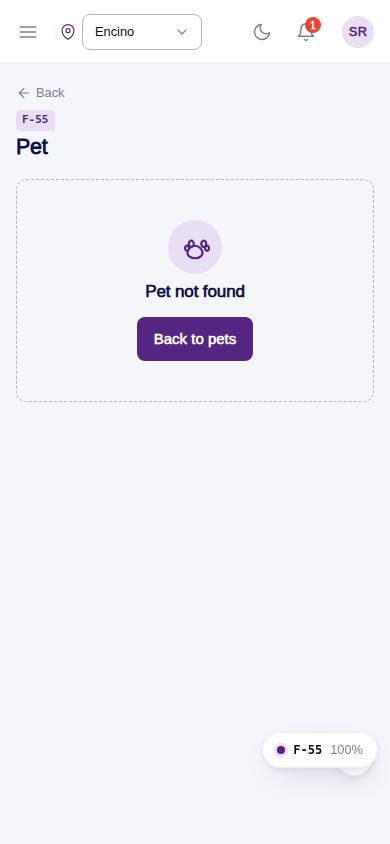
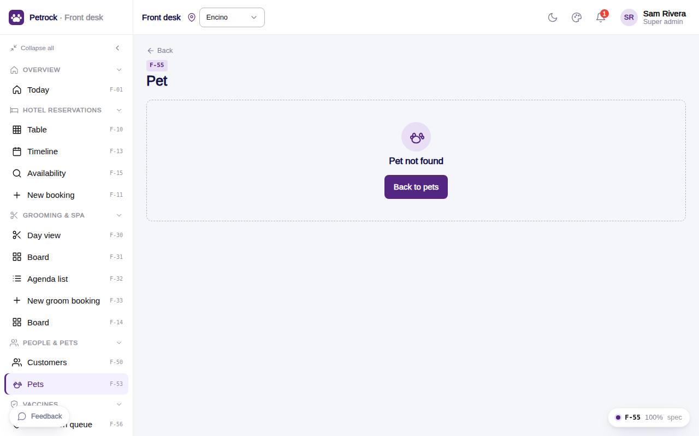

# F-55 · Pet detail & vaccine verification

## Purpose

One pet: profile, owner, care and medical, staff attributes, and the vaccine table where staff verify or reject uploads; verifying every required vaccine approves the pet and confirms its pending bookings.

## Screenshots

| 390 | 1280 |
| --- | --- |
|  |  |

Dark: `../screenshots/F-55/390-dark.jpg`, `../screenshots/F-55/1280-dark.jpg`.

## Sections (layout order)

1. PageHeader - approval eyebrow, facts subtitle, Edit, Book groom
2. Vaccine banner (issue or confirmed bookings)
3. Left: pet card (facts, attributes, medical, note, attachments) + owner CustomerSummaryCard
4. Right: Vaccines table (verify / reject / dates / upload), Hotel bookings, Grooming & Spa, Deactivate pet (PIN)
5. Modals: reject reason, dates, upload

## Data

| Table | Read / write | Notes |
| --- | --- | --- |
| `pets` | read + write (approval_status, status) | |
| `pet_profiles` | read | |
| `customers` | read | |
| `vets` | read | |
| `vaccine_records` | read + write (verify / reject / dates / proof) | |
| `vaccine_types` | read | |
| `bookings` | read + write (pending_vaccines -> confirmed) | |
| `booking_pets` | read | |
| `daycare_bookings` | read + write (same) | |
| `appointments` | read | |
| `attachments` | read | |
| `notifications` | read + write (customer) | |
| `approvals` | read + write | |
| `audit_log` | read + write | |

## Rules

- `R-X60` - see `src/rules/` (registry) and the Rules tab of the inspector on this page
- `R-X61` - see `src/rules/` (registry) and the Rules tab of the inspector on this page
- `R-B01` - see `src/rules/` (registry) and the Rules tab of the inspector on this page
- `R-B02` - see `src/rules/` (registry) and the Rules tab of the inspector on this page
- `R-B03` - see `src/rules/` (registry) and the Rules tab of the inspector on this page
- `R-B11` - see `src/rules/` (registry) and the Rules tab of the inspector on this page
- `R-A05` - see `src/rules/` (registry) and the Rules tab of the inspector on this page
- `R-A13` - see `src/rules/` (registry) and the Rules tab of the inspector on this page
- `R-X68` - see `src/rules/` (registry) and the Rules tab of the inspector on this page
- `R-J08` - see `src/rules/` (registry) and the Rules tab of the inspector on this page

## Logic

- verifyVaccineRecord -> settleVaccineStatus: approve pet + confirm pending_vaccines bookings whose pets are all approved (R-X60)
- Reject asks a reason and notifies the customer (R-X61)
- Expired records flagged even when verified (R-B11)
- Deactivate = PIN + soft delete (R-X68)

## Components

`PageHeader`, `Card`, `Avatar`, `Badge`, `PetVaccineChip`, `CustomerSummaryCard`, `PetVaccineVerifyTable`, `DeskAttachmentDropzone`, `StatusBadge`, `GroomStatusBadge`, `Modal`, `Textarea`, `DatePicker`, `Button`, `PinApprovalModal`, `Toast`, `EmptyState`

## Real vs mock

Real: verify / reject chain (R-X60, R-X61) confirms pending bookings and notifies the customer. Mock: proof links open nothing (mock URLs).

## Responsive check (D-016)

Checked at: 360, 390, 768, 1280, 1920 with Playwright (no console errors, no horizontal overflow). Phones: two-column layout stacks.

## Changelog

- `docs/changelog/_pending/frontdesk-grooming-people.md` (to be merged into the next numbered entry)
