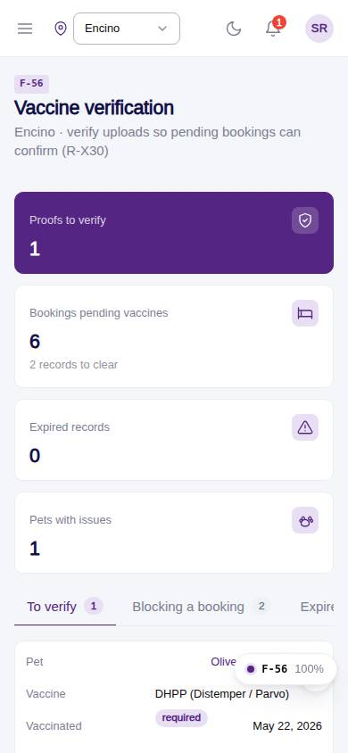
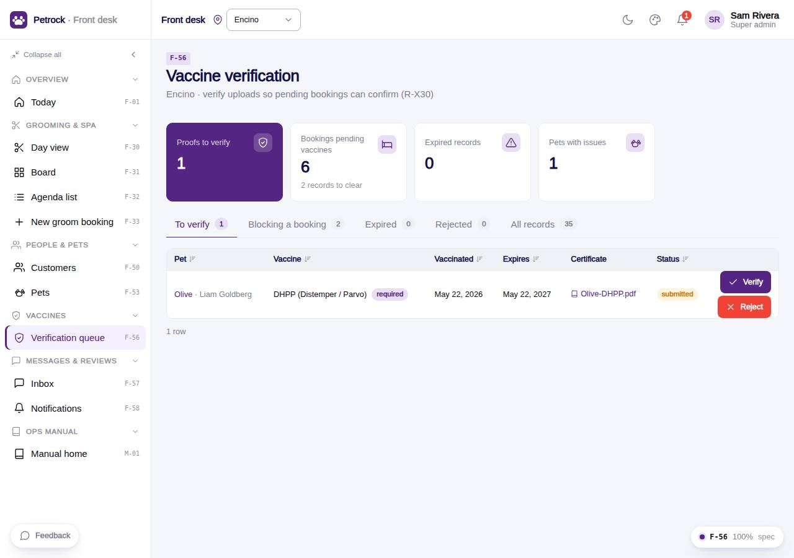

# F-56 · Vaccine verification queue

## Purpose

Every submitted proof waiting for staff, plus expired / rejected records, across pets at the location: verify or reject inline, jump to the pet.

## Screenshots

| 390 | 1280 |
| --- | --- |
|  |  |

Dark variant: not a key page (theme tokens apply; checked manually).

## Sections (layout order)

1. PageHeader
2. StatTiles - Proofs to verify, Bookings pending vaccines, Expired records, Pets with issues
3. Tabs - To verify / Blocking a booking / Expired / Rejected / All records
4. PetVaccineVerifyTable with pet + owner columns and actions
5. Reject reason modal

## Data

| Table | Read / write | Notes |
| --- | --- | --- |
| `vaccine_records` | read + write (verify / reject) | |
| `vaccine_types` | read | |
| `pets` | read + write (approval_status) | |
| `customers` | read | |
| `bookings` | read + write (confirm) | |
| `booking_pets` | read | |
| `notifications` | read + write | |
| `audit_log` | read + write | |

## Rules

- `R-X30` - see `src/rules/` (registry) and the Rules tab of the inspector on this page
- `R-X31` - see `src/rules/` (registry) and the Rules tab of the inspector on this page
- `R-B01` - see `src/rules/` (registry) and the Rules tab of the inspector on this page
- `R-B11` - see `src/rules/` (registry) and the Rules tab of the inspector on this page
- `R-A05` - see `src/rules/` (registry) and the Rules tab of the inspector on this page

## Logic

- Location scope through the customer\'s home location (records are global)
- Same verify / reject chain as F-55 (R-X30, R-X31)

## Components

`PageHeader`, `StatTile`, `Tabs`, `PetVaccineVerifyTable`, `Modal`, `Textarea`, `Button`, `Toast`

## Real vs mock

Real: same chain as F-55 across all pets at the location. Mock: none.

## Responsive check (D-016)

Checked at: 360, 390, 768, 1280, 1920 with Playwright (no console errors, no horizontal overflow). Phones: DataTable falls back to cards.

## Changelog

- `docs/changelog/_pending/frontdesk-grooming-people.md` (to be merged into the next numbered entry)
