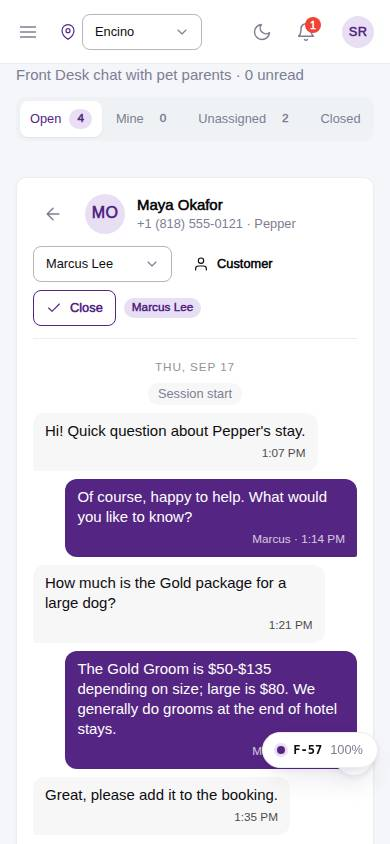
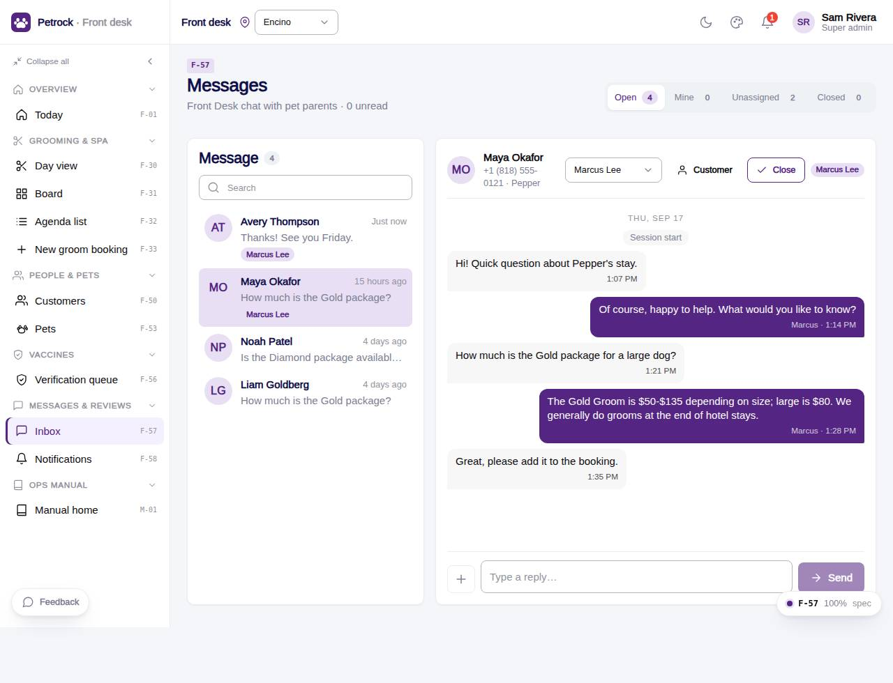

# F-57 · Staff messages inbox

## Purpose

Front Desk chat with customers: thread list (search, unread, assignee), conversation with reply, assign to a colleague, close / reopen, quick links to the customer and pets. Marks messages read on open.

## Screenshots

| 390 | 1280 |
| --- | --- |
|  |  |

Dark: `../screenshots/F-57/390-dark.jpg`, `../screenshots/F-57/1280-dark.jpg`.

## Sections (layout order)

1. PageHeader with filter pills (Open / Mine / Unassigned / Closed)
2. Left card - DeskChatThreadList (search, unread, assignee chips)
3. Right card - DeskChatThread (bubbles, day separators, system markers, composer) with Assign select, Customer link, Close / Reopen
4. Phone: list or thread with a back button

## Data

| Table | Read / write | Notes |
| --- | --- | --- |
| `conversations` | read + write | |
| `messages` | read + write | |
| `conversation_assignments` | read + write | |
| `customers` | read | |
| `users` | read | |
| `employees` | read | |
| `notifications` | read + write (customer + assignee) | |

## Rules

- `R-M08` - see `src/rules/` (registry) and the Rules tab of the inspector on this page
- `R-M09` - see `src/rules/` (registry) and the Rules tab of the inspector on this page
- `R-M11` - see `src/rules/` (registry) and the Rules tab of the inspector on this page
- `R-X36` - see `src/rules/` (registry) and the Rules tab of the inspector on this page

## Logic

- Open thread marks customer messages read and zeroes unread_staff
- Reply inserts messages (sender staff), updates last_preview / last_message_at, bumps unread_customer and notifies the customer user
- Assign upserts conversation_assignments (R-X36)
- Relative timestamps (R-M08)

## Components

`PageHeader`, `Tabs`, `DeskChatThreadList`, `DeskChatThread`, `Select`, `Button`, `Badge`, `EmptyState`, `Toast`

## Real vs mock

Real: messages, unread counters, assignment and close write to tables; the customer gets a notification row. Mock: no push / SMS delivery; attach button is a placeholder; voice / video dropped (R-M11).

## Responsive check (D-016)

Checked at: 360, 390, 768, 1280, 1920 with Playwright (no console errors, no horizontal overflow). Phones: list or thread, back button in the thread header.

## Changelog

- `docs/changelog/_pending/frontdesk-grooming-people.md` (to be merged into the next numbered entry)
