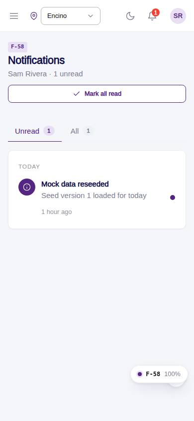
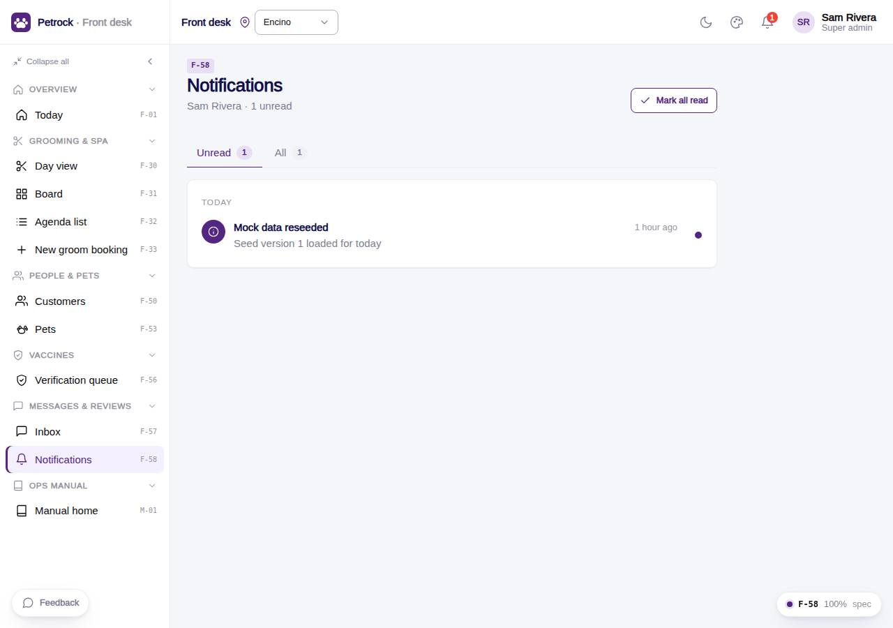

# F-58 · Staff notifications

## Purpose

Notifications for the signed-in staff user (vaccine proofs, new app bookings, messages, approvals): unread first, mark read on open, mark all read, follow the link.

## Screenshots

| 390 | 1280 |
| --- | --- |
|  |  |

Dark variant: not a key page (theme tokens apply; checked manually).

## Sections (layout order)

1. PageHeader - Mark all read
2. Tabs - Unread / All
3. Grouped by day: StaffNotificationItem rows (open follows the link; dot toggles read)

## Data

| Table | Read / write | Notes |
| --- | --- | --- |
| `notifications` | read + write (read flag) | |

## Rules

- `R-M07` - see `src/rules/` (registry) and the Rules tab of the inspector on this page
- `R-M08` - see `src/rules/` (registry) and the Rules tab of the inspector on this page

## Logic

- Rows where user_id = session user
- Open = mark read + navigate to link
- Relative time (R-M08)

## Components

`PageHeader`, `Tabs`, `Card`, `StaffNotificationItem`, `Button`, `EmptyState`

## Real vs mock

Real: reads notifications for the signed-in user, marks read. Mock: no push.

## Responsive check (D-016)

Checked at: 360, 390, 768, 1280, 1920 with Playwright (no console errors, no horizontal overflow). Phones: two-column layout stacks.

## Changelog

- `docs/changelog/_pending/frontdesk-grooming-people.md` (to be merged into the next numbered entry)
