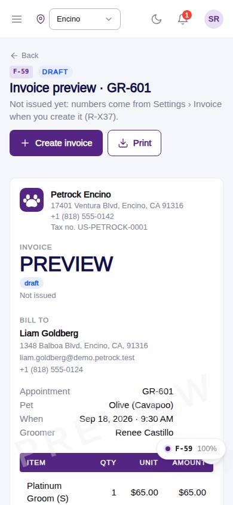
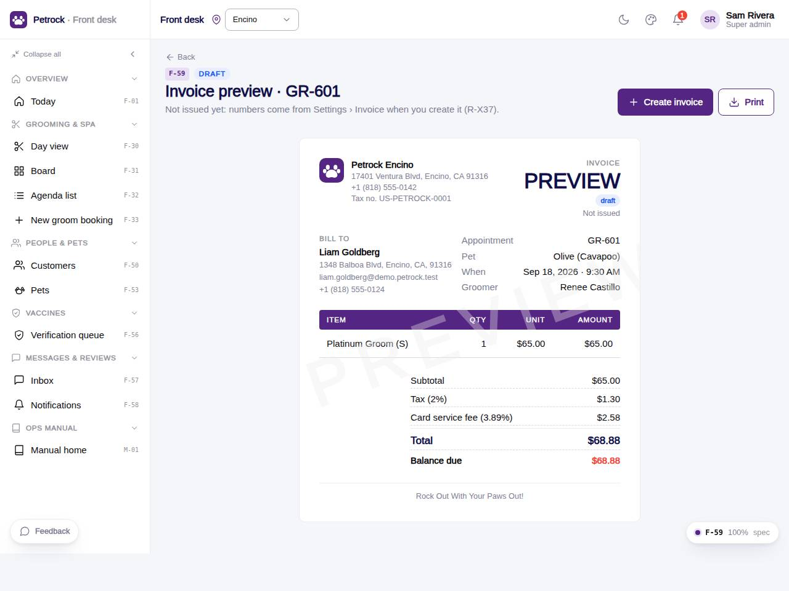

# F-59 · Invoice view & print

## Purpose

Printable invoice for a hotel booking, grooming appointment or daycare day: issued invoice from the invoices table or a live preview from the pricing engine, with Create invoice, Mark paid and Print.

## Screenshots

| 390 | 1280 |
| --- | --- |
|  |  |

Dark: `../screenshots/F-59/390-dark.jpg`, `../screenshots/F-59/1280-dark.jpg`.

## Sections (layout order)

1. PageHeader - status eyebrow, Create invoice / Take payment (method select) / Print
2. DeskInvoiceSheet - business, bill to, meta, lines, totals, deposit, balance, note, footer; PREVIEW watermark until issued
3. Payments table for the invoice

## Data

| Table | Read / write | Notes |
| --- | --- | --- |
| `invoices` | read + write (create, mark paid) | |
| `payments` | read + write | |
| `bookings` | read + write (payment_status) | |
| `booking_pets` | read | |
| `appointments` | read + write (payment_status) | |
| `appointment_extras` | read + write (invoice_id) | |
| `daycare_bookings` | read + write (payment_status) | |
| `customers` | read | |
| `pets` | read | |
| `employees` | read | |
| `locations` | read | |
| `packages` | read | |
| `addons` | read | |
| `fees` | read | |
| `taxes` | read | |
| `settings` | read + write (invoice.next_number) | |

## Rules

- `R-X37` - see `src/rules/` (registry) and the Rules tab of the inspector on this page
- `R-J06` - see `src/rules/` (registry) and the Rules tab of the inspector on this page
- `R-H03` - see `src/rules/` (registry) and the Rules tab of the inspector on this page
- `R-H04` - see `src/rules/` (registry) and the Rules tab of the inspector on this page
- `R-H05` - see `src/rules/` (registry) and the Rules tab of the inspector on this page
- `R-J03` - see `src/rules/` (registry) and the Rules tab of the inspector on this page

## Logic

- :id = invoice id, or a booking / appointment / daycare id (preview when no invoice exists)
- Preview lines: booking.quote JSON or quoteForAppointment
- Create invoice numbers from settings.invoice.next_number (R-X37)
- Mark paid writes a payments row through the payment method and sets invoice + source payment_status paid (payments.write)

## Components

`PageHeader`, `DeskInvoiceSheet`, `Button`, `Badge`, `DataTable`, `EmptyState`, `Toast`

## Real vs mock

Real: invoice numbering from settings, payments row through the PaymentProvider (MockPaymentProvider now, Stripe later), source payment_status updated. Mock: card details are a fixed test card; print uses the browser print dialog.

## Responsive check (D-016)

Checked at: 360, 390, 768, 1280, 1920 with Playwright (no console errors, no horizontal overflow). Phones: two-column layout stacks.

## Changelog

- `docs/changelog/_pending/frontdesk-grooming-people.md` (to be merged into the next numbered entry)
