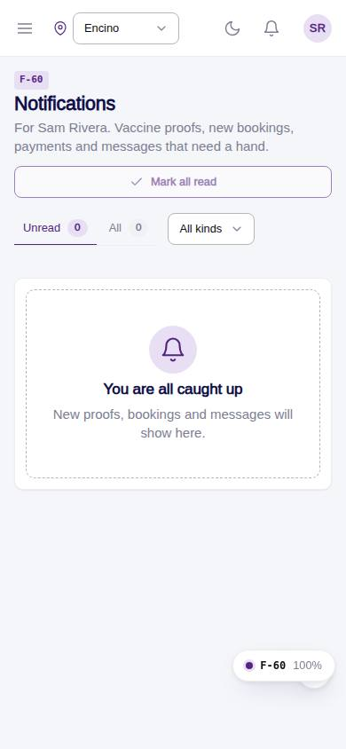
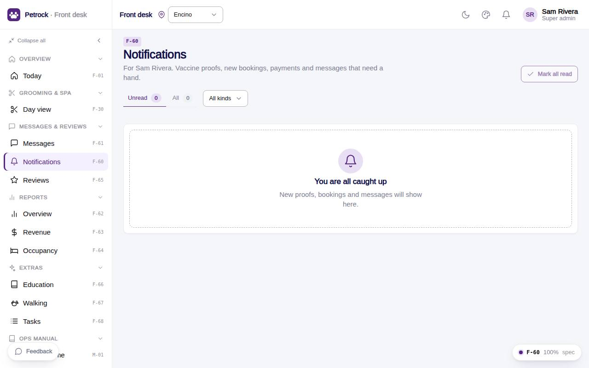

# F-60 · Staff notifications

## Purpose

Notifications for the signed-in staff user: vaccine proofs submitted, new app bookings, payments, messages, reviews. Unread / all tabs, kind filter, mark read on open, mark all read; the TopBar bell shows the unread count.

## Screenshots

| 390 | 1280 |
| --- | --- |
|  |  |

Dark: not captured for this page (key pages only).

## Sections (layout order)

1. PageHeader (tabs, kind filter, mark all read)
2. NotificationList (StaffNotificationRow)

## Data

| Table | Read / write | Notes |
| --- | --- | --- |
| `notifications` | read / write | |

## Rules

- `R-M07` - see the rules registry (Settings › Rules) and the Rules tab of the page inspector
- `R-M08` - see the rules registry (Settings › Rules) and the Rules tab of the page inspector
- `R-X48` - see the rules registry (Settings › Rules) and the Rules tab of the page inspector
- `R-M13` - see the rules registry (Settings › Rules) and the Rules tab of the page inspector

## Logic

- where user_id = session user; unread first.
- Rows visible while the list was open are marked read on leave (R-X48); the dot toggles read/unread.
- relativeTime() (R-M08); kind vocabulary (R-M07).

## Components

PageHeader, Tabs, Select, Card, StaffNotificationRow, EmptyState, Button

## Real vs mock

Writes and reads the mock provider (localStorage). Deletions go through `PinApprovalModal` and write `approvals`. No email, push, Stripe or CSV upload integration yet; CSV export (F-63) is built client-side.

## Responsive check (D-016)

Checked at 360, 390, 768, 1280, 1920 on 2026-09-18 (Playwright against `vite preview`): no horizontal page scroll at any width. DesktopShell sidebar becomes an overlay drawer under 900 px; DataTable rows become cards under 768 px; wide matrices scroll inside their card.

## Changelog

- `docs/changelog/_pending/extras-manual-website.md` (merged into the next numbered entry by the integrator)
