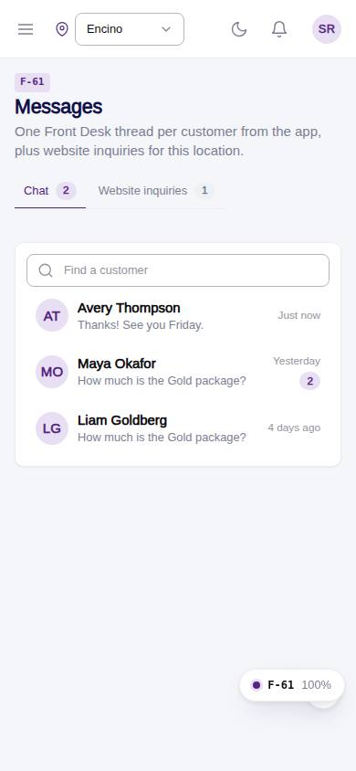
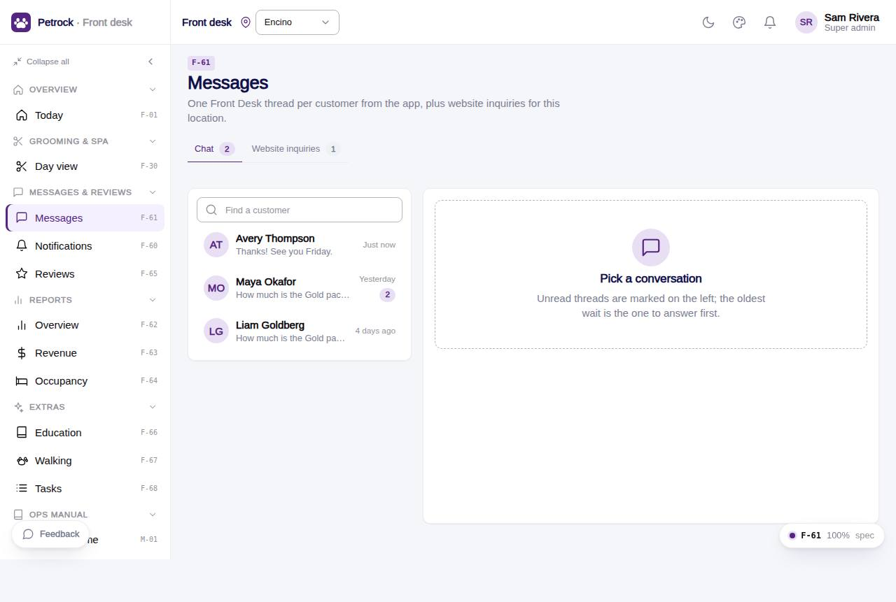

# F-61 · Messages inbox

## Purpose

Front desk side of the customer chat: conversations at the location (one per customer, R-M09), the thread with composer, and the website inquiries tab where the desk marks seen / replied / closed.

## Screenshots

| 390 | 1280 |
| --- | --- |
|  |  |

Dark: `../screenshots/F-61/390-dark.jpg`, `../screenshots/F-61/1280-dark.jpg`.

## Sections (layout order)

1. PageHeader (Chat | Website inquiries tabs)
2. ConversationList (search, unread badges)
3. Thread (DeskChatThread)
4. InquiriesTable (DataTable)

## Data

| Table | Read / write | Notes |
| --- | --- | --- |
| `conversations` | read / write | |
| `messages` | read / write | |
| `customers` | read | |
| `pets` | read | |
| `site_inquiries` | read / write | |

## Rules

- `R-M09` - see the rules registry (Settings › Rules) and the Rules tab of the page inspector
- `R-M08` - see the rules registry (Settings › Rules) and the Rules tab of the page inspector
- `R-M11` - see the rules registry (Settings › Rules) and the Rules tab of the page inspector
- `R-X42` - see the rules registry (Settings › Rules) and the Rules tab of the page inspector

## Logic

- Opening a thread zeroes conversations.unread_staff and marks customer messages read.
- Sending inserts messages { sender staff } and updates last_message_at / last_preview / unread_customer.
- Composer needs messages.write; inquiries status flow new -> seen -> replied -> closed (R-X42).

## Components

PageHeader, Tabs, Card, Input, Avatar, Badge, Button, DeskChatThread, DataTable, EmptyState

## Real vs mock

Writes and reads the mock provider (localStorage). Deletions go through `PinApprovalModal` and write `approvals`. No email, push, Stripe or CSV upload integration yet; CSV export (F-63) is built client-side.

## Responsive check (D-016)

Checked at 360, 390, 768, 1280, 1920 on 2026-09-18 (Playwright against `vite preview`): no horizontal page scroll at any width. DesktopShell sidebar becomes an overlay drawer under 900 px; DataTable rows become cards under 768 px; wide matrices scroll inside their card.

## Changelog

- `docs/changelog/_pending/extras-manual-website.md` (merged into the next numbered entry by the integrator)
