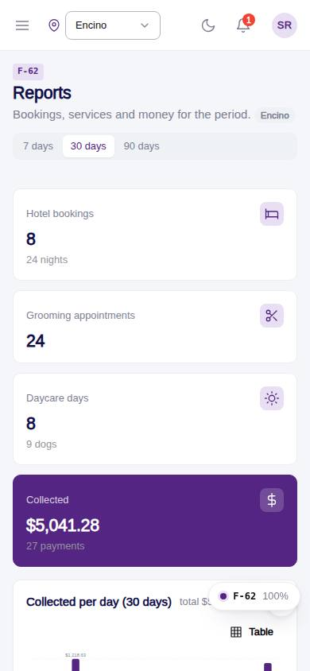
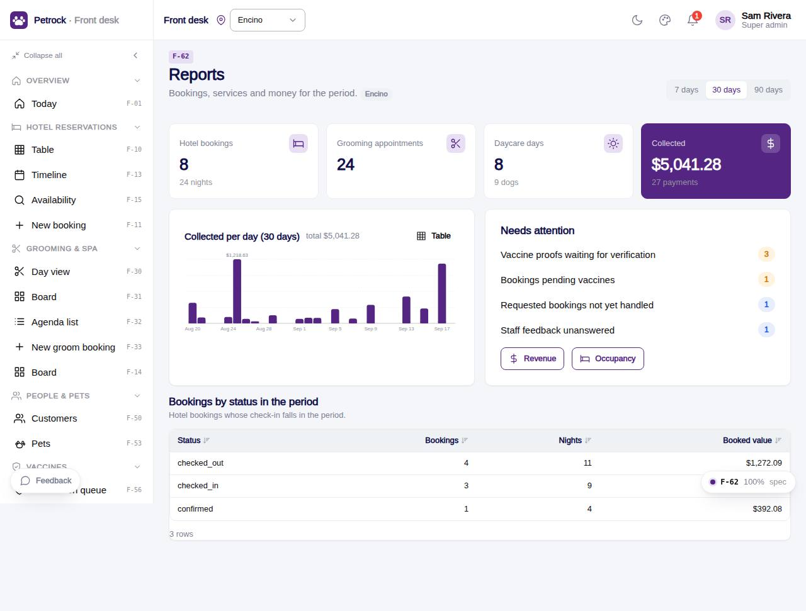

# F-62 · Reports overview

## Purpose

KPIs for 7 / 30 / 90 days at the location scope: hotel bookings and nights, grooming appointments, daycare days, money collected (owner), collected-per-day chart, attention list (vaccine proofs, pending bookings, feedback), bookings by status.

## Screenshots

| 390 | 1280 |
| --- | --- |
|  |  |

Dark: `../screenshots/F-62/390-dark.jpg`, `../screenshots/F-62/1280-dark.jpg`.

## Sections (layout order)

1. PageHeader (period)
2. StatTiles
3. ReportBarChart (collected per day)
4. Needs attention
5. Bookings by status table

## Data

| Table | Read / write | Notes |
| --- | --- | --- |
| `bookings` | read | |
| `appointments` | read | |
| `daycare_bookings` | read | |
| `payments` | read | |
| `vaccine_records` | read | |
| `feedback` | read | |

## Rules

- `R-X76` - see the rules registry (Settings › Rules) and the Rules tab of the page inspector
- `R-L05` - see the rules registry (Settings › Rules) and the Rules tab of the page inspector
- `R-I05` - see the rules registry (Settings › Rules) and the Rules tab of the page inspector

## Logic

- Period = last N days ending today; bookings by check_in, appointments by starts_at, daycare by date, payments by paid_at (status paid).
- useLocation().scope: pinned location or all (R-X76); money needs reports.financial.

## Components

PageHeader, SegmentedControl, StatTile, Card, ReportBarChart, DataTable, Badge, Button, Section, EmptyState

## Real vs mock

Writes and reads the mock provider (localStorage). Deletions go through `PinApprovalModal` and write `approvals`. No email, push, Stripe or CSV upload integration yet; CSV export (F-63) is built client-side.

## Responsive check (D-016)

Checked at 360, 390, 768, 1280, 1920 on 2026-09-18 (Playwright against `vite preview`): no horizontal page scroll at any width. DesktopShell sidebar becomes an overlay drawer under 900 px; DataTable rows become cards under 768 px; wide matrices scroll inside their card.

## Changelog

- `docs/changelog/_pending/extras-manual-website.md` (merged into the next numbered entry by the integrator)
