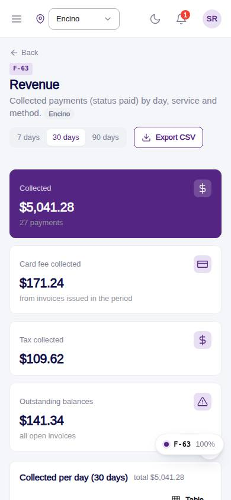
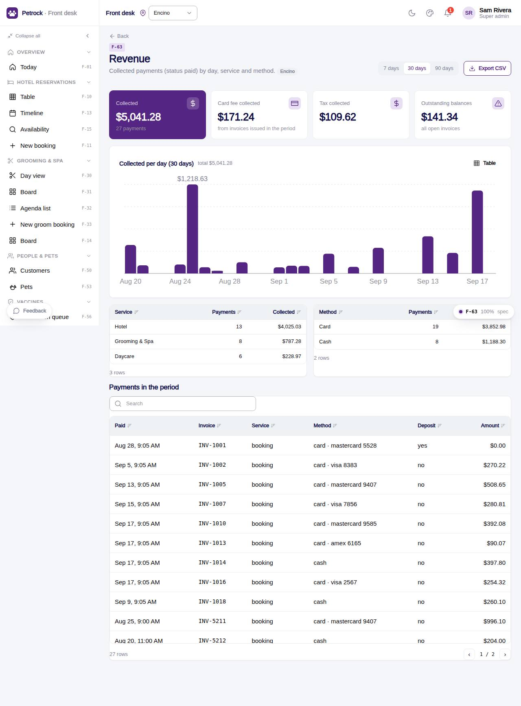

# F-63 · Revenue report

## Purpose

Collected payments for the period by day, by service (hotel / grooming / daycare) and by method (card / cash), card fee and tax collected, outstanding balances, payment list, CSV export. Owner only.

## Screenshots

| 390 | 1280 |
| --- | --- |
|  |  |

Dark: not captured for this page (key pages only).

## Sections (layout order)

1. PageHeader (period, export)
2. StatTiles
3. ReportBarChart
4. By service / by method tables
5. Payments table

## Data

| Table | Read / write | Notes |
| --- | --- | --- |
| `payments` | read | |
| `invoices` | read | |

## Rules

- `R-X76` - see the rules registry (Settings › Rules) and the Rules tab of the page inspector
- `R-L05` - see the rules registry (Settings › Rules) and the Rules tab of the page inspector
- `R-H03` - see the rules registry (Settings › Rules) and the Rules tab of the page inspector
- `R-H04` - see the rules registry (Settings › Rules) and the Rules tab of the page inspector

## Logic

- paid = payments.status paid && paid_at in period; service from invoices.source_type.
- Fee and tax from invoices issued in the period; outstanding = sum(balance) of open invoices.
- Blocked without reports.financial (EmptyState).
- CSV built client-side.

## Components

PageHeader, SegmentedControl, StatTile, Card, ReportBarChart, DataTable, Button, Section, EmptyState

## Real vs mock

Writes and reads the mock provider (localStorage). Deletions go through `PinApprovalModal` and write `approvals`. No email, push, Stripe or CSV upload integration yet; CSV export (F-63) is built client-side.

## Responsive check (D-016)

Checked at 360, 390, 768, 1280, 1920 on 2026-09-18 (Playwright against `vite preview`): no horizontal page scroll at any width. DesktopShell sidebar becomes an overlay drawer under 900 px; DataTable rows become cards under 768 px; wide matrices scroll inside their card.

## Changelog

- `docs/changelog/_pending/extras-manual-website.md` (merged into the next numbered entry by the integrator)
