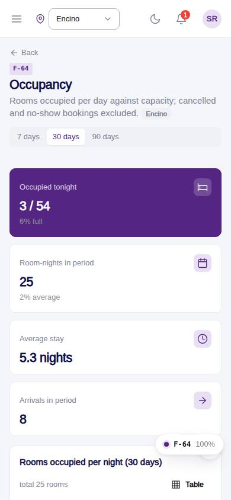
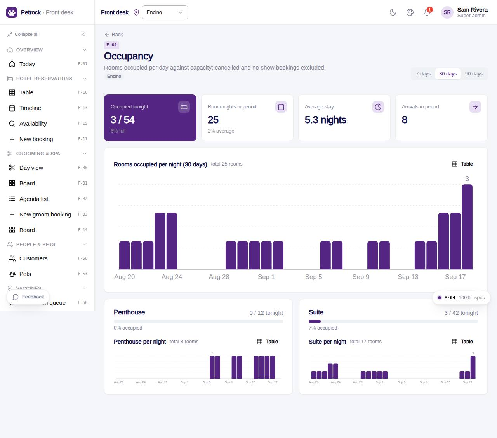

# F-64 · Occupancy report

## Purpose

Rooms occupied per night against capacity for the period, tonight per room type with a meter, room-nights sold, average stay, arrivals; cancelled and no-show excluded.

## Screenshots

| 390 | 1280 |
| --- | --- |
|  |  |

Dark: not captured for this page (key pages only).

## Sections (layout order)

1. PageHeader (period)
2. StatTiles
3. ReportBarChart (rooms per night)
4. Per room type cards (meter + mini chart)

## Data

| Table | Read / write | Notes |
| --- | --- | --- |
| `bookings` | read | |
| `room_types` | read | |
| `capacities` | read | |

## Rules

- `R-X76` - see the rules registry (Settings › Rules) and the Rules tab of the page inspector
- `R-E11` - see the rules registry (Settings › Rules) and the Rules tab of the page inspector
- `R-E12` - see the rules registry (Settings › Rules) and the Rules tab of the page inspector

## Logic

- occupied(day) = live bookings with check_in <= day < check_out.
- capacity = sum capacities.max_simultaneous for the scoped locations by room_types.key.

## Components

PageHeader, SegmentedControl, StatTile, Card, ReportBarChart

## Real vs mock

Writes and reads the mock provider (localStorage). Deletions go through `PinApprovalModal` and write `approvals`. No email, push, Stripe or CSV upload integration yet; CSV export (F-63) is built client-side.

## Responsive check (D-016)

Checked at 360, 390, 768, 1280, 1920 on 2026-09-18 (Playwright against `vite preview`): no horizontal page scroll at any width. DesktopShell sidebar becomes an overlay drawer under 900 px; DataTable rows become cards under 768 px; wide matrices scroll inside their card.

## Changelog

- `docs/changelog/_pending/extras-manual-website.md` (merged into the next numbered entry by the integrator)
