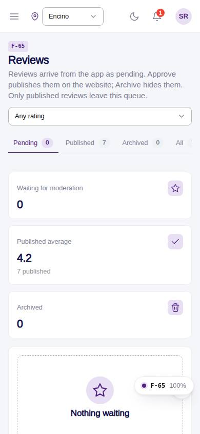
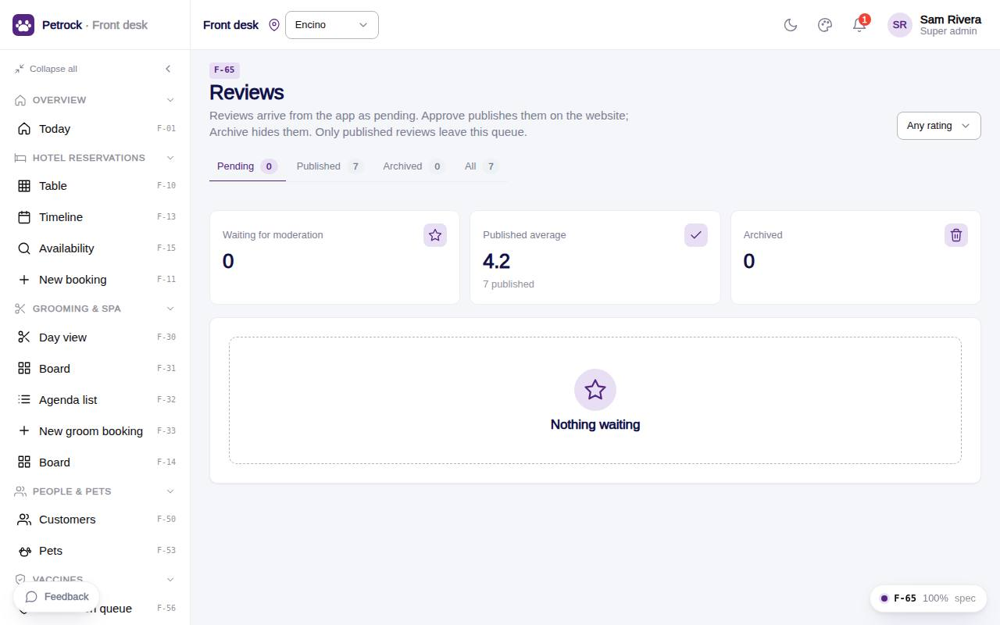

# F-65 · Reviews moderation

## Purpose

Moderation queue from reviews.jpg: pending / published / archived tabs, minimum rating filter, KPI tiles, one row per review with Approve (publish) and Archive; only published reviews reach the website.

## Screenshots

| 390 | 1280 |
| --- | --- |
|  |  |

Dark: not captured for this page (key pages only).

## Sections (layout order)

1. PageHeader (tabs, rating filter)
2. StatTiles
3. ReviewList (ReviewListItem rows)

## Data

| Table | Read / write | Notes |
| --- | --- | --- |
| `reviews` | read / write | |
| `customers` | read | |

## Rules

- `R-M12` - see the rules registry (Settings › Rules) and the Rules tab of the page inspector
- `R-X70` - see the rules registry (Settings › Rules) and the Rules tab of the page inspector

## Logic

- where location scope; Approve sets status published, Archive sets archived (R-M12).
- Buttons need reviews.moderate; others read only.

## Components

PageHeader, Tabs, Select, StatTile, Card, ReviewListItem, ReviewStars, Badge, Button, EmptyState, Toast

## Real vs mock

Writes and reads the mock provider (localStorage). Deletions go through `PinApprovalModal` and write `approvals`. No email, push, Stripe or CSV upload integration yet; CSV export (F-63) is built client-side.

## Responsive check (D-016)

Checked at 360, 390, 768, 1280, 1920 on 2026-09-18 (Playwright against `vite preview`): no horizontal page scroll at any width. DesktopShell sidebar becomes an overlay drawer under 900 px; DataTable rows become cards under 768 px; wide matrices scroll inside their card.

## Changelog

- `docs/changelog/_pending/extras-manual-website.md` (merged into the next numbered entry by the integrator)
