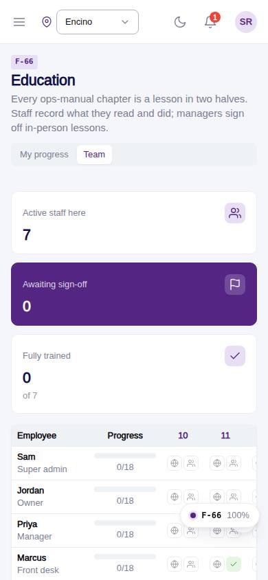
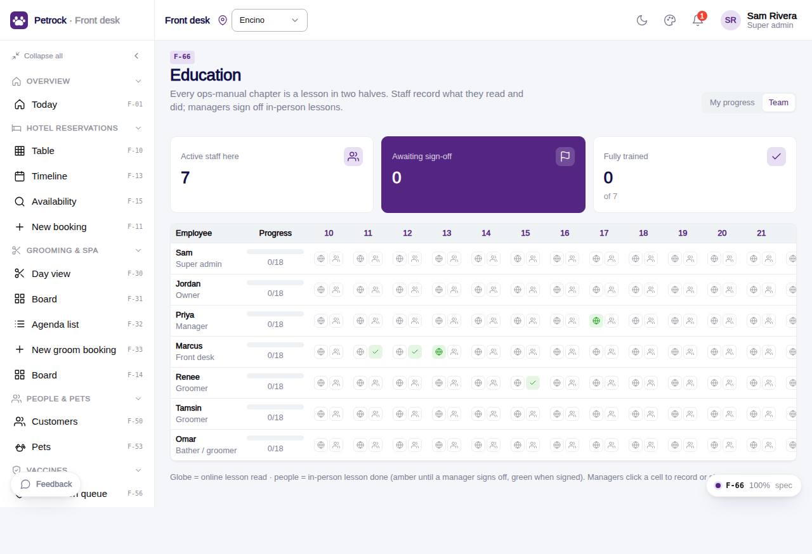

# F-66 · Education

## Purpose

Training from the ops manual: my progress per chapter (online read, in-person done, signed off) and, for managers, the team matrix where a click records a lesson or signs it off.

## Screenshots

| 390 | 1280 |
| --- | --- |
|  |  |

Dark: `../screenshots/F-66/390-dark.jpg`, `../screenshots/F-66/1280-dark.jpg`.

## Sections (layout order)

1. PageHeader (My progress | Team)
2. StatTiles
3. My chapters list
4. Team matrix (employees x chapters)

## Data

| Table | Read / write | Notes |
| --- | --- | --- |
| `employees` | read | |
| `training_completions` | read / write | |

## Rules

- `R-X74` - see the rules registry (Settings › Rules) and the Rules tab of the page inspector
- `R-L05` - see the rules registry (Settings › Rules) and the Rules tab of the page inspector

## Logic

- Chapters and audiences from docs/ops-manual; completion rows per employee per chapter per mode (R-X74).
- Sign-off sets signed_off_by to the manager's employee id; employees.read unlocks the team view.

## Components

PageHeader, SegmentedControl, StatTile, Card, Badge, Button, EmptyState, Toast

## Real vs mock

Writes and reads the mock provider (localStorage). Deletions go through `PinApprovalModal` and write `approvals`. No email, push, Stripe or CSV upload integration yet; CSV export (F-63) is built client-side.

## Responsive check (D-016)

Checked at 360, 390, 768, 1280, 1920 on 2026-09-18 (Playwright against `vite preview`): no horizontal page scroll at any width. DesktopShell sidebar becomes an overlay drawer under 900 px; DataTable rows become cards under 768 px; wide matrices scroll inside their card.

## Changelog

- `docs/changelog/_pending/extras-manual-website.md` (merged into the next numbered entry by the integrator)
