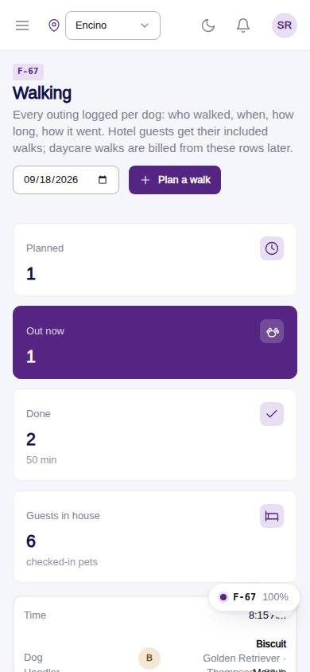
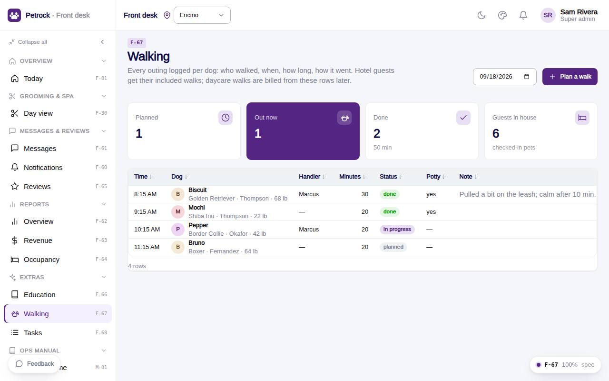

# F-67 · Walking

## Purpose

Walk log per day and location: dog, handler, start, minutes, potty, note; plan / start / finish / skip; checked-in hotel guests listed first when planning.

## Screenshots

| 390 | 1280 |
| --- | --- |
|  |  |

Dark: not captured for this page (key pages only).

## Sections (layout order)

1. PageHeader (day, plan)
2. StatTiles
3. Walks table (row actions)
4. Plan-a-walk Drawer

## Data

| Table | Read / write | Notes |
| --- | --- | --- |
| `walks` | read / write | |
| `pets` | read | |
| `customers` | read | |
| `employees` | read | |
| `bookings` | read | |

## Rules

- `R-X45` - see the rules registry (Settings › Rules) and the Rules tab of the page inspector
- `R-F05` - see the rules registry (Settings › Rules) and the Rules tab of the page inspector

## Logic

- Start sets started_at now and status in_progress; Finish computes duration from the clock (min 5) and marks done (R-X45).
- Guests in house = pets of bookings with status checked_in at the location.

## Components

PageHeader, StatTile, Card, DataTable, Drawer, DatePicker, Select, Input, Textarea, Checkbox, Badge, Avatar, Button, Toast

## Real vs mock

Writes and reads the mock provider (localStorage). Deletions go through `PinApprovalModal` and write `approvals`. No email, push, Stripe or CSV upload integration yet; CSV export (F-63) is built client-side.

## Responsive check (D-016)

Checked at 360, 390, 768, 1280, 1920 on 2026-09-18 (Playwright against `vite preview`): no horizontal page scroll at any width. DesktopShell sidebar becomes an overlay drawer under 900 px; DataTable rows become cards under 768 px; wide matrices scroll inside their card.

## Changelog

- `docs/changelog/_pending/extras-manual-website.md` (merged into the next numbered entry by the integrator)
