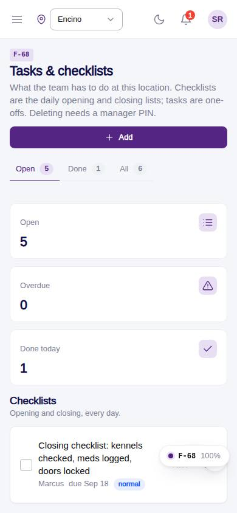
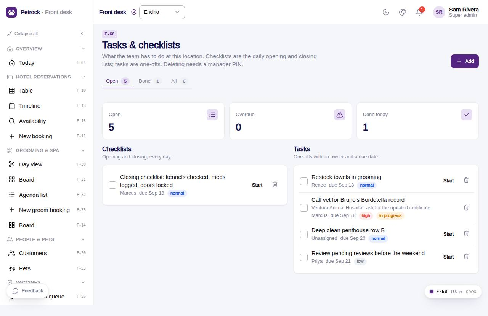

# F-68 · Tasks & checklists

## Purpose

Management to-dos per location: checklists (opening / closing) and one-off tasks with assignee, due date, priority, status; add via drawer; delete is PIN-gated and audited.

## Screenshots

| 390 | 1280 |
| --- | --- |
|  |  |

Dark: not captured for this page (key pages only).

## Sections (layout order)

1. PageHeader (tabs, add)
2. StatTiles
3. Checklists
4. Tasks
5. Add Drawer
6. PinApprovalModal

## Data

| Table | Read / write | Notes |
| --- | --- | --- |
| `tasks` | read / write | |
| `employees` | read | |
| `approvals` | read / write | |

## Rules

- `R-L07` - see the rules registry (Settings › Rules) and the Rules tab of the page inspector
- `R-X77` - see the rules registry (Settings › Rules) and the Rules tab of the page inspector
- `R-P01` - see the rules registry (Settings › Rules) and the Rules tab of the page inspector

## Logic

- Toggle completes / reopens (completed_at); Start sets in_progress.
- Overdue = due_on < today and not done.
- Delete opens PinApprovalModal (action task.delete) and removes the row only after approval (R-X77, R-P01).

## Components

PageHeader, Tabs, StatTile, Section, Card, Checkbox, Badge, Button, IconButton, Drawer, Input, Textarea, Select, DatePicker, PinApprovalModal, EmptyState, Toast

## Real vs mock

Writes and reads the mock provider (localStorage). Deletions go through `PinApprovalModal` and write `approvals`. No email, push, Stripe or CSV upload integration yet; CSV export (F-63) is built client-side.

## Responsive check (D-016)

Checked at 360, 390, 768, 1280, 1920 on 2026-09-18 (Playwright against `vite preview`): no horizontal page scroll at any width. DesktopShell sidebar becomes an overlay drawer under 900 px; DataTable rows become cards under 768 px; wide matrices scroll inside their card.

## Changelog

- `docs/changelog/_pending/extras-manual-website.md` (merged into the next numbered entry by the integrator)
