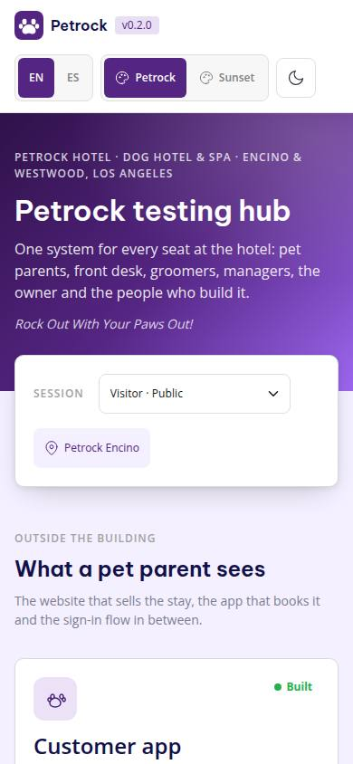
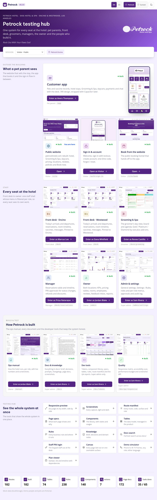
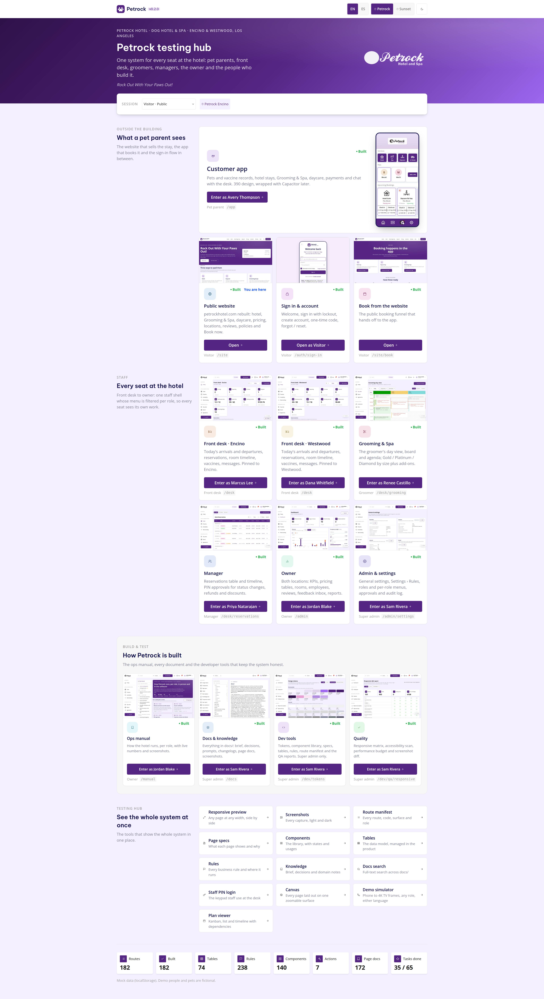

# HUB-01 · Testing hub

## Purpose

The front door of the build. Anyone on the team - or Justin, or a tester - opens `/#/` and sees the whole system laid out by audience: what a pet parent sees, every seat at the hotel, how Petrock is built, and the tools that show the whole system at once. Every card carries a real screenshot of the page behind it, says whether it is built, a stub or only planned, and has exactly one button that switches to the demo person who works there, pins their location and opens their home page. The header switches language, brand theme, light / dark and the builder tool; the session bar switches demo user, view-as role and location. Nothing here is customer-facing.

## Screenshots

| 390 | 1280 | 3840 |
| --- | --- | --- |
|  |  |  |

Dark: `../screenshots/HUB-01/390-dark.jpg`, `../screenshots/HUB-01/1280-dark.jpg`, `../screenshots/HUB-01/3840-dark.jpg`.

Card thumbnails are a separate set, captured by `npm run thumbs` into `../screenshots/<CODE>/thumb[-dark][-<label>].jpg` (D-218).

## Sections (layout order)

1. **HubHeader** - Petrock lockup + version, EN / ES, brand theme (petrock / sunset), light / dark, builder-tool toggle (super admin only).
2. **Hero band** - eyebrow (hotel, services, locations), display title "Petrock testing hub", the promise line, the company tagline and the logo art.
3. **Session bar** - floating over the hero: `RoleSwitcher` (demo user + view as), `LocationSwitcher`, builder-tool hint (Ctrl+.).
4. **Group 1 - "What a pet parent sees"**

   | Card | Route | Demo person | Thumb code / shape |
   | --- | --- | --- | --- |
   | Customer app (feature card) | `/app` | Avery Thompson (customer) | `C-10` phone |
   | Public website | `/site` | - (Open, no switch) | `P-01` desktop |
   | Sign in & account | `/auth/sign-in` | Visitor (public) | `C-02` phone |
   | Book from the website | `/site/book` | - (Open, no switch) | `P-10` desktop |

5. **Group 2 - "Every seat at the hotel"**

   | Card | Route | Demo person | Thumb code / shape |
   | --- | --- | --- | --- |
   | Front desk · Encino | `/desk` (pins `loc_encino`) | Marcus Lee (front desk) | `F-01` desktop |
   | Front desk · Westwood | `/desk` (pins `loc_westwood`) | Dana Whitfield (front desk) | `F-01` label `westwood` |
   | Grooming & Spa | `/desk/grooming` | Renee Castillo (groomer) | `F-30` desktop |
   | Manager | `/desk/reservations` | Priya Natarajan (manager) | `F-10` desktop |
   | Owner | `/admin` | Jordan Blake (owner) | `A-01` desktop |
   | Admin & settings | `/admin/settings` | Sam Rivera (super admin) | `A-44` desktop |

6. **Group 3 - "How Petrock is built"** (tinted band, compact, 4 columns)

   | Card | Route | Demo person | Thumb code / shape |
   | --- | --- | --- | --- |
   | Ops manual | `/manual` | Jordan Blake (owner) | `M-01` desktop |
   | Docs & knowledge | `/docs` | Sam Rivera (super admin) | `D-06` desktop |
   | Dev tools | `/dev/tokens` | Sam Rivera (super admin) | `D-01` desktop |
   | Quality | `/dev/qa/responsive` | Sam Rivera (super admin) | `D-12` desktop |

7. **Group 4 - "See the whole system at once"** - 13 compact tool rows (icon, name, one-line description, chevron): Responsive preview `D-13` `/dev/qa/preview`, Screenshots `D-17` `/dev/qa/screenshots`, Route manifest `D-19` `/dev/routes`, Page specs `D-03` `/dev/specs`, Components `D-02` `/dev/components`, Tables `D-04` `/dev/tables`, Rules `D-05` `/dev/rules`, Knowledge `D-07` `/dev/knowledge`, Docs search `D-18` `/dev/docs-search`, Staff PIN login `A-00` `/staff/pin`, and the three **Placeholders** (D-222): Canvas `D-21` `/dev/canvas`, Demo simulator `D-22` `/dev/simulator`, Plan viewer `D-23` `/plan`.
8. **Stat strip** - routes, built, tables, rules, components, actions, page docs, tasks done, plus the "mock data (localStorage), demo people and pets are fictional" note.

## Data

| Table | Read / write | Notes |
| --- | --- | --- |
| `users` | read | demo users are also seed rows; the card's demo person is named from here |
| `locations` | read | the two front-desk cards and the LocationSwitcher |

Counts in the stat strip come from `getRoutes()`, the table and rule registries, the component library, the sum of every `spec.actions`, `docs/pages/*.md` and `docs/kanban.md` - not from a table.

## Rules

- `R-K01` - location is always known; the front-desk cards pin it before navigating.
- `R-M04` - dark mode toggle.

## Logic

- **Enter flow**: the card's single button calls `switchUser(userId)`, then `setLocationId(locationId)` when the card is location-bound (Encino / Westwood), then navigates to `to`. Cards with `cta: 'open'` navigate without touching the session.
- **Status pill**: read from the route manifest - `built` when the route is registered and its element is not `PageStub`, `stub` when it is, `planned` when the path is not registered at all (the three placeholders).
- **"You are here"**: shows when the card's `role` equals the viewer's effective role (view-as wins over the signed-in demo user) and the card is that role's home (`ROLE_HOME`, or the card's `home` override), and, for location-bound cards, the current location matches.
- **`thumbFor(code, { dark, label })`** fallback chain: labelled + theme -> labelled light -> unlabelled + theme -> unlabelled light -> `undefined`, in which case the card draws a CSS / SVG window wireframe in its own hue. The page therefore ships correctly before any capture exists.
- **Dev-only codes**: the page code renders on a card or tool row only when the builder tool (`devMode`) is on; role and route always show in the card footer.
- **Scale**: `--hub-scale` (1 / 1.375 at >= 2560 / 1.75 at >= 3840) multiplies type, spacing, medallions, thumbnail size and the content max-width (D-220).

## Actions (D-221)

| id | label | intent | permission | params |
| --- | --- | --- | --- | --- |
| `hub.enterAs` | Enter a surface as its demo person | open a surface as the demo person who works there | - | `surface: enum:app,site,auth,book,desk,grooming,reservations,admin,settings,manual,docs,dev,qa`; `role: enum:super_admin,owner,manager,front_desk,groomer,customer,public` |
| `hub.openTool` | Open a testing-hub tool | open one of the whole-system tools | - | `tool: enum:preview,screenshots,routes,specs,components,tables,rules,knowledge,docsSearch,pin,canvas,simulator,plan` |
| `hub.setLang` | Change language | switch the interface between English and Spanish | - | `lang: enum:en,es` |
| `hub.toggleTheme` | Toggle light / dark | switch between light and dark mode | - | - |
| `hub.setBrand` | Change brand theme | switch the brand palette | - | `brand: enum:petrock,sunset` |
| `hub.toggleDevMode` | Toggle the builder tool | turn the builder tool and its spec chips on or off | `dev.tools` | - |
| `hub.switchLocation` | Change location | work in Encino or Westwood | - | `locationId: id` |

## Components

`Card`, `Button`, `Badge`, `Icon`, `IconButton`, `Toggle`, `SegmentedControl`, `RoleSwitcher`, `LocationSwitcher`, `StatTile`, `Placeholder`. No hand-rolled UI; the hero band, session bar, card grid and tool rows are layout CSS in `src/modules/hub/hub.css` over library components.

## Real vs mock

Real: the route manifest and status pills, the registries behind every count, the session (demo users, view-as, dev mode), the location switcher, theme and brand, language. Mock: the demo identities themselves (fictional people, `src/auth/demoUsers.ts`) and everything behind the `DataProvider` (localStorage). The thumbnails are captured files, not live pages, so a card can be one capture behind its page until `npm run thumbs` runs again (D-218). Version comes from `package.json`. When Company-OS lands, only the data behind the surfaces changes; the hub itself does not.

## Responsive check (D-016, D-194)

Checked at 360, 390, 768, 1280, 1920, 2560 and 3840, light and dark, on 2026-09-20 with Playwright: no horizontal scroll at any width; one column on phones, two at 768, three (four in the build band) from 1280; every button >= 44 px; body text 16 px at 1920, 22 px at 2560 and 28 px at 3840 through `--hub-scale`; focus rings visible at TV distance; nothing hover-only (the tool-row chevron and the card pills are always rendered).

## Changelog

- `docs/changelog/0007-foundation.md`
- `docs/changelog/0030-hub-home-redesign.md`
