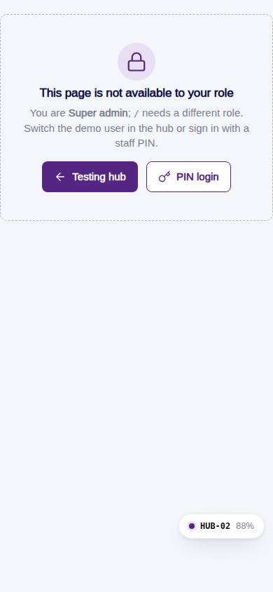
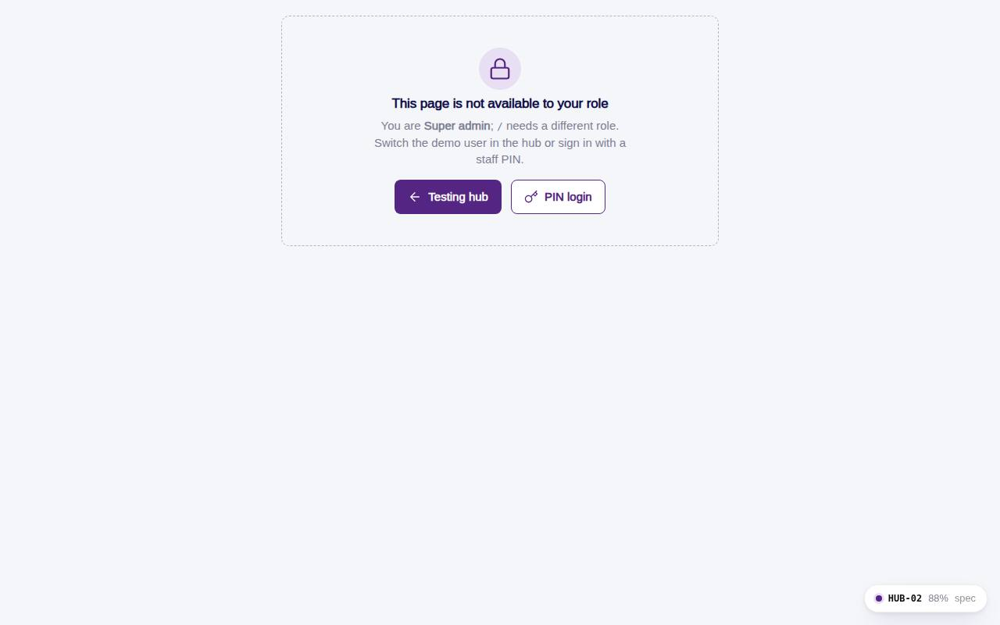

# HUB-02 · No access

## Purpose

Friendly page when the effective role cannot open a route; RequireRole redirects here with ?from=<path>.

## Screenshots

| 390 | 1280 |
| --- | --- |
|  |  |

## Sections (layout order)

1. EmptyState with role and target route
2. Actions: hub, PIN login

## Data

| Table | Read / write | Notes |
| --- | --- | --- |
| `users` | read |  |

## Rules

- none

## Logic

- Reads ?from from the query string

## Components

EmptyState, Button

## Real vs mock

Real.

## Responsive check (D-016)

Checked at 360, 390, 768, 1280, 1920 on 2026-09-18 (Playwright): no horizontal scroll; DesktopShell sidebar becomes an overlay drawer under 900 px; DataTable rows become cards under 768 px.

## Changelog

- `docs/changelog/0007-foundation.md`
