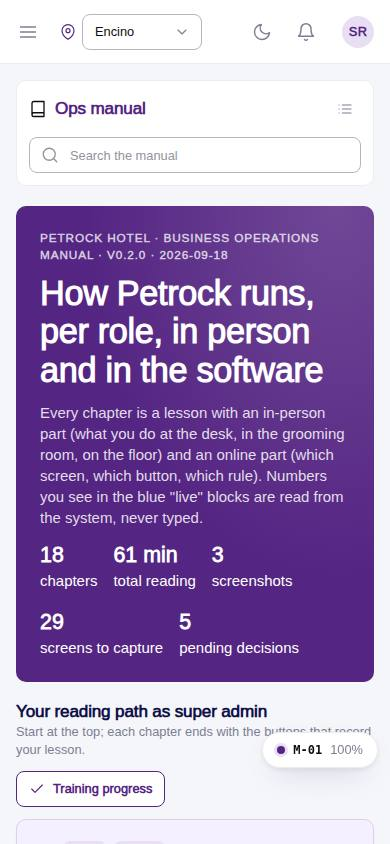
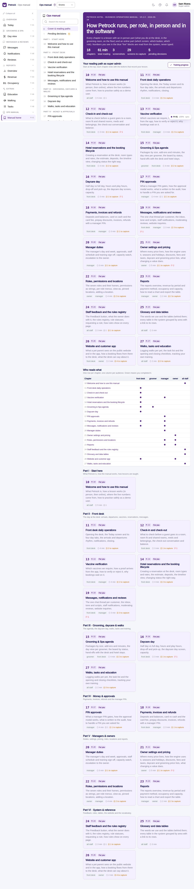

# M-01 · Ops manual cover

## Purpose

Business operations manual cover: what the manual is, the reading path for the current role with completion ticks, the role x chapter matrix, and every chapter by part. Chapters come from docs/ops-manual/en/*.md at build time.

## Screenshots

| 390 | 1280 |
| --- | --- |
|  |  |

Dark: `../screenshots/M-01/390-dark.jpg`, `../screenshots/M-01/1280-dark.jpg`.

## Sections (layout order)

1. ManualSidebar (search, parts, pending)
2. Cover (stats)
3. Your reading path (role)
4. Who reads what (matrix)
5. Parts I–VI chapter grids

## Data

| Table | Read / write | Notes |
| --- | --- | --- |
| `training_completions` | read / write | |
| `employees` | read | |

## Rules

- `R-X43` - see the rules registry (Settings › Rules) and the Rules tab of the page inspector
- `R-X44` - see the rules registry (Settings › Rules) and the Rules tab of the page inspector

## Logic

- chaptersForRole(role): audience labels in front matter (all staff, front desk, groomer, manager, owner).
- Completion = training_completions rows of the signed-in employee.
- readingMinutes = words/180 + figures + directives.

## Components

ManualChapterCard, ManualToc, ManualCallout, LiveBlock, Figure, MarkdownViewer, Card, Badge, Button, Input, Chip, Section, PageHeader

## Real vs mock

Chapter text is real (docs/ops-manual/en); every number comes from LiveBlock directives reading the tables. Screenshot placeholders resolve to docs/screenshots/<CODE>/ once the referenced page is captured; until then a dashed Figure shows. Lesson buttons write `training_completions` in the mock provider.

## Responsive check (D-016)

Checked at 360, 390, 768, 1280, 1920 on 2026-09-18 (Playwright against `vite preview`): no horizontal page scroll at any width. Manual sidebar stacks above the article under 900 px (chapter list collapsible); the right-hand TOC hides under 1200 px and renders inline; live tables scroll inside their block.

## Changelog

- `docs/changelog/_pending/extras-manual-website.md` (merged into the next numbered entry by the integrator)
