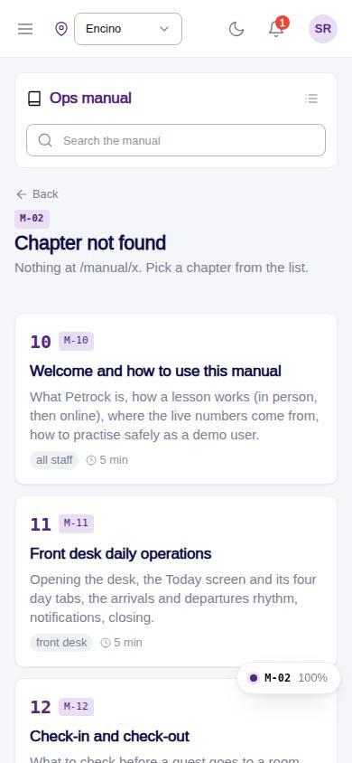
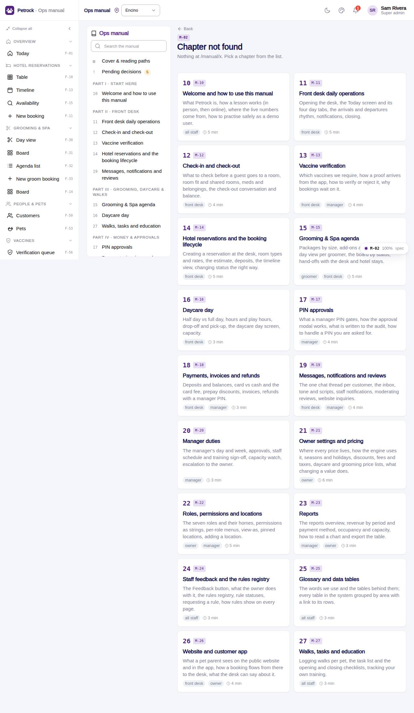

# M-02 · Manual chapter (fallback)

## Purpose

Route /manual/:slug: renders the chapter when the slug exists (same as its own M-1x route) or a not-found page with every chapter card.

## Screenshots

| 390 | 1280 |
| --- | --- |
|  |  |

Dark: not captured for this page (key pages only).

## Sections (layout order)

1. ManualSidebar
2. PageHeader (not found)
3. Chapter grid

## Data

| Table | Read / write | Notes |
| --- | --- | --- |
| `training_completions` | read / write | |

## Rules

- `R-X73` - see the rules registry (Settings › Rules) and the Rules tab of the page inspector

## Logic

- chapterBySlug(slug) ?? not found

## Components

ManualChapterCard, ManualToc, ManualCallout, LiveBlock, Figure, MarkdownViewer, Card, Badge, Button, Input, Chip, Section, PageHeader

## Real vs mock

Chapter text is real (docs/ops-manual/en); every number comes from LiveBlock directives reading the tables. Screenshot placeholders resolve to docs/screenshots/<CODE>/ once the referenced page is captured; until then a dashed Figure shows. Lesson buttons write `training_completions` in the mock provider.

## Responsive check (D-016)

Checked at 360, 390, 768, 1280, 1920 on 2026-09-18 (Playwright against `vite preview`): no horizontal page scroll at any width. Manual sidebar stacks above the article under 900 px (chapter list collapsible); the right-hand TOC hides under 1200 px and renders inline; live tables scroll inside their block.

## Changelog

- `docs/changelog/_pending/extras-manual-website.md` (merged into the next numbered entry by the integrator)
