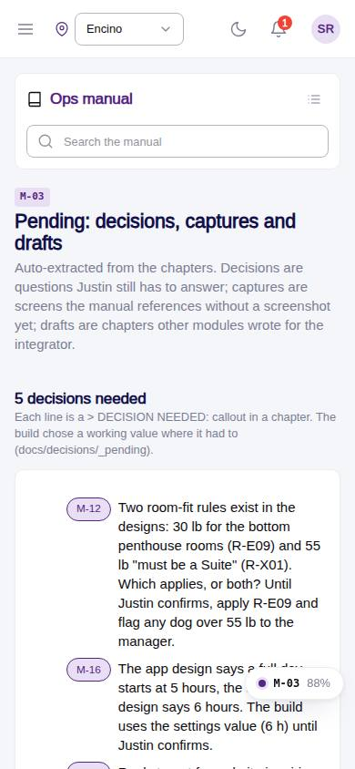
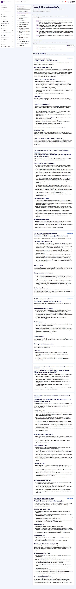

# M-03 · Manual: pending decisions, captures and drafts

## Purpose

Auto-extracted from the chapters: every > DECISION NEEDED: callout, every [screenshot: CODE] without a capture, and draft chapters other modules dropped in docs/ops-manual/en/_pending.

## Screenshots

| 390 | 1280 |
| --- | --- |
|  |  |

Dark: not captured for this page (key pages only).

## Sections (layout order)

1. ManualSidebar
2. PageHeader
3. Decisions needed
4. Screens to capture
5. Draft chapters

## Data

| Table | Read / write | Notes |
| --- | --- | --- |
| `-` | read | |

## Rules

- `R-X73` - see the rules registry (Settings › Rules) and the Rules tab of the page inspector

## Logic

- allDecisions(), allPlaceholders(), pendingDrafts from import.meta.glob.

## Components

PageHeader, Section, Card, Chip, Badge, EmptyState, MarkdownViewer

## Real vs mock

Chapter text is real (docs/ops-manual/en); every number comes from LiveBlock directives reading the tables. Screenshot placeholders resolve to docs/screenshots/<CODE>/ once the referenced page is captured; until then a dashed Figure shows. Lesson buttons write `training_completions` in the mock provider.

## Responsive check (D-016)

Checked at 360, 390, 768, 1280, 1920 on 2026-09-18 (Playwright against `vite preview`): no horizontal page scroll at any width. Manual sidebar stacks above the article under 900 px (chapter list collapsible); the right-hand TOC hides under 1200 px and renders inline; live tables scroll inside their block.

## Changelog

- `docs/changelog/_pending/extras-manual-website.md` (merged into the next numbered entry by the integrator)
