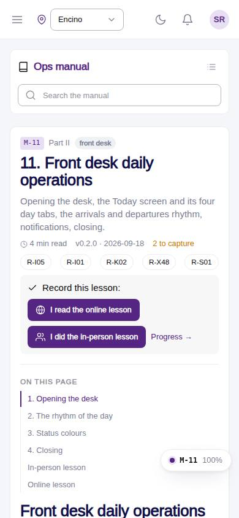
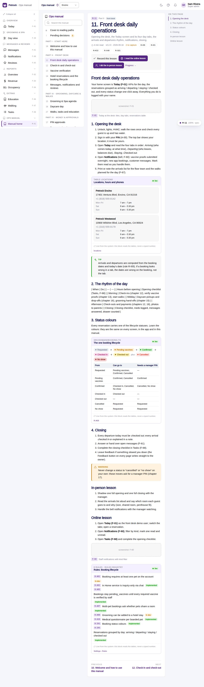

# M-11 · Manual: Front desk daily operations

## Purpose

Opening the desk, the Today screen and its four day tabs, the arrivals and departures rhythm, notifications, closing. Chapter 11 of the ops manual (part II) for front desk; in-person and online lesson recorded to training_completions.

## Screenshots

| 390 | 1280 |
| --- | --- |
|  |  |

Dark: `../screenshots/M-11/390-dark.jpg`, `../screenshots/M-11/1280-dark.jpg`.

## Sections (layout order)

1. ManualSidebar
2. ChapterHeader (code, roles, meta, rules, lesson buttons)
3. ManualToc
4. 1. Opening the desk
5. 2. The rhythm of the day
6. 3. Status colours
7. 4. Closing
8. In-person lesson
9. Online lesson
10. PrevNext

## Data

| Table | Read / write | Notes |
| --- | --- | --- |
| `locations` | read | |
| `rules` | read | |
| `training_completions` | read / write | |

## Rules

- `R-X43` - see the rules registry (Settings › Rules) and the Rules tab of the page inspector
- `R-X44` - see the rules registry (Settings › Rules) and the Rules tab of the page inspector
- `R-I05` - see the rules registry (Settings › Rules) and the Rules tab of the page inspector
- `R-I01` - see the rules registry (Settings › Rules) and the Rules tab of the page inspector
- `R-K02` - see the rules registry (Settings › Rules) and the Rules tab of the page inspector
- `R-X48` - see the rules registry (Settings › Rules) and the Rules tab of the page inspector
- `R-S01` - see the rules registry (Settings › Rules) and the Rules tab of the page inspector

## Logic

- Rendered from docs/ops-manual/en/11-front-desk-daily-operations.md: 14 segments (md, shot, live, callout).
- 3 live directive(s): {{locations}} {{statuses}} {{rules:booking}}.
- 2 screenshot placeholder(s) resolve to docs/screenshots/<CODE>/ when captured.
- Recording a lesson inserts training_completions { mode online | in_person } for the signed-in employee (R-X44).

## Components

ManualChapterCard, ManualToc, ManualCallout, LiveBlock, Figure, MarkdownViewer, Card, Badge, Button, Input, Chip, Section, PageHeader

## Real vs mock

Chapter text is real (docs/ops-manual/en); every number comes from LiveBlock directives reading the tables. Screenshot placeholders resolve to docs/screenshots/<CODE>/ once the referenced page is captured; until then a dashed Figure shows. Lesson buttons write `training_completions` in the mock provider.

## Responsive check (D-016)

Checked at 360, 390, 768, 1280, 1920 on 2026-09-18 (Playwright against `vite preview`): no horizontal page scroll at any width. Manual sidebar stacks above the article under 900 px (chapter list collapsible); the right-hand TOC hides under 1200 px and renders inline; live tables scroll inside their block.

## Changelog

- `docs/changelog/_pending/extras-manual-website.md` (merged into the next numbered entry by the integrator)
