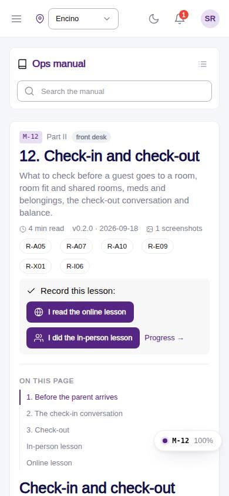
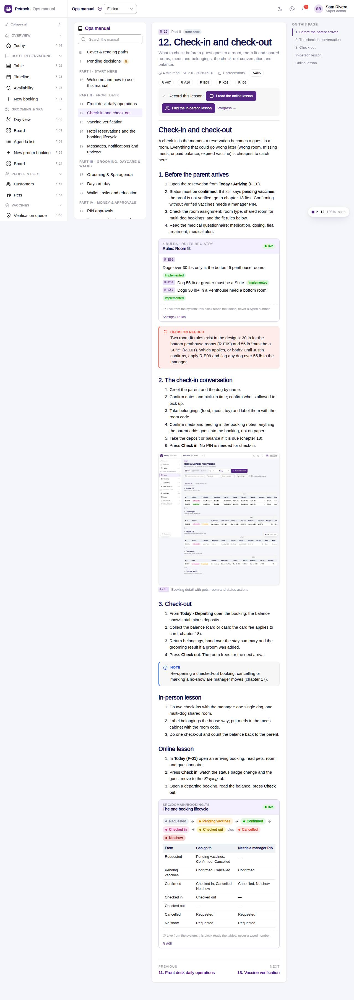

# M-12 · Manual: Check-in and check-out

## Purpose

What to check before a guest goes to a room, room fit and shared rooms, meds and belongings, the check-out conversation and balance. Chapter 12 of the ops manual (part II) for front desk; in-person and online lesson recorded to training_completions.

## Screenshots

| 390 | 1280 |
| --- | --- |
|  |  |

Dark: not captured for this page (key pages only).

## Sections (layout order)

1. ManualSidebar
2. ChapterHeader (code, roles, meta, rules, lesson buttons)
3. ManualToc
4. 1. Before the parent arrives
5. 2. The check-in conversation
6. 3. Check-out
7. In-person lesson
8. Online lesson
9. PrevNext

## Data

| Table | Read / write | Notes |
| --- | --- | --- |
| `rules` | read | |
| `training_completions` | read / write | |

## Rules

- `R-X73` - see the rules registry (Settings › Rules) and the Rules tab of the page inspector
- `R-X74` - see the rules registry (Settings › Rules) and the Rules tab of the page inspector
- `R-A05` - see the rules registry (Settings › Rules) and the Rules tab of the page inspector
- `R-A07` - see the rules registry (Settings › Rules) and the Rules tab of the page inspector
- `R-A10` - see the rules registry (Settings › Rules) and the Rules tab of the page inspector
- `R-E09` - see the rules registry (Settings › Rules) and the Rules tab of the page inspector
- `R-X01` - see the rules registry (Settings › Rules) and the Rules tab of the page inspector
- `R-I06` - see the rules registry (Settings › Rules) and the Rules tab of the page inspector

## Logic

- Rendered from docs/ops-manual/en/12-check-in-and-check-out.md: 11 segments (md, live, callout, shot).
- 2 live directive(s): {{rules:room_fit}} {{statuses}}.
- 1 screenshot placeholder(s) resolve to docs/screenshots/<CODE>/ when captured.
- Recording a lesson inserts training_completions { mode online | in_person } for the signed-in employee (R-X74).

## Components

ManualChapterCard, ManualToc, ManualCallout, LiveBlock, Figure, MarkdownViewer, Card, Badge, Button, Input, Chip, Section, PageHeader

## Real vs mock

Chapter text is real (docs/ops-manual/en); every number comes from LiveBlock directives reading the tables. Screenshot placeholders resolve to docs/screenshots/<CODE>/ once the referenced page is captured; until then a dashed Figure shows. Lesson buttons write `training_completions` in the mock provider.

## Responsive check (D-016)

Checked at 360, 390, 768, 1280, 1920 on 2026-09-18 (Playwright against `vite preview`): no horizontal page scroll at any width. Manual sidebar stacks above the article under 900 px (chapter list collapsible); the right-hand TOC hides under 1200 px and renders inline; live tables scroll inside their block.

## Changelog

- `docs/changelog/_pending/extras-manual-website.md` (merged into the next numbered entry by the integrator)
