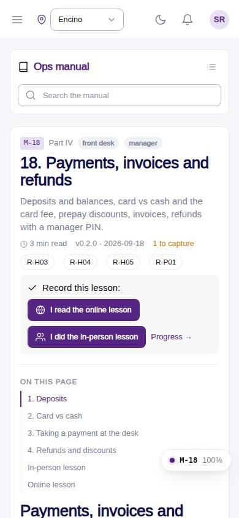
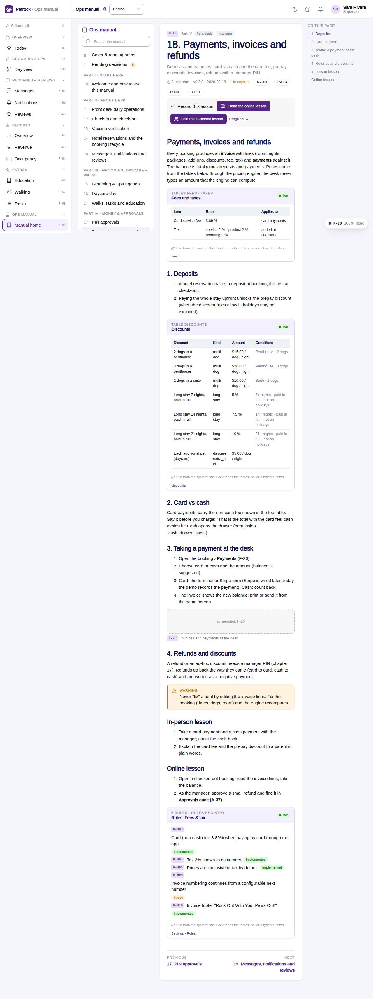

# M-18 · Manual: Payments, invoices and refunds

## Purpose

Deposits and balances, card vs cash and the card fee, prepay discounts, invoices, refunds with a manager PIN. Chapter 18 of the ops manual (part IV) for front desk, manager; in-person and online lesson recorded to training_completions.

## Screenshots

| 390 | 1280 |
| --- | --- |
|  |  |

Dark: not captured for this page (key pages only).

## Sections (layout order)

1. ManualSidebar
2. ChapterHeader (code, roles, meta, rules, lesson buttons)
3. ManualToc
4. 1. Deposits
5. 2. Card vs cash
6. 3. Taking a payment at the desk
7. 4. Refunds and discounts
8. In-person lesson
9. Online lesson
10. PrevNext

## Data

| Table | Read / write | Notes |
| --- | --- | --- |
| `fees` | read | |
| `taxes` | read | |
| `discounts` | read | |
| `room_types` | read | |
| `rules` | read | |
| `training_completions` | read / write | |

## Rules

- `R-X43` - see the rules registry (Settings › Rules) and the Rules tab of the page inspector
- `R-X44` - see the rules registry (Settings › Rules) and the Rules tab of the page inspector
- `R-H03` - see the rules registry (Settings › Rules) and the Rules tab of the page inspector
- `R-H04` - see the rules registry (Settings › Rules) and the Rules tab of the page inspector
- `R-H05` - see the rules registry (Settings › Rules) and the Rules tab of the page inspector
- `R-P01` - see the rules registry (Settings › Rules) and the Rules tab of the page inspector

## Logic

- Rendered from docs/ops-manual/en/18-payments-invoices-and-refunds.md: 12 segments (md, live, shot, callout).
- 3 live directive(s): {{pricing:fees}} {{pricing:discounts}} {{rules:fees_tax}}.
- 1 screenshot placeholder(s) resolve to docs/screenshots/<CODE>/ when captured.
- Recording a lesson inserts training_completions { mode online | in_person } for the signed-in employee (R-X44).

## Components

ManualChapterCard, ManualToc, ManualCallout, LiveBlock, Figure, MarkdownViewer, Card, Badge, Button, Input, Chip, Section, PageHeader

## Real vs mock

Chapter text is real (docs/ops-manual/en); every number comes from LiveBlock directives reading the tables. Screenshot placeholders resolve to docs/screenshots/<CODE>/ once the referenced page is captured; until then a dashed Figure shows. Lesson buttons write `training_completions` in the mock provider.

## Responsive check (D-016)

Checked at 360, 390, 768, 1280, 1920 on 2026-09-18 (Playwright against `vite preview`): no horizontal page scroll at any width. Manual sidebar stacks above the article under 900 px (chapter list collapsible); the right-hand TOC hides under 1200 px and renders inline; live tables scroll inside their block.

## Changelog

- `docs/changelog/_pending/extras-manual-website.md` (merged into the next numbered entry by the integrator)
