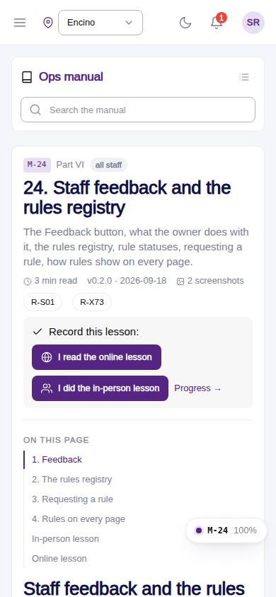
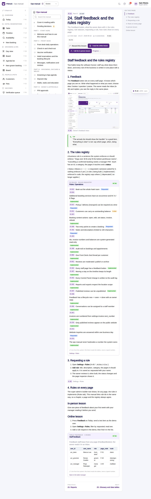

# M-24 · Manual: Staff feedback and the rules registry

## Purpose

The Feedback button, what the owner does with it, the rules registry, rule statuses, requesting a rule, how rules show on every page. Chapter 24 of the ops manual (part VI) for all staff; in-person and online lesson recorded to training_completions.

## Screenshots

| 390 | 1280 |
| --- | --- |
|  |  |

Dark: not captured for this page (key pages only).

## Sections (layout order)

1. ManualSidebar
2. ChapterHeader (code, roles, meta, rules, lesson buttons)
3. ManualToc
4. 1. Feedback
5. 2. The rules registry
6. 3. Requesting a rule
7. 4. Rules on every page
8. In-person lesson
9. Online lesson
10. PrevNext

## Data

| Table | Read / write | Notes |
| --- | --- | --- |
| `rules` | read | |
| `feedback` | read | |
| `training_completions` | read / write | |

## Rules

- `R-X73` - see the rules registry (Settings › Rules) and the Rules tab of the page inspector
- `R-X74` - see the rules registry (Settings › Rules) and the Rules tab of the page inspector
- `R-S01` - see the rules registry (Settings › Rules) and the Rules tab of the page inspector

## Logic

- Rendered from docs/ops-manual/en/24-staff-feedback-and-the-rules-registry.md: 12 segments (md, shot, callout, live).
- 2 live directive(s): {{rules:operations}} {{table:feedback}}.
- 1 screenshot placeholder(s) resolve to docs/screenshots/<CODE>/ when captured.
- Recording a lesson inserts training_completions { mode online | in_person } for the signed-in employee (R-X74).

## Components

ManualChapterCard, ManualToc, ManualCallout, LiveBlock, Figure, MarkdownViewer, Card, Badge, Button, Input, Chip, Section, PageHeader

## Real vs mock

Chapter text is real (docs/ops-manual/en); every number comes from LiveBlock directives reading the tables. Screenshot placeholders resolve to docs/screenshots/<CODE>/ once the referenced page is captured; until then a dashed Figure shows. Lesson buttons write `training_completions` in the mock provider.

## Responsive check (D-016)

Checked at 360, 390, 768, 1280, 1920 on 2026-09-18 (Playwright against `vite preview`): no horizontal page scroll at any width. Manual sidebar stacks above the article under 900 px (chapter list collapsible); the right-hand TOC hides under 1200 px and renders inline; live tables scroll inside their block.

## Changelog

- `docs/changelog/_pending/extras-manual-website.md` (merged into the next numbered entry by the integrator)
