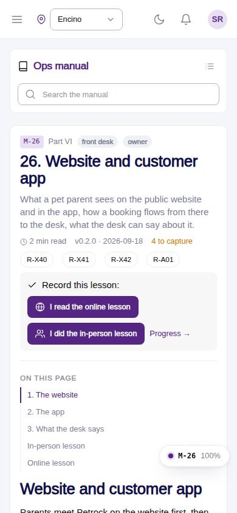
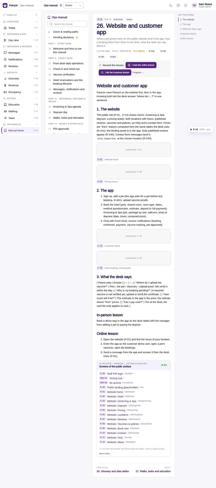

# M-26 · Manual: Website and customer app

## Purpose

What a pet parent sees on the public website and in the app, how a booking flows from there to the desk, what the desk can say about it. Chapter 26 of the ops manual (part VI) for front desk, owner; in-person and online lesson recorded to training_completions.

## Screenshots

| 390 | 1280 |
| --- | --- |
|  |  |

Dark: not captured for this page (key pages only).

## Sections (layout order)

1. ManualSidebar
2. ChapterHeader (code, roles, meta, rules, lesson buttons)
3. ManualToc
4. 1. The website
5. 2. The app
6. 3. What the desk says
7. In-person lesson
8. Online lesson
9. PrevNext

## Data

| Table | Read / write | Notes |
| --- | --- | --- |
| `training_completions` | read / write | |

## Rules

- `R-X43` - see the rules registry (Settings › Rules) and the Rules tab of the page inspector
- `R-X44` - see the rules registry (Settings › Rules) and the Rules tab of the page inspector
- `R-X40` - see the rules registry (Settings › Rules) and the Rules tab of the page inspector
- `R-X41` - see the rules registry (Settings › Rules) and the Rules tab of the page inspector
- `R-X42` - see the rules registry (Settings › Rules) and the Rules tab of the page inspector
- `R-A01` - see the rules registry (Settings › Rules) and the Rules tab of the page inspector

## Logic

- Rendered from docs/ops-manual/en/26-website-and-customer-app.md: 11 segments (md, shot, live).
- 1 live directive(s): {{routes:public}}.
- 4 screenshot placeholder(s) resolve to docs/screenshots/<CODE>/ when captured.
- Recording a lesson inserts training_completions { mode online | in_person } for the signed-in employee (R-X44).

## Components

ManualChapterCard, ManualToc, ManualCallout, LiveBlock, Figure, MarkdownViewer, Card, Badge, Button, Input, Chip, Section, PageHeader

## Real vs mock

Chapter text is real (docs/ops-manual/en); every number comes from LiveBlock directives reading the tables. Screenshot placeholders resolve to docs/screenshots/<CODE>/ once the referenced page is captured; until then a dashed Figure shows. Lesson buttons write `training_completions` in the mock provider.

## Responsive check (D-016)

Checked at 360, 390, 768, 1280, 1920 on 2026-09-18 (Playwright against `vite preview`): no horizontal page scroll at any width. Manual sidebar stacks above the article under 900 px (chapter list collapsible); the right-hand TOC hides under 1200 px and renders inline; live tables scroll inside their block.

## Changelog

- `docs/changelog/_pending/extras-manual-website.md` (merged into the next numbered entry by the integrator)
