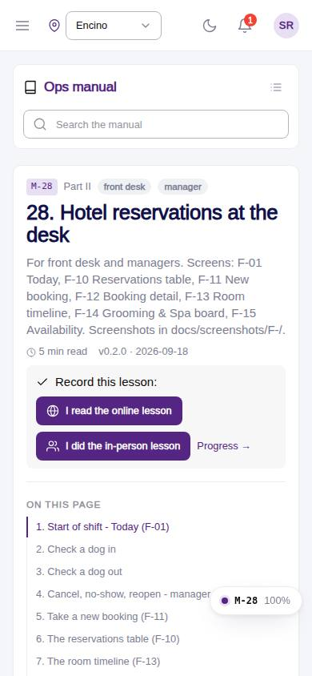
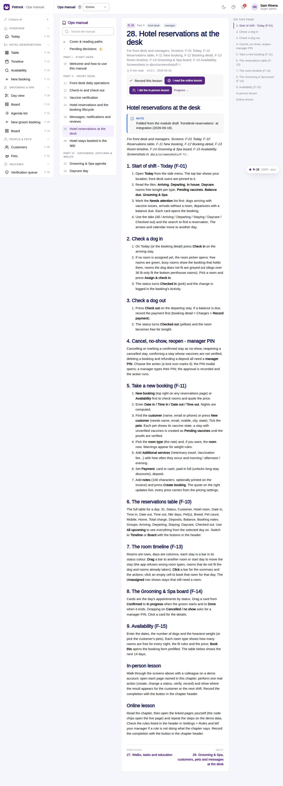

# M-28 · Manual: Hotel reservations at the desk

## Purpose

For front desk and managers. Screens: F-01 Today, F-10 Reservations table, F-11 New booking, F-12 Booking detail, F-13 Room timeline, F-14 Grooming & Spa board, F-15 Availability. Screenshots in docs/screenshots/F-/. Chapter 28 of the ops manual (part II) for front desk, manager; folded at integration (2026-09-18) from the `hotel-reservations-at-the-desk` module draft; in-person and online lesson recorded to training_completions.

## Screenshots

| 390 | 1280 |
| --- | --- |
|  |  |

Dark: not captured for this page (key pages only).

## Sections (layout order)

1. ManualSidebar
2. ChapterHeader (code, roles, meta, rules, lesson buttons)
3. ManualToc
4. 1. Start of shift - Today (F-01)
5. 2. Check a dog in
6. 3. Check a dog out
7. 4. Cancel, no-show, reopen - manager PIN
8. 5. Take a new booking (F-11)
9. 6. The reservations table (F-10)
10. 7. The room timeline (F-13)
11. 8. The Grooming & Spa board (F-14)
12. 9. Availability (F-15)
13. In-person lesson
14. Online lesson
15. PrevNext

## Data

| Table | Read / write | Notes |
| --- | --- | --- |
| `training_completions` | read / write | lesson buttons |

## Rules

- none listed in the front matter; the chapter teaches the pages F-01, F-10, F-11, F-12, F-13, F-14, F-15, M-28

## Logic

- Rendered from docs/ops-manual/en/28-hotel-reservations-at-the-desk.md: markdown segments, screenshot placeholders and callouts parsed by manualIndex.ts.
- Screenshot placeholders resolve to docs/screenshots/<CODE>/ when captured.
- Recording a lesson inserts training_completions { mode online | in_person } for the signed-in employee (R-X74).

## Components

ManualChapterCard, ManualToc, ManualCallout, LiveBlock, Figure, MarkdownViewer, Card, Badge, Button, Input, Chip, Section, PageHeader

## Real vs mock

Chapter text is real (docs/ops-manual/en); screenshot figures resolve once the referenced page is captured. Lesson buttons write `training_completions` in the mock provider.

## Responsive check (D-016)

Rendered by the same ManualChapterPage as M-10..M-27 (checked at 360, 390, 768, 1280, 1920 on 2026-09-18); captured at 390 and 1280 at integration with no console errors.

## Changelog

- `docs/changelog/0018-integration-merge.md`
