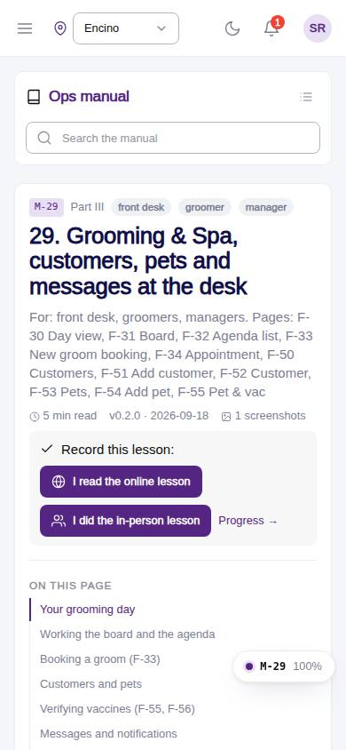
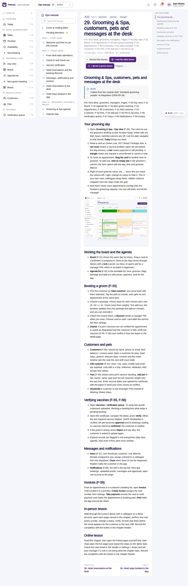

# M-29 · Manual: Grooming & Spa, customers, pets and messages at the desk

## Purpose

For: front desk, groomers, managers. Pages: F-30 Day view, F-31 Board, F-32 Agenda list, F-33 New groom booking, F-34 Appointment, F-50 Customers, F-51 Add customer, F-52 Customer, F-53 Pets, F-54 Add pet, F-55 Pet & vac Chapter 29 of the ops manual (part III) for front desk, groomer, manager; folded at integration (2026-09-18) from the `grooming-customers-and-pets-at-the-desk` module draft; in-person and online lesson recorded to training_completions.

## Screenshots

| 390 | 1280 |
| --- | --- |
|  |  |

Dark: not captured for this page (key pages only).

## Sections (layout order)

1. ManualSidebar
2. ChapterHeader (code, roles, meta, rules, lesson buttons)
3. ManualToc
4. Your grooming day
5. Working the board and the agenda
6. Booking a groom (F-33)
7. Customers and pets
8. Verifying vaccines (F-55, F-56)
9. Messages and notifications
10. Invoices (F-59)
11. In-person lesson
12. Online lesson
13. PrevNext

## Data

| Table | Read / write | Notes |
| --- | --- | --- |
| `training_completions` | read / write | lesson buttons |

## Rules

- none listed in the front matter; the chapter teaches the pages F-30, F-31, F-32, F-33, F-34, F-50, F-51, F-52, F-53, F-54, F-55, F-56

## Logic

- Rendered from docs/ops-manual/en/29-grooming-customers-and-pets-at-the-desk.md: markdown segments, screenshot placeholders and callouts parsed by manualIndex.ts.
- Screenshot placeholders resolve to docs/screenshots/<CODE>/ when captured.
- Recording a lesson inserts training_completions { mode online | in_person } for the signed-in employee (R-X74).

## Components

ManualChapterCard, ManualToc, ManualCallout, LiveBlock, Figure, MarkdownViewer, Card, Badge, Button, Input, Chip, Section, PageHeader

## Real vs mock

Chapter text is real (docs/ops-manual/en); screenshot figures resolve once the referenced page is captured. Lesson buttons write `training_completions` in the mock provider.

## Responsive check (D-016)

Rendered by the same ManualChapterPage as M-10..M-27 (checked at 360, 390, 768, 1280, 1920 on 2026-09-18); captured at 390 and 1280 at integration with no console errors.

## Changelog

- `docs/changelog/0018-integration-merge.md`
