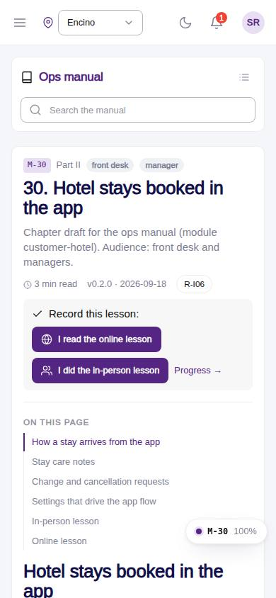
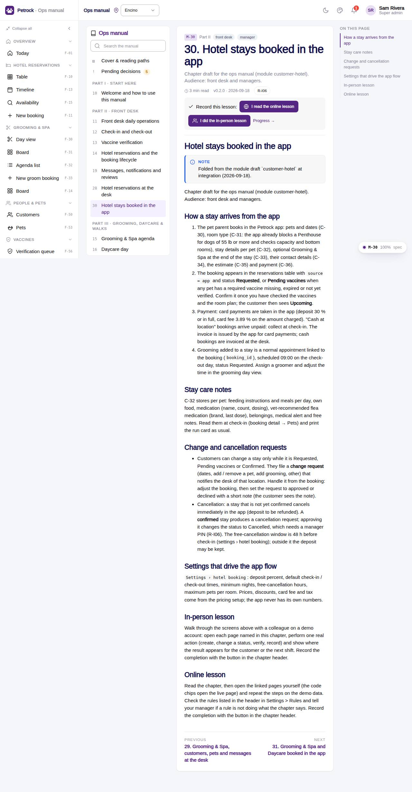

# M-30 · Manual: Hotel stays booked in the app

## Purpose

Chapter draft for the ops manual (module customer-hotel). Audience: front desk and managers. Chapter 30 of the ops manual (part II) for front desk, manager; folded at integration (2026-09-18) from the `hotel-stays-booked-in-the-app` module draft; in-person and online lesson recorded to training_completions.

## Screenshots

| 390 | 1280 |
| --- | --- |
|  |  |

Dark: not captured for this page (key pages only).

## Sections (layout order)

1. ManualSidebar
2. ChapterHeader (code, roles, meta, rules, lesson buttons)
3. ManualToc
4. How a stay arrives from the app
5. Stay care notes
6. Change and cancellation requests
7. Settings that drive the app flow
8. In-person lesson
9. Online lesson
10. PrevNext

## Data

| Table | Read / write | Notes |
| --- | --- | --- |
| `training_completions` | read / write | lesson buttons |

## Rules

- `R-I06` - see the rules registry (Settings › Rules) and the Rules tab of the page inspector

## Logic

- Rendered from docs/ops-manual/en/30-hotel-stays-booked-in-the-app.md: markdown segments, screenshot placeholders and callouts parsed by manualIndex.ts.
- Screenshot placeholders resolve to docs/screenshots/<CODE>/ when captured.
- Recording a lesson inserts training_completions { mode online | in_person } for the signed-in employee (R-X74).

## Components

ManualChapterCard, ManualToc, ManualCallout, LiveBlock, Figure, MarkdownViewer, Card, Badge, Button, Input, Chip, Section, PageHeader

## Real vs mock

Chapter text is real (docs/ops-manual/en); screenshot figures resolve once the referenced page is captured. Lesson buttons write `training_completions` in the mock provider.

## Responsive check (D-016)

Rendered by the same ManualChapterPage as M-10..M-27 (checked at 360, 390, 768, 1280, 1920 on 2026-09-18); captured at 390 and 1280 at integration with no console errors.

## Changelog

- `docs/changelog/0018-integration-merge.md`
