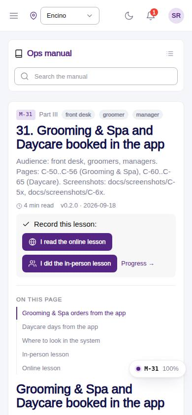
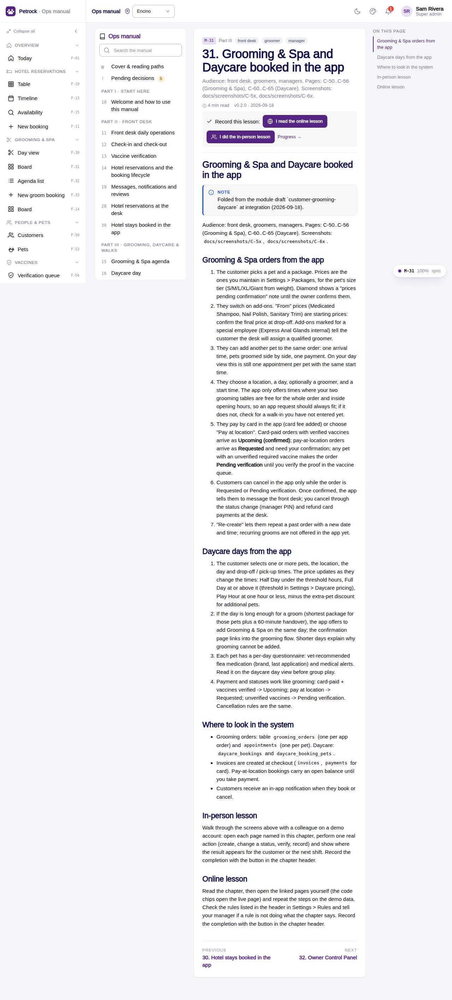

# M-31 · Manual: Grooming & Spa and Daycare booked in the app

## Purpose

Audience: front desk, groomers, managers. Pages: C-50..C-56 (Grooming & Spa), C-60..C-65 (Daycare). Screenshots: docs/screenshots/C-5x, docs/screenshots/C-6x. Chapter 31 of the ops manual (part III) for front desk, groomer, manager; folded at integration (2026-09-18) from the `grooming-and-daycare-booked-in-the-app` module draft; in-person and online lesson recorded to training_completions.

## Screenshots

| 390 | 1280 |
| --- | --- |
|  |  |

Dark: not captured for this page (key pages only).

## Sections (layout order)

1. ManualSidebar
2. ChapterHeader (code, roles, meta, rules, lesson buttons)
3. ManualToc
4. Grooming & Spa orders from the app
5. Daycare days from the app
6. Where to look in the system
7. In-person lesson
8. Online lesson
9. PrevNext

## Data

| Table | Read / write | Notes |
| --- | --- | --- |
| `training_completions` | read / write | lesson buttons |

## Rules

- none listed in the front matter; the chapter teaches the pages C-50, C-56, C-60, C-65, M-31

## Logic

- Rendered from docs/ops-manual/en/31-grooming-and-daycare-booked-in-the-app.md: markdown segments, screenshot placeholders and callouts parsed by manualIndex.ts.
- Screenshot placeholders resolve to docs/screenshots/<CODE>/ when captured.
- Recording a lesson inserts training_completions { mode online | in_person } for the signed-in employee (R-X74).

## Components

ManualChapterCard, ManualToc, ManualCallout, LiveBlock, Figure, MarkdownViewer, Card, Badge, Button, Input, Chip, Section, PageHeader

## Real vs mock

Chapter text is real (docs/ops-manual/en); screenshot figures resolve once the referenced page is captured. Lesson buttons write `training_completions` in the mock provider.

## Responsive check (D-016)

Rendered by the same ManualChapterPage as M-10..M-27 (checked at 360, 390, 768, 1280, 1920 on 2026-09-18); captured at 390 and 1280 at integration with no console errors.

## Changelog

- `docs/changelog/0018-integration-merge.md`
