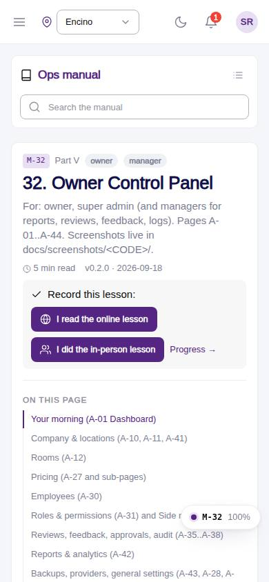
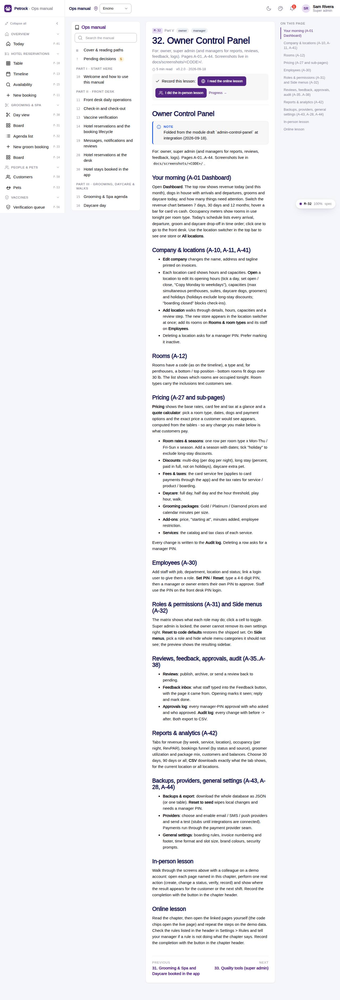

# M-32 · Manual: Owner Control Panel

## Purpose

For: owner, super admin (and managers for reports, reviews, feedback, logs). Pages A-01..A-44. Screenshots live in docs/screenshots/<CODE>/. Chapter 32 of the ops manual (part V) for owner, manager; folded at integration (2026-09-18) from the `owner-control-panel` module draft; in-person and online lesson recorded to training_completions.

## Screenshots

| 390 | 1280 |
| --- | --- |
|  |  |

Dark: not captured for this page (key pages only).

## Sections (layout order)

1. ManualSidebar
2. ChapterHeader (code, roles, meta, rules, lesson buttons)
3. ManualToc
4. Your morning (A-01 Dashboard)
5. Company & locations (A-10, A-11, A-41)
6. Rooms (A-12)
7. Pricing (A-27 and sub-pages)
8. Employees (A-30)
9. Roles & permissions (A-31) and Side menus (A-32)
10. Reviews, feedback, approvals, audit (A-35..A-38)
11. Reports & analytics (A-42)
12. Backups, providers, general settings (A-43, A-28, A-44)
13. In-person lesson
14. Online lesson
15. PrevNext

## Data

| Table | Read / write | Notes |
| --- | --- | --- |
| `training_completions` | read / write | lesson buttons |

## Rules

- none listed in the front matter; the chapter teaches the pages A-01, A-10, A-11, A-12, A-27, A-28, A-30, A-31, A-32, A-35, A-38, A-41

## Logic

- Rendered from docs/ops-manual/en/32-owner-control-panel.md: markdown segments, screenshot placeholders and callouts parsed by manualIndex.ts.
- Screenshot placeholders resolve to docs/screenshots/<CODE>/ when captured.
- Recording a lesson inserts training_completions { mode online | in_person } for the signed-in employee (R-X74).

## Components

ManualChapterCard, ManualToc, ManualCallout, LiveBlock, Figure, MarkdownViewer, Card, Badge, Button, Input, Chip, Section, PageHeader

## Real vs mock

Chapter text is real (docs/ops-manual/en); screenshot figures resolve once the referenced page is captured. Lesson buttons write `training_completions` in the mock provider.

## Responsive check (D-016)

Rendered by the same ManualChapterPage as M-10..M-27 (checked at 360, 390, 768, 1280, 1920 on 2026-09-18); captured at 390 and 1280 at integration with no console errors.

## Changelog

- `docs/changelog/0018-integration-merge.md`
