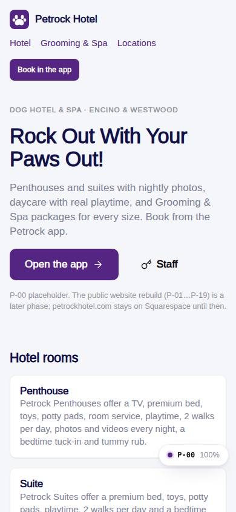
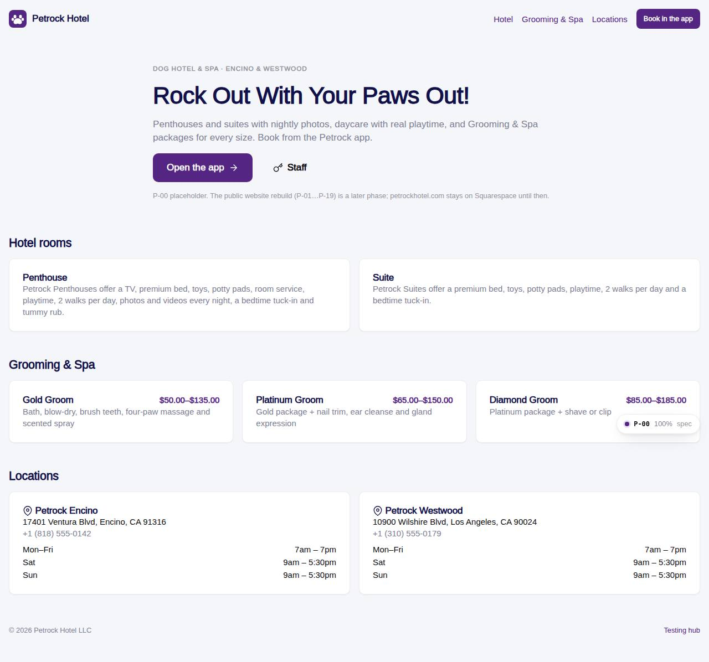

# P-00 · Public landing placeholder

## Purpose

Placeholder public website: hero, room types, Grooming & Spa packages and locations with hours, read from tables. The website rebuild is P-01..P-19 (extras-manual-website module).

## Screenshots

| 390 | 1280 |
| --- | --- |
|  |  |

Dark: `../screenshots/P-00/390-dark.jpg`, `../screenshots/P-00/1280-dark.jpg`.

## Sections (layout order)

1. SiteHeader
2. Hero
3. Rooms
4. Grooming packages
5. Locations with hours
6. Footer

## Data

| Table | Read / write | Notes |
| --- | --- | --- |
| `locations` | read | hours JSON |
| `room_types` | read |  |
| `packages` | read | price range S..Giant |

## Rules

- R-K02 - business hours
- R-G02 - Gold prices

## Logic

- Hours: Mon-Fri from weekday 1, Sat, Sun from locations.hours

## Components

Button, Card, Icon

## Real vs mock

Real against the mock provider; petrockhotel.com stays on Squarespace.

## Responsive check (D-016)

Checked at 360, 390, 768, 1280, 1920 on 2026-09-18 (Playwright): no horizontal scroll; DesktopShell sidebar becomes an overlay drawer under 900 px; DataTable rows become cards under 768 px.

## Changelog

- `docs/changelog/0007-foundation.md`
