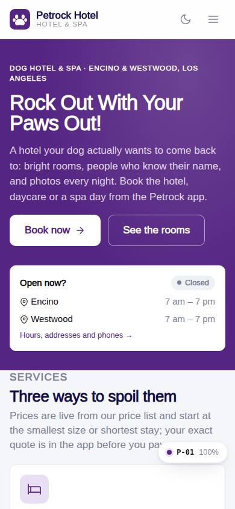
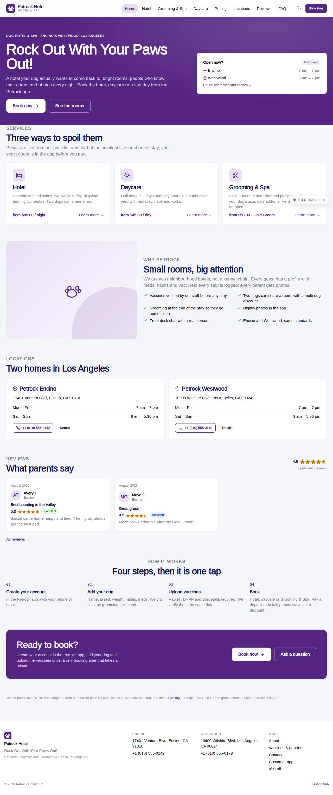

# P-01 · Website home

## Purpose

Petrock brand landing: hero with tagline, the three services with live "from" teasers, why Petrock, both locations with hours and open-now, published reviews with the average rating, how it works, book-now CTA into the app.

## Screenshots

| 390 | 1280 |
| --- | --- |
|  |  |

Dark: `../screenshots/P-01/390-dark.jpg`, `../screenshots/P-01/1280-dark.jpg`.

## Sections (layout order)

1. SiteLayout header
2. SiteHero (tagline, open-now card)
3. Services (Hotel, Daycare, Grooming & Spa tiles with teasers)
4. Why Petrock
5. Locations strip
6. Reviews (published)
7. How it works
8. CtaBand
9. Footer

## Data

| Table | Read / write | Notes |
| --- | --- | --- |
| `locations` | read | |
| `room_types` | read | |
| `rates` | read | |
| `packages` | read | |
| `daycare_pricing` | read | |
| `reviews` | read | |
| `customers` | read | |

## Rules

- `R-X40` - see the rules registry (Settings › Rules) and the Rules tab of the page inspector
- `R-X41` - see the rules registry (Settings › Rules) and the Rules tab of the page inspector
- `R-K02` - see the rules registry (Settings › Rules) and the Rules tab of the page inspector
- `R-A01` - see the rules registry (Settings › Rules) and the Rules tab of the page inspector

## Logic

- Teasers = min standard-season nightly rate per room type, Gold price_s, full-day daycare price (R-X41).
- Open now = current time inside locations.hours for today.
- Only reviews with status published are shown (R-X40); customer shown as first name + initial.

## Components

SiteLayout, SiteHero, Button, Card, Icon, Badge, ReviewListItem, ReviewStars

## Real vs mock

Reads the mock provider (localStorage) through the same `useTable` hooks the app uses; prices are computed from the pricing tables (R-X41), never typed. Petrock brand assets: the mark only (no photography in the repo; `Art` blocks are gradient placeholders). Squarespace stays live at petrockhotel.com until this site replaces it. When Company-OS lands, `DataProvider` swaps and nothing on the page changes.

## Responsive check (D-016)

Checked at 360, 390, 768, 1280, 1920 on 2026-09-18 (Playwright against `vite preview`): no horizontal page scroll at any width. Header nav becomes a slide-in drawer under 960 px; grids collapse to one column under 600 px.

## Changelog

- `docs/changelog/_pending/extras-manual-website.md` (merged into the next numbered entry by the integrator)
