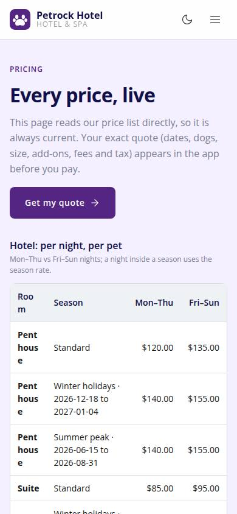
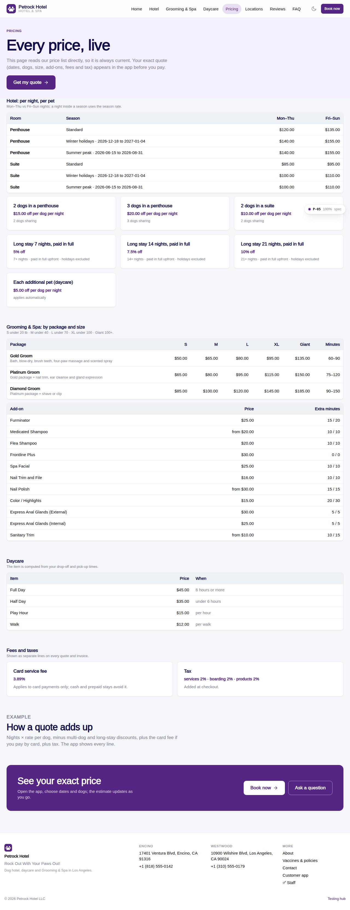

# P-05 · Website: Pricing

## Purpose

Pricing teaser page: every price live from the tables: room rates by day kind and season, discounts, Grooming & Spa by size, add-ons, daycare items, fees and taxes, how a quote adds up.

## Screenshots

| 390 | 1280 |
| --- | --- |
|  |  |

Dark: `../screenshots/P-05/390-dark.jpg`, `../screenshots/P-05/1280-dark.jpg`.

## Sections (layout order)

1. SiteHero (soft)
2. Hotel rates table
3. Discount cards
4. Grooming table + add-ons table
5. Daycare table
6. Fees & taxes cards
7. Example
8. CtaBand

## Data

| Table | Read / write | Notes |
| --- | --- | --- |
| `room_types` | read | |
| `rates` | read | |
| `seasons` | read | |
| `discounts` | read | |
| `packages` | read | |
| `addons` | read | |
| `daycare_pricing` | read | |
| `fees` | read | |
| `taxes` | read | |

## Rules

- `R-D05` - see the rules registry (Settings › Rules) and the Rules tab of the page inspector
- `R-D06` - see the rules registry (Settings › Rules) and the Rules tab of the page inspector
- `R-E01` - see the rules registry (Settings › Rules) and the Rules tab of the page inspector
- `R-E05` - see the rules registry (Settings › Rules) and the Rules tab of the page inspector
- `R-H03` - see the rules registry (Settings › Rules) and the Rules tab of the page inspector
- `R-H04` - see the rules registry (Settings › Rules) and the Rules tab of the page inspector
- `R-G02` - see the rules registry (Settings › Rules) and the Rules tab of the page inspector
- `R-F01` - see the rules registry (Settings › Rules) and the Rules tab of the page inspector
- `R-X71` - see the rules registry (Settings › Rules) and the Rules tab of the page inspector

## Logic

- Tables render rows verbatim; the binding quote is the pricing engine in the app (R-X71).

## Components

SiteLayout, SiteHero, Button, Card, Icon, Section

## Real vs mock

Reads the mock provider (localStorage) through the same `useTable` hooks the app uses; prices are computed from the pricing tables (R-X71), never typed. Petrock brand assets: the mark only (no photography in the repo; `Art` blocks are gradient placeholders). Squarespace stays live at petrockhotel.com until this site replaces it. When Company-OS lands, `DataProvider` swaps and nothing on the page changes.

## Responsive check (D-016)

Checked at 360, 390, 768, 1280, 1920 on 2026-09-18 (Playwright against `vite preview`): no horizontal page scroll at any width. Header nav becomes a slide-in drawer under 960 px; grids collapse to one column under 600 px.

## Changelog

- `docs/changelog/_pending/extras-manual-website.md` (merged into the next numbered entry by the integrator)
