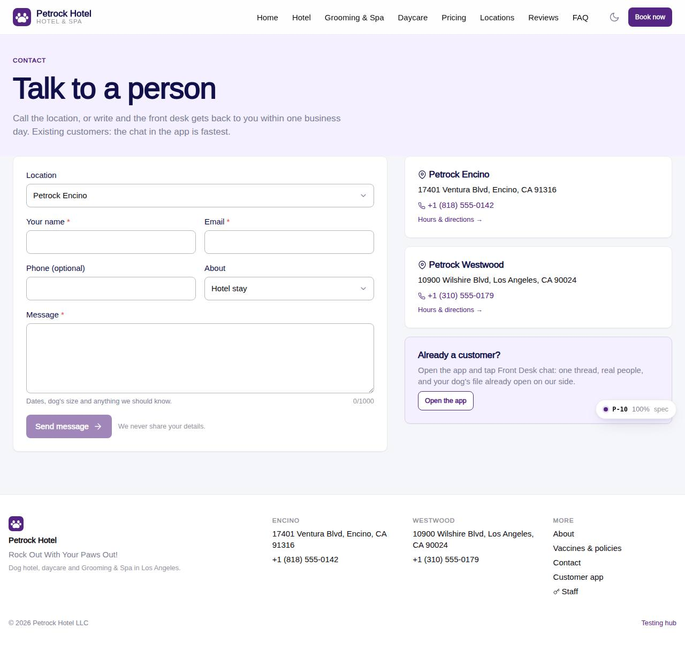

# P-10 · Website: Contact

## Purpose

Phones and addresses per location and a contact form that writes a site_inquiries row for the chosen location; the desk handles it in F-61.

## Screenshots

| 390 | 1280 |
| --- | --- |
|  |  |

Dark: not captured for this page (key pages only).

## Sections (layout order)

1. SiteHero (soft)
2. Form card (location, name, email, phone, topic, message)
3. Location cards + app note

## Data

| Table | Read / write | Notes |
| --- | --- | --- |
| `locations` | read | |
| `site_inquiries` | read / write | |

## Rules

- `R-X42` - see the rules registry (Settings › Rules) and the Rules tab of the page inspector
- `R-A02` - see the rules registry (Settings › Rules) and the Rules tab of the page inspector

## Logic

- Validation: name, email pattern, message >= 10 chars.
- insert site_inquiries { status new, location_id } (R-X42); ?location= preselects.

## Components

SiteLayout, SiteHero, Button, Card, Icon, Input, Select, Textarea, EmptyState, Toast

## Real vs mock

Reads the mock provider (localStorage) through the same `useTable` hooks the app uses; prices are computed from the pricing tables (R-X41), never typed. Petrock brand assets: the mark only (no photography in the repo; `Art` blocks are gradient placeholders). Squarespace stays live at petrockhotel.com until this site replaces it. When Company-OS lands, `DataProvider` swaps and nothing on the page changes. The contact form inserts a real `site_inquiries` row; email/SMS notification to the desk is not wired (R-M13).

## Responsive check (D-016)

Checked at 360, 390, 768, 1280, 1920 on 2026-09-18 (Playwright against `vite preview`): no horizontal page scroll at any width. Header nav becomes a slide-in drawer under 960 px; grids collapse to one column under 600 px.

## Changelog

- `docs/changelog/_pending/extras-manual-website.md` (merged into the next numbered entry by the integrator)
