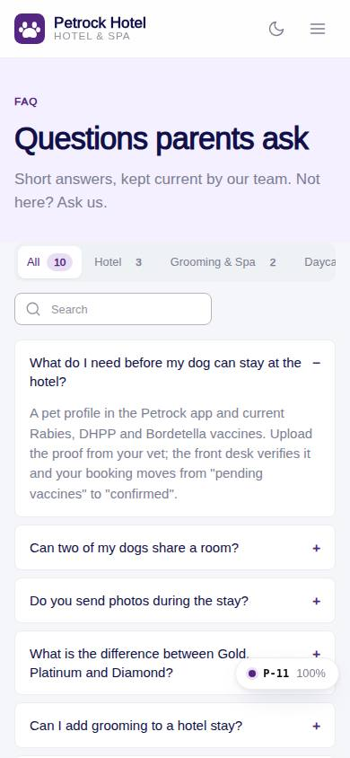
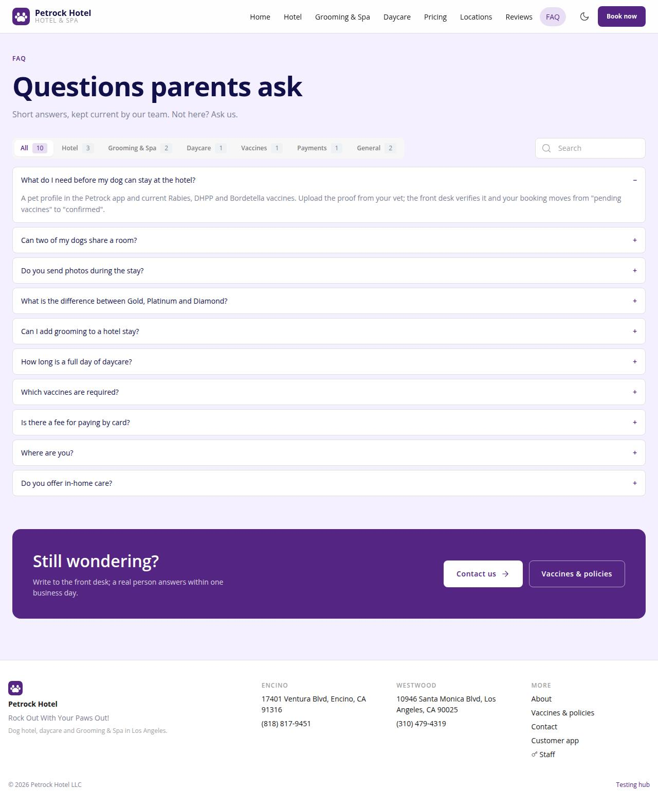

# P-11 · Website: FAQ

## Purpose

Published FAQs from site_faqs grouped by topic tabs with search; owners edit the table, not the code.

## Screenshots

| 390 | 1280 |
| --- | --- |
|  |  |

Dark: not captured for this page (key pages only).

## Sections (layout order)

1. SiteHero (soft)
2. Topic tabs + search
3. Accordion list
4. CtaBand

## Data

| Table | Read / write | Notes |
| --- | --- | --- |
| `site_faqs` | read | |

## Rules

- `R-A05` - see the rules registry (Settings › Rules) and the Rules tab of the page inspector
- `R-H03` - see the rules registry (Settings › Rules) and the Rules tab of the page inspector

## Logic

- where published = true, order sort_order; client-side topic and text filter.

## Components

SiteLayout, SiteHero, Button, Card, Icon, Tabs, Input, EmptyState

## Real vs mock

Reads the mock provider (localStorage) through the same `useTable` hooks the app uses; prices are computed from the pricing tables (R-X71), never typed. Petrock brand assets: the mark only (no photography in the repo; `Art` blocks are gradient placeholders). Squarespace stays live at petrockhotel.com until this site replaces it. When Company-OS lands, `DataProvider` swaps and nothing on the page changes.

## Responsive check (D-016)

Checked at 360, 390, 768, 1280, 1920 on 2026-09-18 (Playwright against `vite preview`): no horizontal page scroll at any width. Header nav becomes a slide-in drawer under 960 px; grids collapse to one column under 600 px.

## Changelog

- `docs/changelog/_pending/extras-manual-website.md` (merged into the next numbered entry by the integrator)
