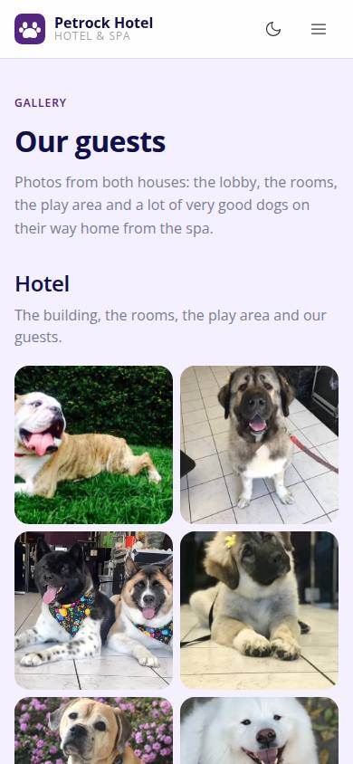
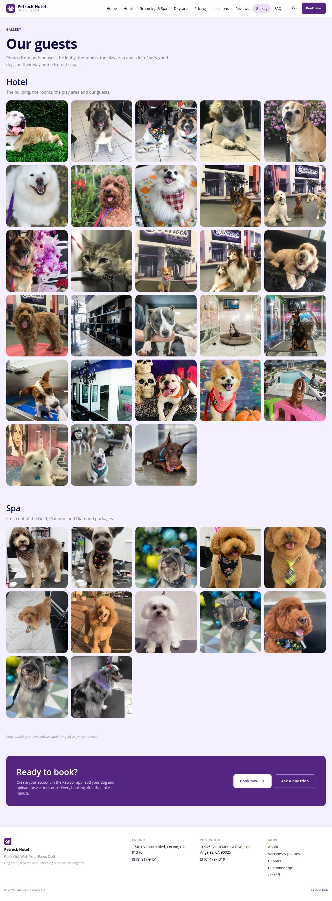

# P-13 · Website: Gallery

## Purpose

The client's two Squarespace galleries (`/petrock-gallery` and `/spa-gallery`) rebuilt as one page: everyone who is deciding where to leave their dog can see the building, the rooms, the play area and forty very good dogs, in a responsive grid with a lightbox that works from a keyboard as well as a thumb (D-227).

## Screenshots

| 390 | 1280 |
| --- | --- |
|  |  |

Dark: not captured for this page (key pages only).

## Sections (layout order)

1. SiteHero (soft) - "Our guests" with the gallery intro
2. **Hotel** - 28 photos: the building, the rooms, the play area and the guests
3. **Spa** - 12 photos: fresh out of the Gold, Platinum and Diamond packages
4. Tour note ("stop by with your pets and we would be glad to give you a tour")
5. **Lightbox** (`Modal`): the photo, previous / next, an "n of N" counter and the caption
6. CtaBand

## Photos used

`HOTEL_GALLERY` (28 slugs) and `SPA_GALLERY` (12 slugs) from `src/modules/extras-manual-website/site/siteImages.tsx`; the hero uses `dsc06483` and `dsc06504`. Every file is a committed WebP derivative in `public/site/img`, built by `npm run site:images` from `docs/reference/petrockhotel-scrape/images` (D-225).

## Data

| Table | Read / write | Notes |
| --- | --- | --- |
| `locations` | read | header, footer and the CTA band |

The photos themselves are not a table: they are build-time assets with a generated manifest (`siteImages.generated.ts`).

## Rules

- `R-K01` - locations and their details come from the `locations` table

## Logic

- Photos come from `public/site/img`, built by `npm run site:images` from `docs/reference/petrockhotel-scrape/images`; the generated manifest gives every srcset width and the source aspect, so tiles reserve their space and nothing shifts while loading.
- The lightbox walks **one flat list** across both sections: Left / Right arrows step (and wrap at the ends), Escape closes through `Modal`, and the caption is the photo's translated alt text (`extras-manual-website.photo.<slug>`).
- Every tile is a 44 px `button`, so touch, pen, mouse, keyboard and a future TV remote / d-pad all work; nothing is hover-only and nothing is drag-only (D-195).
- Tiles below the fold are lazy; the first row is `priority` so the page paints immediately.

## Actions (D-197)

| id | Label | Intent |
| --- | --- | --- |
| `site.gallery.open` | Open a photo | open a photo full size (`index`) |
| `site.gallery.next` | Next photo | show the next photo |
| `site.gallery.prev` | Previous photo | show the previous photo |
| `site.gallery.close` | Close the photo | close the photo viewer |
| `site.book` | Book now | start a booking from the website |

## Components

SiteLayout, SiteHero, **SitePhoto**, Modal, IconButton, Button, Card, Icon

## Real vs mock

The photos are the client's own, crawled on 2026-09-20 (D-224) and committed as derivatives (D-225); the originals stay in `docs/reference/petrockhotel-scrape/images`. No data is written. Squarespace keeps serving `/petrock-gallery` and `/spa-gallery` until this site replaces it.

## Responsive check (D-016, D-194)

Checked at 360, 390, 768, 1280, 1920, 2560 and 3840 on 2026-09-20 (Playwright against `vite preview`): no horizontal page scroll at any width; the grid runs 2 columns on phones, 3 at 768, 5 at 1280+, and the lightbox never exceeds the viewport. Phones fetch the 480 / 960 derivative, a 4K TV the 2560.

## Changelog

- `docs/changelog/0031-petrockhotel-content-site-rebuild.md` (new page)
